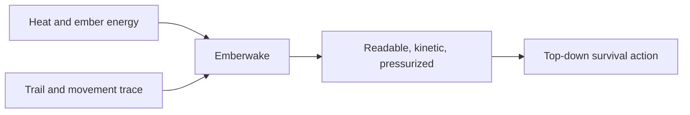
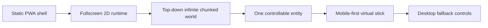
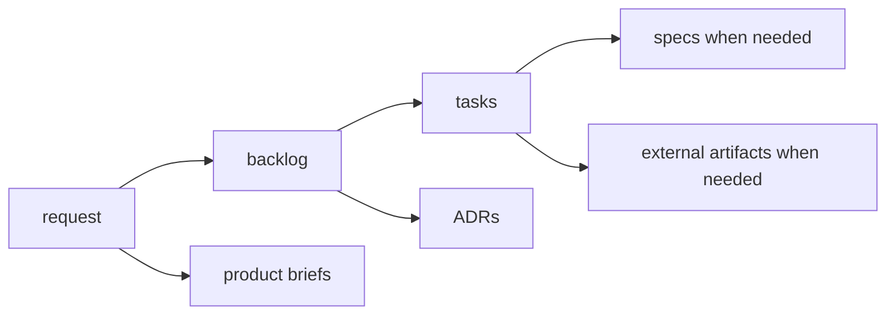
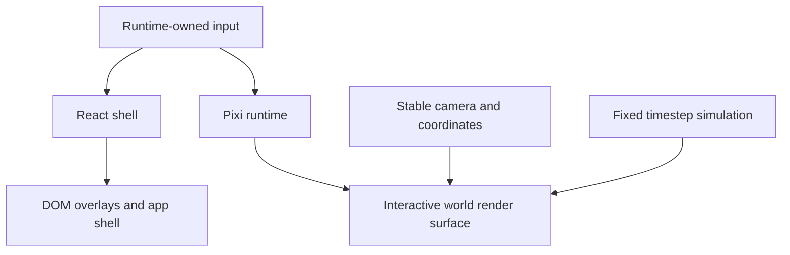
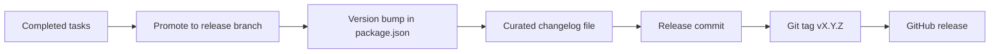

# Emberwake

Static frontend game project built around a fullscreen 2D top-down world, designed for `React + TypeScript + PixiJS`, with `PWA` delivery and no backend runtime.

This repository is now past the first bootstrap slice:
- the product, architecture, backlog, and execution flow are structured under `logics/`
- the frontend runtime is split across shell, engine, Pixi adapter, and game modules
- the playable loop runs through a shell-owned boot boundary with a Pixi-driven visual frame loop
- mobile virtual-stick input, diagnostics sampling, gameplay outcomes, and release validation are all part of the current baseline

This README is meant to evolve with the project.

Repository meta:
- [LICENSE](/Users/alexandreagostini/Documents/emberwake/LICENSE)
- [CONTRIBUTING.md](/Users/alexandreagostini/Documents/emberwake/CONTRIBUTING.md)

## Identity

`Emberwake` is the working name and product identity for the game.

The name combines:
- `ember`: heat, braise, lingering energy
- `wake`: a trail, a moving trace, a disturbance left behind

Taken together, `Emberwake` suggests a moving presence that leaves pressure, heat, and momentum in its path. That fits the current product direction: top-down real-time survival action built around movement, readability, and escalating density.

Reference brief:
- [prod_004_emberwake_name_and_brand_direction.md](/Users/alexandreagostini/Documents/emberwake/logics/product/prod_004_emberwake_name_and_brand_direction.md)



## Current Direction

The current target is:
- a static web app
- a fullscreen 2D render surface
- a top-down infinite chunked world
- one controllable entity as the first playable loop
- mobile-first direct control through a virtual stick
- desktop support as a fallback



## Current Status

Latest tagged release:
- `v0.1.2`

What `main` now carries beyond that release:
- a modular `app / engine / engine-pixi / game` runtime split
- shell-owned scene and meta-flow orchestration for `runtime`, `pause`, `settings`, `defeat`, and `victory`
- lazy runtime boot behind a shell boundary instead of eager Pixi startup
- a unified live frame loop where Pixi drives visual frames while the engine runner keeps fixed-step authority
- typed gameplay content and ordered gameplay systems in `games/emberwake`
- public package entrypoints and targeted lint rules to keep architecture boundaries honest
- runtime interaction recovery after delayed surface mount and regression coverage for the mobile virtual stick

## Planned Stack

- `React`
- `TypeScript`
- `PixiJS`
- `@pixi/react`
- `Vite`
- `vite-plugin-pwa`
- `Vitest`
- `Playwright`
- `ESLint`
- `Render` for static hosting
- `GitHub Actions` for CI

## Local Development

Bootstrap:
- `npm ci`

Run the app locally:
- `npm run dev`

Main validation commands:
- `npm run test`
- `npm run ci`
- `npm run test:browser:smoke`
- `npm run release:ready:advisory`

## Repository Status

At the moment, this repository contains both the operating model and an active modular runtime:
- requests
- backlog items
- execution tasks
- ADRs
- product briefs
- a Vite + React + PixiJS + PWA frontend shell
- a reusable engine core package
- a reusable Pixi adapter package
- an Emberwake game package with runtime, content, presentation, and gameplay systems

Recent orchestration waves:
- [task_026_orchestrate_engine_gameplay_boundary_extraction_for_runtime_reuse.md](/Users/alexandreagostini/Documents/emberwake/logics/tasks/task_026_orchestrate_engine_gameplay_boundary_extraction_for_runtime_reuse.md)
- [task_027_orchestrate_runtime_convergence_and_modular_boundary_hardening.md](/Users/alexandreagostini/Documents/emberwake/logics/tasks/task_027_orchestrate_runtime_convergence_and_modular_boundary_hardening.md)
- [task_028_orchestrate_the_next_architecture_wave_for_app_state_loading_content_rendering_and_boundary_enforcement.md](/Users/alexandreagostini/Documents/emberwake/logics/tasks/task_028_orchestrate_the_next_architecture_wave_for_app_state_loading_content_rendering_and_boundary_enforcement.md)
- [task_029_orchestrate_runtime_performance_product_meta_flow_and_gameplay_system_architecture.md](/Users/alexandreagostini/Documents/emberwake/logics/tasks/task_029_orchestrate_runtime_performance_product_meta_flow_and_gameplay_system_architecture.md)
- [task_030_orchestrate_unified_frame_loop_architecture_for_runtime_stability_and_render_scheduling.md](/Users/alexandreagostini/Documents/emberwake/logics/tasks/task_030_orchestrate_unified_frame_loop_architecture_for_runtime_stability_and_render_scheduling.md)
- [task_031_orchestrate_the_remaining_open_architecture_and_runtime_input_reliability_wave.md](/Users/alexandreagostini/Documents/emberwake/logics/tasks/task_031_orchestrate_the_remaining_open_architecture_and_runtime_input_reliability_wave.md)

## Runtime Topology

The repository now carries an explicit modular runtime split:
- `apps/emberwake-web` owns the web entrypoint and shell boot wiring
- `packages/engine-core` owns reusable runtime math, contracts, camera, world, and input primitives
- `packages/engine-pixi` owns reusable Pixi composition primitives
- `games/emberwake` owns Emberwake gameplay rules, content, scenarios, and runtime adapters
- `src/` owns the shell, shared frontend services, assets, and a narrowing set of app-facing adapters

Public TypeScript entrypoints:
- `@app/*`
- `@engine`
- `@engine-pixi`
- `@game`

Reference decisions:
- [adr_014_adopt_a_modular_app_engine_game_topology_with_one_way_dependencies.md](/Users/alexandreagostini/Documents/emberwake/logics/architecture/adr_014_adopt_a_modular_app_engine_game_topology_with_one_way_dependencies.md)
- [adr_015_define_engine_to_game_runtime_contract_boundaries.md](/Users/alexandreagostini/Documents/emberwake/logics/architecture/adr_015_define_engine_to_game_runtime_contract_boundaries.md)

## Workflow

This repo uses a staged `logics/` workflow:

- `logics/request`: incoming needs and problem framing
- `logics/backlog`: scoped implementation slices with acceptance criteria
- `logics/tasks`: executable delivery steps
- `logics/product`: product briefs
- `logics/architecture`: ADRs and structural decisions
- `logics/specs`: lightweight functional specs when needed
- `logics/external`: generated artifacts that do not fit elsewhere

Useful entry points:
- [logics/instructions.md](/Users/alexandreagostini/Documents/emberwake/logics/instructions.md)
- [logics/request/req_000_bootstrap_fullscreen_2d_react_pwa_shell.md](/Users/alexandreagostini/Documents/emberwake/logics/request/req_000_bootstrap_fullscreen_2d_react_pwa_shell.md)
- [logics/product/prod_000_initial_single_entity_navigation_loop.md](/Users/alexandreagostini/Documents/emberwake/logics/product/prod_000_initial_single_entity_navigation_loop.md)



## Key Rules Already Fixed

- `React` owns the app shell and DOM overlays
- `PixiJS` owns the interactive world render surface and drives live visual frames
- viewport behavior must not arbitrarily distort world scale or position
- the engine runner keeps fixed-timestep authority for simulation
- world identity must be deterministic from seed and coordinates
- debug instrumentation is a first-class concern
- runtime input must be isolated from browser page behavior
- shell scenes and meta surfaces are shell-owned rather than gameplay-owned
- gameplay outcomes are exposed to the shell through narrow contracts instead of gameplay internals
- diagnostics stay off the runtime hot path through sampled publication
- public module boundaries are enforced with targeted deep-import rules
- no large source files beyond the repository rule fixed in ADRs
- React side effects should be isolated into dedicated hooks or modules

Relevant ADRs:
- [adr_000_adopt_feature_oriented_organic_frontend_structure.md](/Users/alexandreagostini/Documents/emberwake/logics/architecture/adr_000_adopt_feature_oriented_organic_frontend_structure.md)
- [adr_001_enforce_bounded_file_size_and_isolate_react_side_effects.md](/Users/alexandreagostini/Documents/emberwake/logics/architecture/adr_001_enforce_bounded_file_size_and_isolate_react_side_effects.md)
- [adr_002_separate_react_shell_from_pixi_runtime_ownership.md](/Users/alexandreagostini/Documents/emberwake/logics/architecture/adr_002_separate_react_shell_from_pixi_runtime_ownership.md)
- [adr_003_define_coordinate_spaces_and_camera_contract.md](/Users/alexandreagostini/Documents/emberwake/logics/architecture/adr_003_define_coordinate_spaces_and_camera_contract.md)
- [adr_004_run_simulation_on_a_fixed_timestep.md](/Users/alexandreagostini/Documents/emberwake/logics/architecture/adr_004_run_simulation_on_a_fixed_timestep.md)



## Release And Changelog Policy

Releases are expected to stay explicit and documented.

Current rule:
- `package.json` will be the source of truth for app versioning
- each release must have a curated changelog file
- deployable releases must be promoted onto a dedicated `release` branch
- release tags use the form `vX.Y.Z`
- a release is blocked if its changelog is missing or stale

Reference ADR:
- [adr_012_require_curated_versioned_changelogs_for_releases.md](/Users/alexandreagostini/Documents/emberwake/logics/architecture/adr_012_require_curated_versioned_changelogs_for_releases.md)
- [adr_013_use_a_dedicated_release_branch_for_deployable_static_releases.md](/Users/alexandreagostini/Documents/emberwake/logics/architecture/adr_013_use_a_dedicated_release_branch_for_deployable_static_releases.md)

Expected changelog location:
- `changelogs/CHANGELOGS_X_Y_Z.md`

Current helpers:
- `npm run release:changelog:resolve`
- `npm run release:changelog:validate`



## Environment Files

For the future Vite frontend:
- `.env.example` is versioned documentation
- `.env.local` is local-only
- `.env.production` is local-only and mirrors Render values for reproduction
- frontend `VITE_*` variables are public build-time configuration, not secrets
- local `RENDER_*` variables may exist in non-versioned env files for service tooling and operations

Reference ADR:
- [adr_010_treat_render_build_variables_as_public_frontend_configuration.md](/Users/alexandreagostini/Documents/emberwake/logics/architecture/adr_010_treat_render_build_variables_as_public_frontend_configuration.md)

## Static Delivery

Static delivery currently assumes:
- Render static hosting on the free plan
- deployment from the dedicated `release` branch
- no backend runtime, worker, preview environment, or paid feature assumptions
- `dist/` as the single deployable frontend artifact
- Render-managed build variables as the production source of truth

Operational notes:
- keep `.env.example` as versioned documentation for expected env shape, especially public `VITE_*` values
- keep `.env.local` and `.env.production` local-only
- use `.env.production` only as a local mirror of Render values when reproducing a release build
- do not put secrets into `VITE_*` variables because they are embedded into the client build
- keep any local `RENDER_*` values out of version control and treat them as tooling or service-operation inputs rather than frontend config
- keep PR validation in CI and keep deployable states flowing through `release`

The Render Blueprint lives in:
- [render.yaml](/Users/alexandreagostini/Documents/emberwake/render.yaml)

## Asset Pipeline

The repository now reserves explicit asset ownership for:
- `src/assets/map`
- `src/assets/entities`
- `src/assets/overlays`

Each domain separates:
- `source/`
- `placeholders/`
- `runtime/`

Current rules:
- placeholders are acceptable for early runtime slices
- direct runtime files are allowed before atlas generation is justified
- atlases or spritesheets remain the preferred target once asset count grows
- logical sizing and pivot rules stay independent from source-pixel dimensions
- static delivery should cache hashed runtime assets aggressively while keeping shell files fresh

Reference contract:
- [assetPipeline.ts](/Users/alexandreagostini/Documents/emberwake/src/shared/config/assetPipeline.ts)

## Local Persistence

Local persistence is intentionally narrow for now.

Persisted first:
- shell preferences
- world seed
- camera state

Not persisted first:
- generated chunk content
- entity populations
- large world snapshots

Current rules:
- local storage only, no account or backend sync
- versioned payloads with drop-on-version-mismatch invalidation
- world content is reconstructed from the persisted seed instead of stored as opaque chunk data
- browser storage is treated as best-effort, not durable infrastructure
- this posture stays compatible with the static PWA delivery model

## World Occupancy

World occupancy is now explicit enough for the early movement loop.

Current rules:
- entity occupancy is modeled as a circular radius in continuous world space
- chunks remain indexing and streaming helpers, not hard movement cells
- early overlaps are tolerated and diagnosed rather than blocked
- terrain blocking and world bounds are intentionally off for the first loop
- player-facing continuity expects seamless chunk crossing and stable camera follow

Reference contract:
- [entityOccupancy.ts](/Users/alexandreagostini/Documents/emberwake/src/game/entities/model/entityOccupancy.ts)

## Typed Data And Scenarios

Authoring data now follows a typed TypeScript baseline instead of scattered literals.

Current ownership:
- world-authored terrain data lives in `games/emberwake/src/content/world`
- entity-authored archetypes and visuals live in `games/emberwake/src/content/entities`
- canonical debug scenarios live in `games/emberwake/src/content/scenarios`
- asset ids remain owned by `src/assets/assetCatalog.ts`
- runtime config stays in `src/shared/config`

Current rules:
- static game data, runtime configuration, debug scenarios, and executable logic stay in separate modules
- cross-domain references happen through explicit ids rather than ad-hoc literals
- the official debug scenario is shared by runtime defaults, entity debug content, and automated tests
- validation starts with TypeScript, module-level assertions, and typed catalog authoring guards, while leaving room for stricter schemas later

Reference contracts:
- [dataAuthoringContract.ts](/Users/alexandreagostini/Documents/emberwake/src/shared/config/dataAuthoringContract.ts)
- [contentAuthoring.ts](/Users/alexandreagostini/Documents/emberwake/games/emberwake/src/content/contentAuthoring.ts)
- [officialDebugScenario.ts](/Users/alexandreagostini/Documents/emberwake/games/emberwake/src/content/scenarios/officialDebugScenario.ts)
- [assetCatalog.ts](/Users/alexandreagostini/Documents/emberwake/src/assets/assetCatalog.ts)

## Testing Strategy

Testing now follows explicit tiers instead of a single generic test bucket.

Current tiers:
- `npm run test`: fast unit and integration checks for math, deterministic world logic, simulation, and typed fixtures
- `npm run test:browser:smoke`: slower browser validation for the first runtime loop on a desktop reference viewport
- `npm run ci`: blocking fast quality gates used on `main`, `release`, and pull requests
- `npm run ci:full`: local full-tier check that adds browser smoke on top of the fast gates

Current browser-smoke scope:
- boot the built app through `vite preview`
- verify the shell and player-facing HUD surfaces exist
- steer the primary entity with keyboard fallback input
- confirm visible world-position change and onboarding resolution

Current deterministic fixture anchors:
- `src/test/fixtures/runtimeFixtures.ts`
- `src/game/debug/data/officialDebugScenario.ts`

CI posture:
- fast gates stay blocking on `main`, `release`, and pull requests
- browser smoke runs on the `release` branch and on manual workflow dispatch
- release-oriented smoke uses Playwright Chromium rather than widening the matrix too early

## Release Operations

Release operations now have an explicit minimal posture.

Deployable artifact:
- `dist/`

Release-ready baseline:
- `npm run ci`
- `npm run release:changelog:validate`
- `npm run test:browser:smoke`
- promotion onto the dedicated `release` branch

Operational helpers:
- `npm run release:ready`
- `npm run release:ready:advisory`
- `npm run release:postdeploy:smoke`

Current release operations rules:
- previews are treated as technical validation surfaces, not a second release channel
- `npm run release:ready` now enforces the `release` branch and reruns the required gates instead of only printing them
- `npm run release:ready:advisory` exists for feature-branch rehearsal when the same checks are useful before promotion
- post-deploy smoke reuses the same browser loop against a deployed URL through `RELEASE_SMOKE_URL`
- rollback posture is static-hosting friendly: redeploy the last known-good release commit/tag on `release`

## Validation

The main documentation validation command is:

```bash
python3 logics/skills/logics-doc-linter/scripts/logics_lint.py
```

The main workflow helper is:

```bash
python3 logics/skills/logics-flow-manager/scripts/logics_flow.py --help
```

## Runtime Profiling

Early runtime profiling should stay lightweight, deterministic, and reproducible.

- start with the in-app diagnostics overlay before opening external profiling tools
- use the reference mobile viewport `390 x 844` and the deterministic default seed when comparing changes
- reset the camera before taking before/after readings so chunk and entity counts stay comparable
- capture at minimum `FPS`, `frame time`, `simulation speed`, `tick`, `visible chunks`, scheduler mode, and selected-entity motion signals
- when a performance-sensitive change is introduced, compare the same runtime posture before and after the change
- if the in-app overlay suggests a regression, escalate to a browser trace or devtools recording instead of guessing
- keep startup and frame-pacing checks aligned with `src/shared/config/runtimePerformanceBudget.json`
- use `npm run performance:validate` when touching runtime startup, chunk visibility, or diagnostics publication behavior

This keeps performance review grounded in the same runtime contract used by the shell and diagnostics tasks.

Residual bundle risk:
- the runtime now splits React and Pixi vendor code into separate Rollup chunks as a first mitigation direction
- Pixi-heavy startup cost is still treated as a tracked delivery risk while the runtime grows
- if chunk warnings or cold-start cost return, narrow imports first and then review deeper runtime partitioning

## Recent Delivery Waves

The main branch has recently closed these larger runtime waves:

1. engine/gameplay boundary extraction and reusable runtime contracts
2. runtime convergence onto modular `engine-core`, `engine-pixi`, and `games/emberwake`
3. shell scene architecture, lazy runtime boot, content validation, and render-layer contracts
4. startup performance budgets, shell-owned meta flow, and gameplay system ownership seams
5. unified frame-loop scheduling and hot-path diagnostics sampling
6. gameplay-to-shell outcomes, render phase separation, public entrypoint hardening, and lazy-mount input reliability

The detailed orchestration trail lives in:
- [task_026_orchestrate_engine_gameplay_boundary_extraction_for_runtime_reuse.md](/Users/alexandreagostini/Documents/emberwake/logics/tasks/task_026_orchestrate_engine_gameplay_boundary_extraction_for_runtime_reuse.md)
- [task_027_orchestrate_runtime_convergence_and_modular_boundary_hardening.md](/Users/alexandreagostini/Documents/emberwake/logics/tasks/task_027_orchestrate_runtime_convergence_and_modular_boundary_hardening.md)
- [task_028_orchestrate_the_next_architecture_wave_for_app_state_loading_content_rendering_and_boundary_enforcement.md](/Users/alexandreagostini/Documents/emberwake/logics/tasks/task_028_orchestrate_the_next_architecture_wave_for_app_state_loading_content_rendering_and_boundary_enforcement.md)
- [task_029_orchestrate_runtime_performance_product_meta_flow_and_gameplay_system_architecture.md](/Users/alexandreagostini/Documents/emberwake/logics/tasks/task_029_orchestrate_runtime_performance_product_meta_flow_and_gameplay_system_architecture.md)
- [task_030_orchestrate_unified_frame_loop_architecture_for_runtime_stability_and_render_scheduling.md](/Users/alexandreagostini/Documents/emberwake/logics/tasks/task_030_orchestrate_unified_frame_loop_architecture_for_runtime_stability_and_render_scheduling.md)
- [task_031_orchestrate_the_remaining_open_architecture_and_runtime_input_reliability_wave.md](/Users/alexandreagostini/Documents/emberwake/logics/tasks/task_031_orchestrate_the_remaining_open_architecture_and_runtime_input_reliability_wave.md)

## Updating This README

This file should be updated progressively when one of these changes:
- the actual runtime stack changes
- the repo gets bootstrapped with real code
- setup commands become real and stable
- delivery or release workflow changes
- the first playable slice becomes available

The goal is to keep this README short, current, and useful as the public entry point to the repository.
