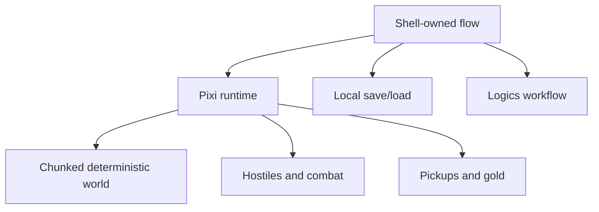
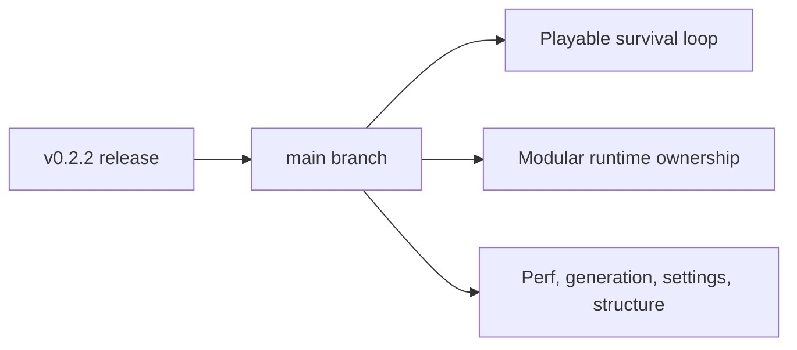
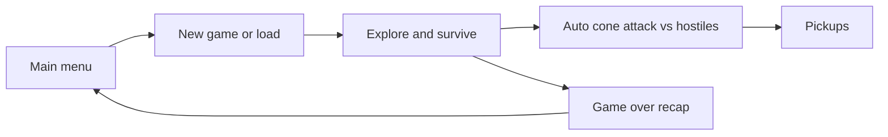
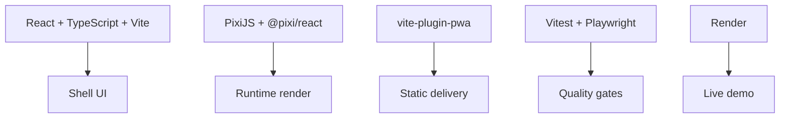
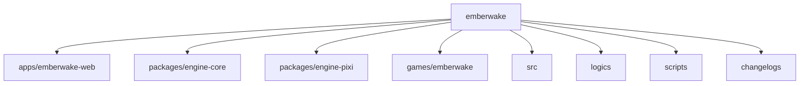
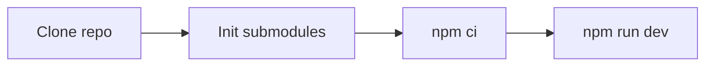
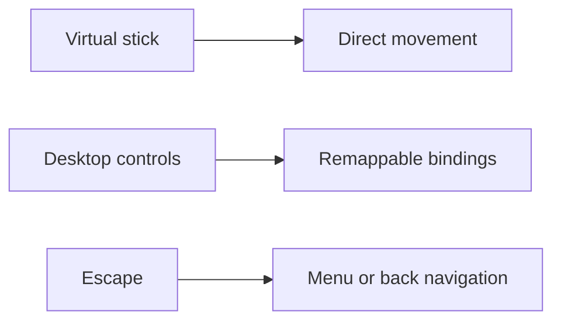
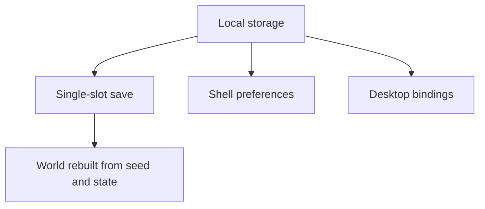
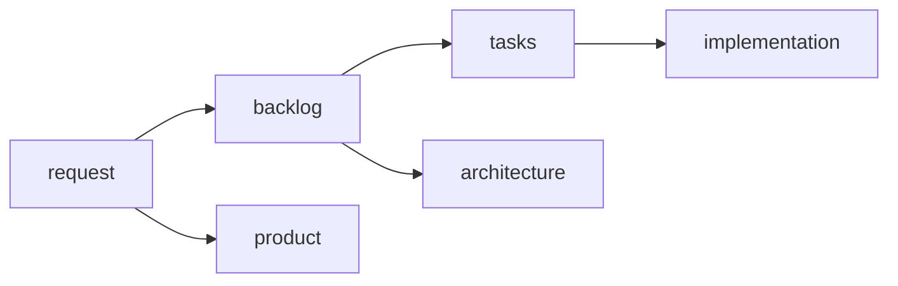
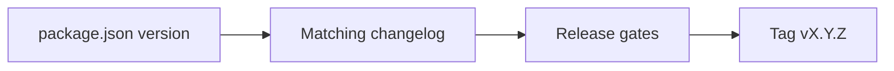

# Emberwake

Emberwake is a TypeScript + React top-down survival action prototype built around a shell-owned game flow, a PixiJS runtime, and a deterministic chunked world.

[](https://github.com/AlexAgo83/emberwake/actions/workflows/ci.yml)
[](LICENSE)
[](https://emberwake.onrender.com/)


## Overview

Emberwake currently includes:

- A shell-owned `Main menu`, `New game`, `Load game`, `Settings`, and `Game over` flow.
- A deterministic infinite world rendered in PixiJS with chunk-based generation.
- Pseudo-physics foundations with blocking obstacles, slow surfaces, and slippery surfaces.
- A first hostile combat loop with pursuit, contact damage, automatic player cone attacks, health, and defeat recap.
- Nearby pickups with healing kits and gold collection.
- Desktop control remapping, mobile virtual-stick control, and shell/runtime feedback surfaces.
- Local-first single-slot save/load and shell preference persistence.
- A planning and delivery workflow tracked in `logics/`.



## Current Status

Latest tagged release:

- `v0.2.2`

What `main` reflects today:

- The project has moved beyond a navigation-only slice into a first playable survival/combat loop.
- Runtime ownership is split between a React shell, reusable engine packages, a Pixi adapter, and Emberwake-specific gameplay modules.
- The next active work focuses on runtime memory/performance, world-generation readability, settings-surface polish, and runtime-structure cleanup.



## Current Gameplay Slice

- Start or load a run from a shell-owned main menu.
- Name the player character before entering runtime.
- Traverse an infinite world with deterministic terrain, obstacles, and movement modifiers.
- Fight hostile entities that spawn around the player, pursue, and deal contact damage.
- Trigger the player attack automatically with a forward cone.
- Collect healing kits and gold.
- Lose the run into a `Game over` recap, then return to the main menu.



## Tech Stack

- **Frontend:** React 19, TypeScript, Vite
- **Rendering:** PixiJS, `@pixi/react`
- **PWA:** `vite-plugin-pwa`
- **Testing:** Vitest, Testing Library, Playwright
- **Quality:** ESLint, TypeScript typecheck, runtime budget checks, browser smoke
- **Hosting:** Render static hosting



## Repository Topology

- `apps/emberwake-web`: web entrypoint and boot wiring
- `packages/engine-core`: reusable runtime contracts, math, camera, world, and simulation primitives
- `packages/engine-pixi`: reusable Pixi runtime composition
- `games/emberwake`: Emberwake gameplay rules, world content, combat, generation, and runtime adapters
- `src`: shell, frontend services, shared config, assets, and app-facing adapters
- `logics`: requests, backlog items, tasks, product briefs, ADRs, and specs
- `scripts`: performance, release, and test helpers
- `changelogs`: curated release notes



## Getting Started

1. Clone the repository:

```bash
git clone https://github.com/AlexAgo83/emberwake.git
cd emberwake
```

2. Initialize the `logics` skill submodule:

```bash
git submodule update --init --recursive
```

3. Install dependencies:

```bash
npm ci
```

4. Start the app locally:

```bash
npm run dev
```



## Useful Commands

```bash
npm run dev
npm run build
npm run test
npm run ci
npm run ci:full
npm run test:browser:smoke
npm run performance:validate
npm run logics:lint
npm run release:ready:advisory
```

## Controls

- **Mobile:** virtual stick for direct movement.
- **Desktop:** remappable movement and rotation controls from `Settings > Desktop controls`.
- **Shell shortcuts:** `Escape` is used for shell navigation and menu/back behavior depending on the active surface.



## Persistence

Current persistence is intentionally local-first:

- Single-slot save/load for the active runtime session
- Shell preferences persisted locally
- Desktop control bindings persisted locally
- Runtime world reconstructed from deterministic seed and state rather than large opaque world snapshots

There is currently no backend runtime or cloud-save stack in Emberwake.



## Delivery Workflow

The repository uses a staged planning workflow:

- `logics/request`: problem framing
- `logics/backlog`: scoped implementation slices
- `logics/tasks`: orchestration and delivery execution
- `logics/architecture`: ADRs
- `logics/product`: product framing

Useful entry points:

- [`logics/instructions.md`](logics/instructions.md)
- [`logics/product/prod_000_initial_single_entity_navigation_loop.md`](logics/product/prod_000_initial_single_entity_navigation_loop.md)
- [`logics/architecture/adr_014_adopt_a_modular_app_engine_game_topology_with_one_way_dependencies.md`](logics/architecture/adr_014_adopt_a_modular_app_engine_game_topology_with_one_way_dependencies.md)



## Releases

- `package.json` is the source of truth for the app version.
- Each release must have a matching curated changelog in `changelogs/`.
- Release tags use `vX.Y.Z`.
- The current release changelog is [`changelogs/CHANGELOGS_0_2_2.md`](changelogs/CHANGELOGS_0_2_2.md).



## Requirements

- Node.js `>= 20`
- npm

## Contributing

See [`CONTRIBUTING.md`](CONTRIBUTING.md).


## License

MIT, see [`LICENSE`](LICENSE).
