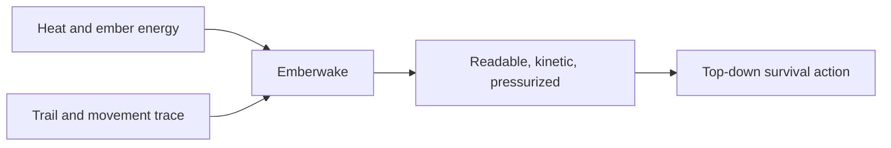
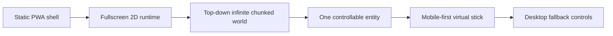
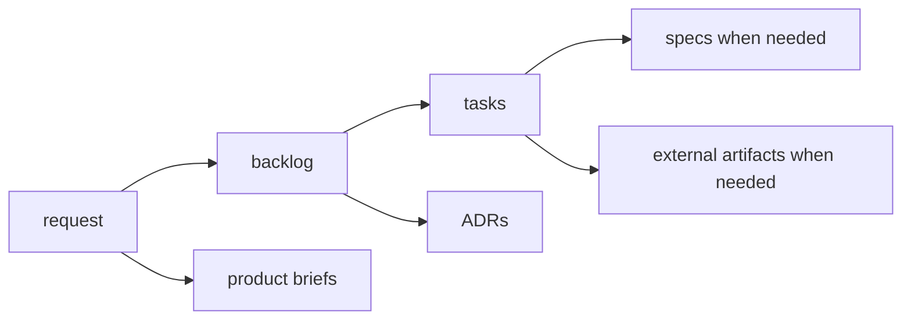
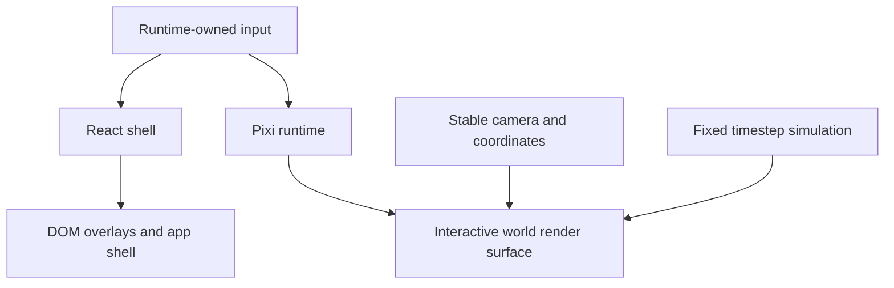
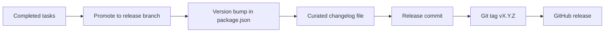
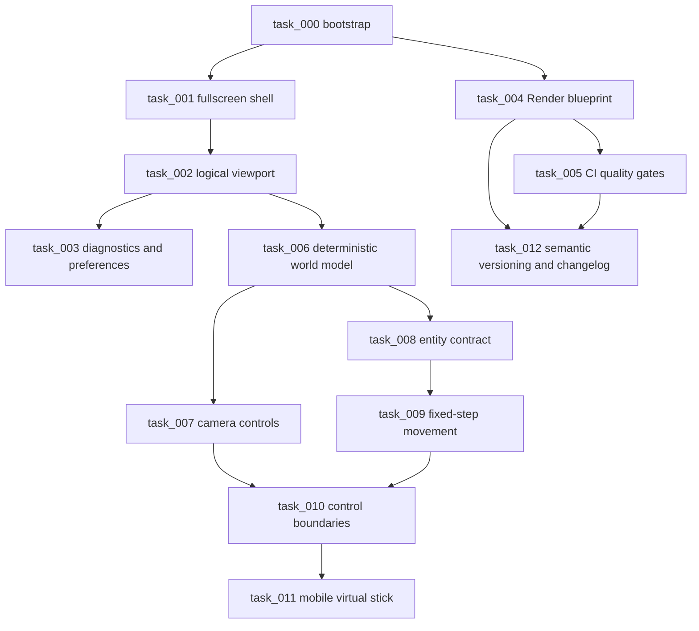

# Emberwake

Static frontend game project built around a fullscreen 2D top-down world, designed for `React + TypeScript + PixiJS`, with `PWA` delivery and no backend runtime.

This repository is currently in early implementation:
- the product, architecture, backlog, and execution flow are already structured
- the frontend runtime foundation is now bootstrapped
- the first shell, viewport, diagnostics, and delivery tasks are being executed incrementally

This README is meant to evolve with the project.

## Identity

`Emberwake` is the working name and product identity for the game.

The name combines:
- `ember`: heat, braise, lingering energy
- `wake`: a trail, a moving trace, a disturbance left behind

Taken together, `Emberwake` suggests a moving presence that leaves pressure, heat, and momentum in its path. That fits the current product direction: top-down real-time survival action built around movement, readability, and escalating density.

Reference brief:
- [prod_004_emberwake_name_and_brand_direction.md](/Users/alexandreagostini/Documents/emberwake/logics/product/prod_004_emberwake_name_and_brand_direction.md)



## Current Direction

The current target is:
- a static web app
- a fullscreen 2D render surface
- a top-down infinite chunked world
- one controllable entity as the first playable loop
- mobile-first direct control through a virtual stick
- desktop support as a fallback



## Planned Stack

- `React`
- `TypeScript`
- `PixiJS`
- `@pixi/react`
- `Vite`
- `vite-plugin-pwa`
- `Render` for static hosting
- `GitHub Actions` for CI

## Repository Status

At the moment, this repository contains both the operating model and the first runtime slice:
- requests
- backlog items
- execution tasks
- ADRs
- product briefs
- a Vite + React + PixiJS + PWA frontend foundation

The implementation backbone already starts in:
- [logics/tasks/task_000_bootstrap_react_pixi_pwa_project_foundation.md](/Users/alexandreagostini/Documents/emberwake/logics/tasks/task_000_bootstrap_react_pixi_pwa_project_foundation.md)
- [logics/tasks/task_001_implement_fullscreen_viewport_ownership_and_input_isolation.md](/Users/alexandreagostini/Documents/emberwake/logics/tasks/task_001_implement_fullscreen_viewport_ownership_and_input_isolation.md)
- [logics/tasks/task_002_add_stable_logical_viewport_and_world_space_shell_contract.md](/Users/alexandreagostini/Documents/emberwake/logics/tasks/task_002_add_stable_logical_viewport_and_world_space_shell_contract.md)
- [logics/tasks/task_003_add_render_diagnostics_fallback_handling_and_shell_preferences.md](/Users/alexandreagostini/Documents/emberwake/logics/tasks/task_003_add_render_diagnostics_fallback_handling_and_shell_preferences.md)

## Workflow

This repo uses a staged `logics/` workflow:

- `logics/request`: incoming needs and problem framing
- `logics/backlog`: scoped implementation slices with acceptance criteria
- `logics/tasks`: executable delivery steps
- `logics/product`: product briefs
- `logics/architecture`: ADRs and structural decisions
- `logics/specs`: lightweight functional specs when needed
- `logics/external`: generated artifacts that do not fit elsewhere

Useful entry points:
- [logics/instructions.md](/Users/alexandreagostini/Documents/emberwake/logics/instructions.md)
- [logics/request/req_000_bootstrap_fullscreen_2d_react_pwa_shell.md](/Users/alexandreagostini/Documents/emberwake/logics/request/req_000_bootstrap_fullscreen_2d_react_pwa_shell.md)
- [logics/product/prod_000_initial_single_entity_navigation_loop.md](/Users/alexandreagostini/Documents/emberwake/logics/product/prod_000_initial_single_entity_navigation_loop.md)



## Key Rules Already Fixed

- `React` owns the app shell and DOM overlays
- `PixiJS` owns the interactive world render surface
- viewport behavior must not arbitrarily distort world scale or position
- simulation is intended to run on a fixed timestep
- world identity must be deterministic from seed and coordinates
- debug instrumentation is a first-class concern
- runtime input must be isolated from browser page behavior
- no large source files beyond the repository rule fixed in ADRs
- React side effects should be isolated into dedicated hooks or modules

Relevant ADRs:
- [adr_000_adopt_feature_oriented_organic_frontend_structure.md](/Users/alexandreagostini/Documents/emberwake/logics/architecture/adr_000_adopt_feature_oriented_organic_frontend_structure.md)
- [adr_001_enforce_bounded_file_size_and_isolate_react_side_effects.md](/Users/alexandreagostini/Documents/emberwake/logics/architecture/adr_001_enforce_bounded_file_size_and_isolate_react_side_effects.md)
- [adr_002_separate_react_shell_from_pixi_runtime_ownership.md](/Users/alexandreagostini/Documents/emberwake/logics/architecture/adr_002_separate_react_shell_from_pixi_runtime_ownership.md)
- [adr_003_define_coordinate_spaces_and_camera_contract.md](/Users/alexandreagostini/Documents/emberwake/logics/architecture/adr_003_define_coordinate_spaces_and_camera_contract.md)
- [adr_004_run_simulation_on_a_fixed_timestep.md](/Users/alexandreagostini/Documents/emberwake/logics/architecture/adr_004_run_simulation_on_a_fixed_timestep.md)



## Release And Changelog Policy

Releases are expected to stay explicit and documented.

Current rule:
- `package.json` will be the source of truth for app versioning
- each release must have a curated changelog file
- deployable releases must be promoted onto a dedicated `release` branch
- release tags use the form `vX.Y.Z`
- a release is blocked if its changelog is missing or stale

Reference ADR:
- [adr_012_require_curated_versioned_changelogs_for_releases.md](/Users/alexandreagostini/Documents/emberwake/logics/architecture/adr_012_require_curated_versioned_changelogs_for_releases.md)
- [adr_013_use_a_dedicated_release_branch_for_deployable_static_releases.md](/Users/alexandreagostini/Documents/emberwake/logics/architecture/adr_013_use_a_dedicated_release_branch_for_deployable_static_releases.md)

Expected changelog location:
- `changelogs/CHANGELOGS_X_Y_Z.md`

Current helpers:
- `npm run release:changelog:resolve`
- `npm run release:changelog:validate`



## Environment Files

For the future Vite frontend:
- `.env.example` is versioned documentation
- `.env.local` is local-only
- `.env.production` is local-only and mirrors Render values for reproduction
- frontend `VITE_*` variables are public build-time configuration, not secrets

Reference ADR:
- [adr_010_treat_render_build_variables_as_public_frontend_configuration.md](/Users/alexandreagostini/Documents/emberwake/logics/architecture/adr_010_treat_render_build_variables_as_public_frontend_configuration.md)

## Validation

The main documentation validation command is:

```bash
python3 logics/skills/logics-doc-linter/scripts/logics_lint.py
```

The main workflow helper is:

```bash
python3 logics/skills/logics-flow-manager/scripts/logics_flow.py --help
```

## Current Execution Order

The current development backbone is intentionally sequential:

1. project bootstrap
2. fullscreen shell ownership
3. stable logical viewport contract
4. debug and fallback shell tooling
5. static delivery and CI
6. deterministic world model
7. camera controls
8. entity contract
9. fixed-step entity movement
10. player control boundaries
11. mobile virtual stick
12. semantic versioning and changelog discipline

Each completed task should end with its own dedicated git commit.



## Updating This README

This file should be updated progressively when one of these changes:
- the actual runtime stack changes
- the repo gets bootstrapped with real code
- setup commands become real and stable
- delivery or release workflow changes
- the first playable slice becomes available

The goal is to keep this README short, current, and useful as the public entry point to the repository.
