<p align="center">
  
</p>

# Emberwake

Emberwake is a techno-shinobi survival action game where every run turns into a faster, louder, more dangerous fight for control. Cut through escalating hostile waves, assemble impossible builds, cash out gold into permanent growth, and push deeper each time before the world finally overwhelms you.

[](https://github.com/AlexAgo83/emberwake/actions/workflows/ci.yml)
[](LICENSE)
[](https://emberwake.onrender.com/)


## Overview

Emberwake currently includes:

- Fast top-down survival combat with auto-firing weapons, passive augments, curated fusions, and run-defining build pivots.
- A persistent `Growth` layer where gold earned in runs becomes permanent talents, shop unlocks, and longer-term progression.
- Discoverable `Grimoire` and `Bestiary` archives that persist across runs and turn play into collectible knowledge.
- Escalating authored pressure through time phases, boss beats, post-boss difficulty spikes, and expanding enemy variety.
- Utility pickups such as magnets, healing kits, gold, and hourglass time-stop drops to create recovery swings in otherwise chaotic fights.
- A shell-owned game flow with `Main menu`, `New game`, `Load game`, `Growth`, `Settings`, `Game over`, `Grimoire`, and `Bestiary`.
- A deterministic chunked world, PixiJS runtime, and local-first persistence model built for repeatable runs and rapid iteration.

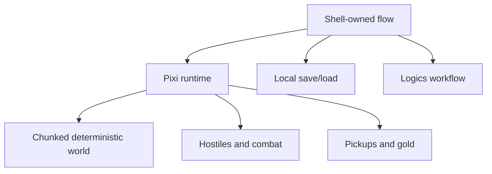

## Current Status

Current release target:

- `v0.6.0`

What `main` reflects today:

- Emberwake is already playable as a full run-based survival experience rather than a bare prototype shell.
- The current build includes meta progression, a broadened combat roster, curated fusion payoffs, codex progression, and a strong shell-driven game flow.
- The game is deep enough to support tuning, pacing, and content iteration as the primary focus of the next waves.
- The project remains in active balancing and content expansion, but the core loop is now strong, legible, and shipping-oriented.

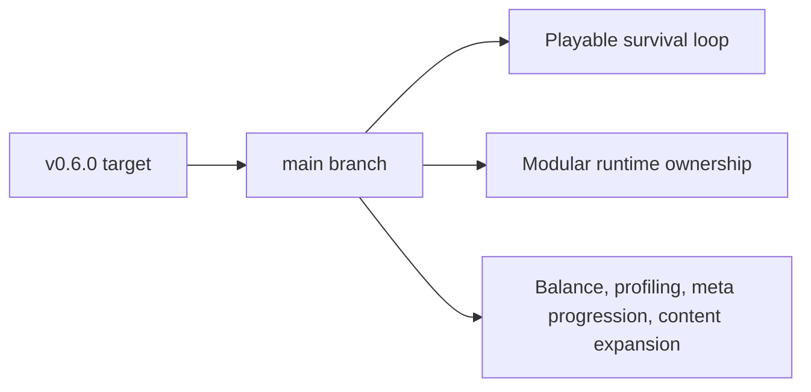

## Current Gameplay Slice

- Drop into a run from the shell, name the character, and survive as long as possible.
- Move through a deterministic hostile world with obstacles, friction surfaces, and readable combat space.
- Let the build evolve through auto-firing weapons, passive items, second-wave skills, and fusion outcomes.
- Use pickups, chest rewards, and level-up offers to stabilize the run or snowball it.
- End each run with recap data, damage-share ranking, earned gold, and cross-run progression.
- Reinvest that gold in permanent growth, then come back stronger for the next attempt.

## Why It Hooks

- Runs are designed to feel doomed in the best way: the better your build gets, the longer you delay the inevitable.
- Progress happens on two levels at once: immediate power inside the run, and permanent growth outside it.
- The shell is part of the product, not just scaffolding. Growth, codex, save/load, updates, and post-run analysis all reinforce the loop.
- The current direction mixes survivor-like escalation with a sharper techno-shinobi presentation instead of generic fantasy horde combat.

## Tuning Contracts

- `games/emberwake/src/config/gameplayTuning.json` is the editable balance surface for hostile, player, pickup, progression, and hostile-spawn values.
- `games/emberwake/src/config/systemTuning.json` is the editable technical tuning surface for input feel, viewport sizing, runtime presentation, pathfinding, and movement-surface response.
- Both JSON files are consumed through validated TypeScript adapters before runtime systems read them; new retunable numbers should default to one of these contracts instead of reappearing as local literals.

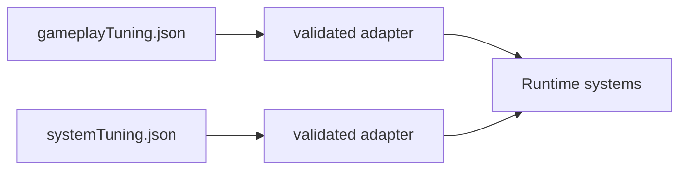

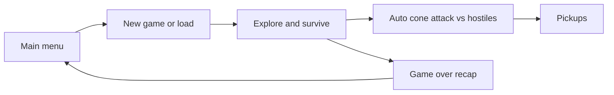

## Tech Stack

- **Frontend:** React 19, TypeScript, Vite
- **Rendering:** PixiJS, `@pixi/react`
- **PWA:** `vite-plugin-pwa`
- **Testing:** Vitest, Testing Library, Playwright
- **Quality:** ESLint, TypeScript typecheck, runtime budget checks, browser smoke, long-session profiling runner
- **Hosting:** Render static hosting

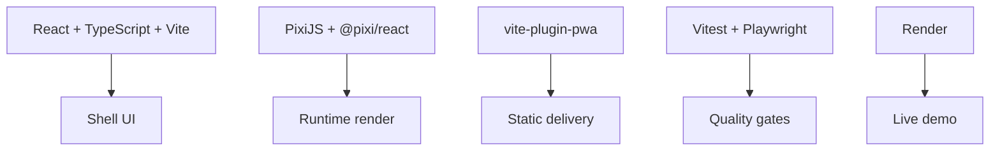

## Repository Topology

- `apps/emberwake-web`: web entrypoint and boot wiring
- `packages/engine-core`: reusable runtime contracts, math, camera, world, and simulation primitives
- `packages/engine-pixi`: reusable Pixi runtime composition
- `games/emberwake`: Emberwake gameplay rules, world content, combat, generation, and runtime adapters
- `src`: shell, frontend services, shared config, assets, and app-facing adapters
- `logics`: requests, backlog items, tasks, product briefs, ADRs, and specs
- `scripts`: performance, release, and test helpers
- `changelogs`: curated release notes

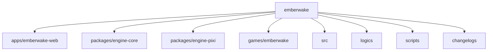

## Getting Started

1. Clone the repository:

```bash
git clone https://github.com/AlexAgo83/emberwake.git
cd emberwake
```

2. Initialize the `logics` skill submodule:

```bash
git submodule update --init --recursive
```

3. Install dependencies:

```bash
npm ci
```

4. Start the app locally:

```bash
npm run dev
```

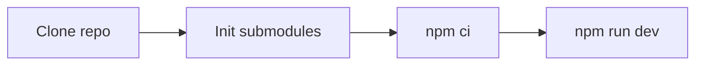

## Useful Commands

```bash
npm run dev
npm run build
npm run test
npm run ci
npm run ci:full
npm run test:browser:smoke
npm run test:browser:profile:long -- --scenario traversal-baseline --duration 120s
npm run test:browser:profile:pendulum
npm run performance:validate
npm run logics:lint
npm run release:ready:advisory
```

## Long-Session Memory Profiling

The repeatable memory-pressure scenario we use most often right now is `left-right-pendulum`.
It alternates the player `5s` right / `5s` left in a loop, runs under Playwright, auto-picks level-up choices, forces runtime simulation to `4x`, and writes JSON plus heap snapshots under `output/playwright/long-session/`.

Quick rerun:

```bash
npm run test:browser:profile:pendulum
```

Generic runner:

```bash
npm run test:browser:profile:long -- --scenario left-right-pendulum --duration 120s --loop
```

Mobile headed rerun:

```bash
node scripts/testing/runLongSessionProfile.mjs --scenario left-right-pendulum --duration 120s --loop --mobile --headed
```

Artifacts to inspect after a run:

- `output/playwright/long-session/latest.json`
- `output/playwright/long-session/*-heap-start.heapsnapshot`
- `output/playwright/long-session/*-heap-mid.heapsnapshot`
- `output/playwright/long-session/*-heap-end.heapsnapshot`

## Controls

- **Mobile:** virtual stick for direct movement.
- **Desktop:** remappable movement controls from `Settings > Desktop controls`.
- **Shell shortcuts:** `Escape` is used for shell navigation and menu/back behavior depending on the active surface.

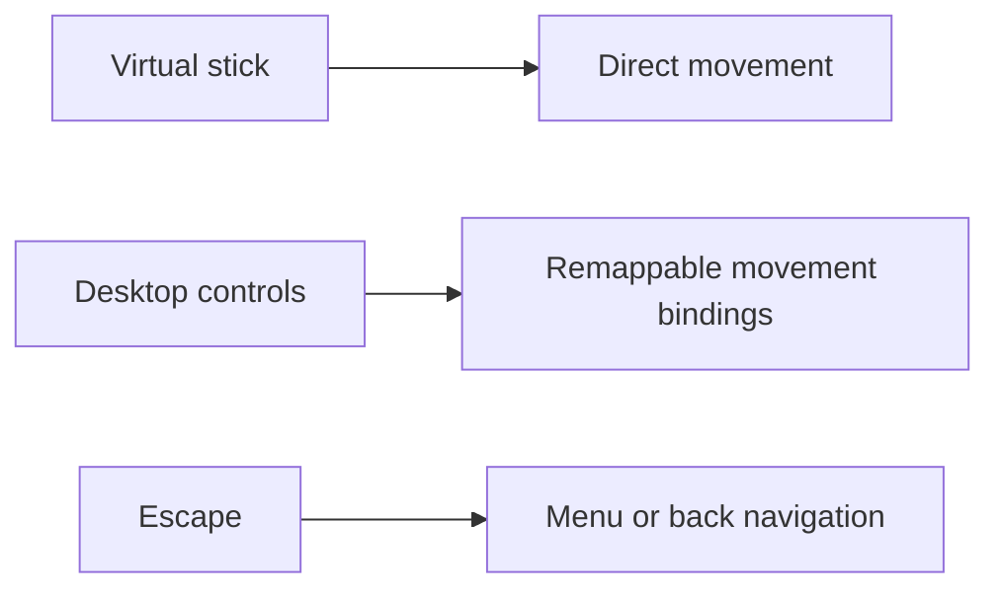

## Persistence

Current persistence is intentionally local-first:

- Single-slot save/load for the active runtime session
- Persistent meta profile for banked gold, purchased unlocks, talent ranks, bestiary discovery, and grimoire discovery
- Shell preferences persisted locally
- Desktop control bindings persisted locally
- Runtime world reconstructed from deterministic seed and state rather than large opaque world snapshots

There is currently no backend runtime or cloud-save stack in Emberwake.

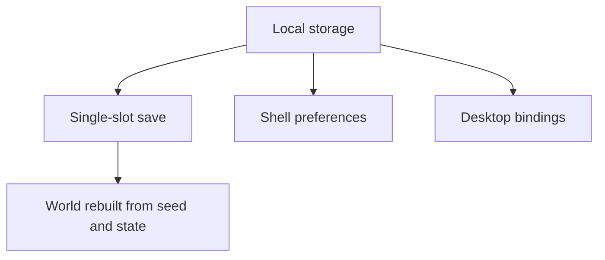

## Delivery Workflow

The repository uses a staged planning workflow:

- `logics/request`: problem framing
- `logics/backlog`: scoped implementation slices
- `logics/tasks`: orchestration and delivery execution
- `logics/architecture`: ADRs
- `logics/product`: product framing

Useful entry points:

- [`logics/instructions.md`](logics/instructions.md)
- [`logics/product/prod_000_initial_single_entity_navigation_loop.md`](logics/product/prod_000_initial_single_entity_navigation_loop.md)
- [`logics/architecture/adr_014_adopt_a_modular_app_engine_game_topology_with_one_way_dependencies.md`](logics/architecture/adr_014_adopt_a_modular_app_engine_game_topology_with_one_way_dependencies.md)

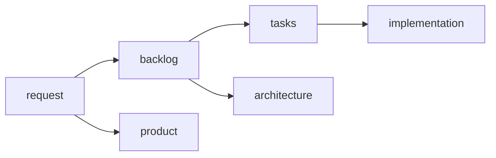

## Releases

- `package.json` is the source of truth for the app version.
- Each release must have a matching curated changelog in `changelogs/`.
- Release tags use `vX.Y.Z`.
- The current release changelog is [`changelogs/CHANGELOGS_0_6_0.md`](changelogs/CHANGELOGS_0_6_0.md).

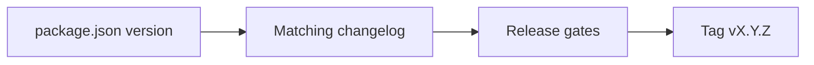

## Requirements

- Node.js `>= 20`
- npm

## Contributing

See [`CONTRIBUTING.md`](CONTRIBUTING.md).


## License

MIT, see [`LICENSE`](LICENSE).
