<p align="center">
  
</p>

# Emberwake

Emberwake is a techno-shinobi survival action game where each run starts from an authored world choice, pushes you across a hostile map-wide mission, and asks you to extract before the pressure wins. Cut through escalating waves, assemble impossible builds, hunt mission bosses, secure mission items, and cash out gold into permanent growth before descending again.

[](https://github.com/AlexAgo83/emberwake/actions/workflows/ci.yml)
[](LICENSE)
[](https://emberwake.onrender.com/)


## Overview

Emberwake currently includes:

- Fast top-down survival combat with auto-firing weapons, passive augments, curated fusions, and run-defining build pivots.
- A persistent `Growth` layer where gold earned in runs becomes permanent talents, shop unlocks, reroll/pass capacity, and longer-term progression.
- A five-world unlock ladder with authored world cards, mission-gated progression, visible attempts/clears/progress, and per-world hostile scaling.
- A primary map mission loop with three distant objectives, mission bosses, mission-item drops, and map exit unlock after all three are secured.
- Discoverable `Grimoire`, `Bestiary`, and `Loot Archive` codex surfaces that persist across runs and turn play into collectible knowledge.
- Escalating authored pressure through time phases, mini-boss beats, mission bosses, post-boss difficulty spikes, and expanding enemy variety.
- Utility pickups such as magnets, healing kits, gold, and hourglass time-stop drops to create recovery swings in otherwise chaotic fights.
- A shell-owned game flow with `Main menu`, `New game`, `Growth`, `Settings`, `Game over`, `Victory`, `Grimoire`, `Bestiary`, and `Loot Archive`.
- A deterministic chunked world, PixiJS runtime, generated asset pipeline, and local-first meta progression model built for repeatable runs and rapid iteration.

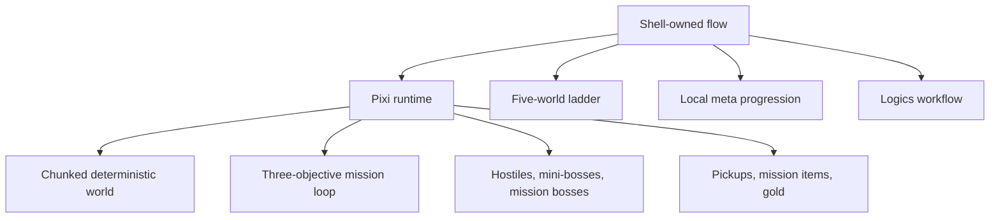

## Current Status

Current release target:

- `v0.6.1`

What `main` reflects today:

- Emberwake is already playable as a full shell-to-runtime action loop rather than a bare prototype shell.
- The current build includes world selection, mission-gated world progression, meta progression, broadened combat/content rosters, curated fusion payoffs, and codex-style archives.
- Generated runtime assets now cover the hero, hostiles, bosses, pickups, skill icons, and world-card presentation more directly than the earlier placeholder-first presentation.
- The game is now in a tuning-and-content-expansion phase where mission pacing, world differentiation, readability, and progression depth are the primary focus.

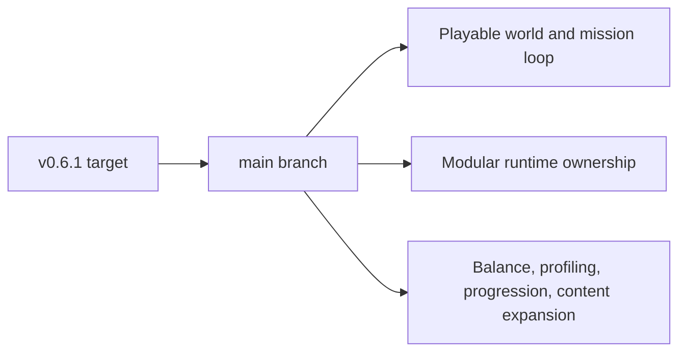

## Current Gameplay Slice

- Choose a world from the shell, name the character, and spawn into a deterministic seed derived from the player name plus the selected world.
- Traverse a hostile map with authored mission objectives, distinct per-world objective names/placements, obstacles, friction surfaces, and readable combat space.
- Follow the off-screen guidance arrow to mission targets, mission bosses, dropped mission items, and mini-bosses when they sit outside the camera.
- Let the build evolve through a dual-track level-up surface: `3` active/fusion offers, `3` passive offers, a single pick, plus reroll and pass charges.
- Use pickups, chest rewards, utility drops, and differentiated crystal tiers to stabilize the run or snowball it.
- Finish the run by extracting after all three mission items are secured, or lose it through defeat or explicit abandonment.
- Review the outcome, damage-share ranking, earned gold, discoveries, attempts, and world progress, then reinvest in permanent growth.

## Why It Hooks

- Runs are structured, not purely endless: each world gives you a route, three objectives, bosses, and a clean extraction condition.
- Progress happens on two levels at once: immediate power inside the run, and permanent growth outside it.
- The shell is part of the product, not just scaffolding. World selection, growth, codex/archive surfaces, and post-run analysis all reinforce the loop.
- The current direction mixes survivor-like escalation with a sharper techno-shinobi presentation instead of generic fantasy horde combat.
- The current asset pipeline makes the game increasingly authored visually instead of relying on abstract placeholders and generic debug shapes.

## Tuning Contracts

- `games/emberwake/src/config/gameplayTuning.json` is the editable balance surface for hostile, player, pickup, progression, and hostile-spawn values.
- `games/emberwake/src/config/systemTuning.json` is the editable technical tuning surface for input feel, viewport sizing, runtime presentation, pathfinding, and movement-surface response.
- Both JSON files are consumed through validated TypeScript adapters before runtime systems read them; new retunable numbers should default to one of these contracts instead of reappearing as local literals.

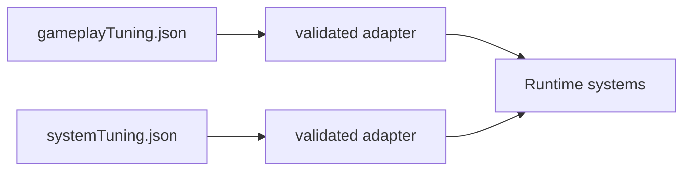

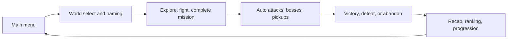

## Tech Stack

- **Frontend:** React 19, TypeScript, Vite
- **Rendering:** PixiJS, `@pixi/react`
- **PWA:** `vite-plugin-pwa`
- **Testing:** Vitest, Testing Library, Playwright
- **Quality:** ESLint, TypeScript typecheck, runtime budget checks, browser smoke, long-session profiling runner
- **Hosting:** Render static hosting

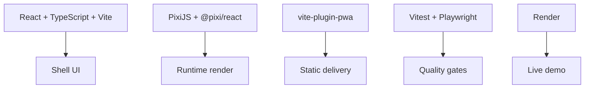

## Repository Topology

- `apps/emberwake-web`: web entrypoint and boot wiring
- `packages/engine-core`: reusable runtime contracts, math, camera, world, and simulation primitives
- `packages/engine-pixi`: reusable Pixi runtime composition
- `games/emberwake`: Emberwake gameplay rules, world content, combat, generation, and runtime adapters
- `src`: shell, frontend services, shared config, assets, and app-facing adapters
- `logics`: requests, backlog items, tasks, product briefs, ADRs, and specs
- `scripts`: performance, release, and test helpers
- `changelogs`: curated release notes

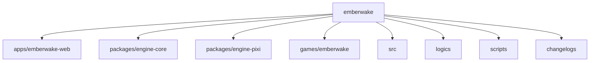

## Getting Started

1. Clone the repository:

```bash
git clone https://github.com/AlexAgo83/emberwake.git
cd emberwake
```

2. Initialize the `logics` skill submodule:

```bash
git submodule update --init --recursive
```

3. Install dependencies:

```bash
npm ci
```

4. Start the app locally:

```bash
npm run dev
```

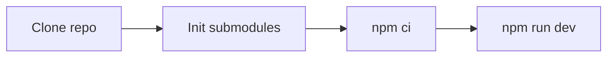

## Useful Commands

```bash
npm run dev
npm run build
npm run test
npm run ci
npm run ci:full
npm run test:browser:smoke
npm run test:browser:profile:long -- --scenario traversal-baseline --duration 120s
npm run test:browser:profile:pendulum
npm run performance:validate
npm run logics:lint
npm run release:ready:advisory
```

## Long-Session Memory Profiling

The repeatable memory-pressure scenario we use most often right now is `left-right-pendulum`.
It alternates the player `5s` right / `5s` left in a loop, runs under Playwright, auto-picks level-up choices, forces runtime simulation to `4x`, and writes JSON plus heap snapshots under `output/playwright/long-session/`.

Quick rerun:

```bash
npm run test:browser:profile:pendulum
```

Generic runner:

```bash
npm run test:browser:profile:long -- --scenario left-right-pendulum --duration 120s --loop
```

Mobile headed rerun:

```bash
node scripts/testing/runLongSessionProfile.mjs --scenario left-right-pendulum --duration 120s --loop --mobile --headed
```

Artifacts to inspect after a run:

- `output/playwright/long-session/latest.json`
- `output/playwright/long-session/*-heap-start.heapsnapshot`
- `output/playwright/long-session/*-heap-mid.heapsnapshot`
- `output/playwright/long-session/*-heap-end.heapsnapshot`

## Controls

- **Mobile:** virtual stick for direct movement.
- **Desktop:** remappable movement controls from `Settings > Controls`.
- **Shell shortcuts:** `Escape` opens the in-run shell menu during runtime and remains the general shell back/menu key on shell surfaces.

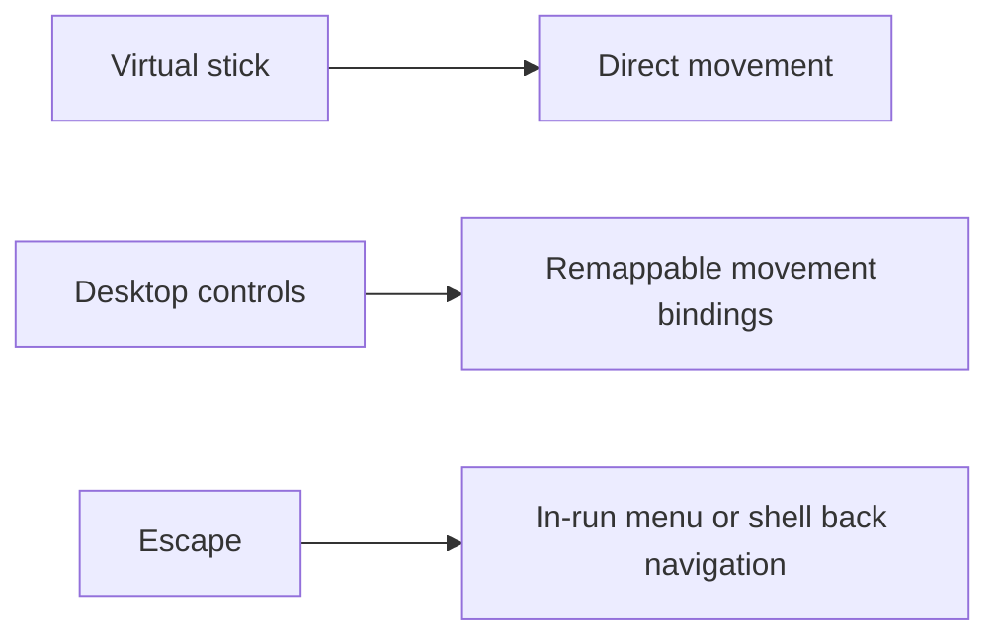

## Persistence

Current persistence is intentionally local-first:

- No player-facing mid-run save/load loop; runs are terminally resolved through victory, defeat, or abandon
- Persistent meta profile for banked gold, purchased unlocks, talent ranks, world progression, bestiary discovery, grimoire discovery, and loot archive discovery
- Shell preferences persisted locally
- Desktop control bindings persisted locally
- Runtime seed derived deterministically from normalized player name plus selected world profile
- Terminal returns to the main menu clean up runtime-owned memory/state instead of keeping a resumable run alive

There is currently no backend runtime or cloud-save stack in Emberwake.

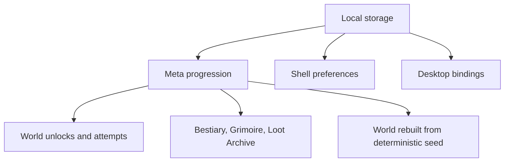

## World Ladder

- `World 1`: `Ashwake Verge`
- `World 2`: `Emberplain Reach` (`+10%` hostile health and damage)
- `World 3`: `Glowfen Basin` (`+20%` hostile health and damage)
- `World 4`: `Obsidian Vault` (`+30%` hostile health and damage)
- `World 5`: `Cinderfall Crown` (`+40%` hostile health and damage)

Each world card exposes its representative asset, mission progress, attempts, clears, and lock state directly in the shell.

## Runtime Presentation

- The main menu now uses large runtime character and enemy assets as screen-edge background silhouettes.
- Living entities use a left/right-facing runtime posture, with vertical movement preserving the last horizontal facing.
- Runtime readability includes dark-on-dark separation treatment, optional debug circles behind sprites, and state-reactive health bars that flare visible on health changes.
- Bosses, crystals, pickups, and skill icons now rely on generated runtime assets instead of a mostly placeholder-first surface.

## Delivery Workflow

The repository uses a staged planning workflow:

- `logics/request`: problem framing
- `logics/backlog`: scoped implementation slices
- `logics/tasks`: orchestration and delivery execution
- `logics/architecture`: ADRs
- `logics/product`: product framing

Useful entry points:

- [`logics/instructions.md`](logics/instructions.md)
- [`logics/product/prod_000_initial_single_entity_navigation_loop.md`](logics/product/prod_000_initial_single_entity_navigation_loop.md)
- [`logics/architecture/adr_014_adopt_a_modular_app_engine_game_topology_with_one_way_dependencies.md`](logics/architecture/adr_014_adopt_a_modular_app_engine_game_topology_with_one_way_dependencies.md)

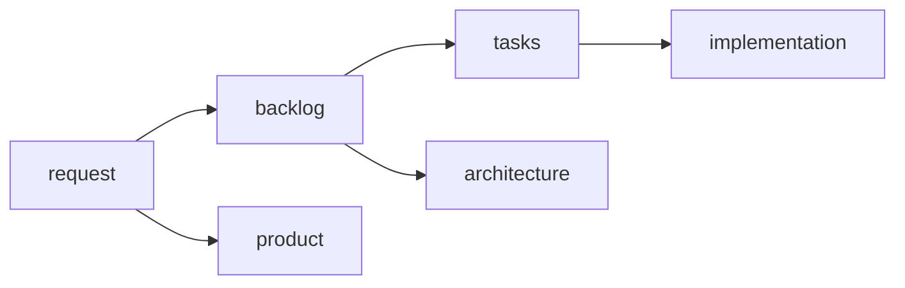

## Releases

- `package.json` is the source of truth for the app version.
- Each release must have a matching curated changelog in `changelogs/`.
- Release tags use `vX.Y.Z`.
- The current release changelog is [`changelogs/CHANGELOGS_0_6_1.md`](changelogs/CHANGELOGS_0_6_1.md).

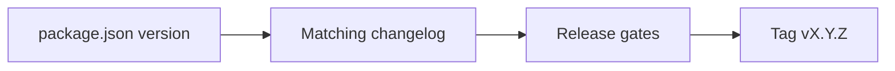

## Requirements

- Node.js `>= 20`
- npm

## Contributing

See [`CONTRIBUTING.md`](CONTRIBUTING.md).


## License

MIT, see [`LICENSE`](LICENSE).
