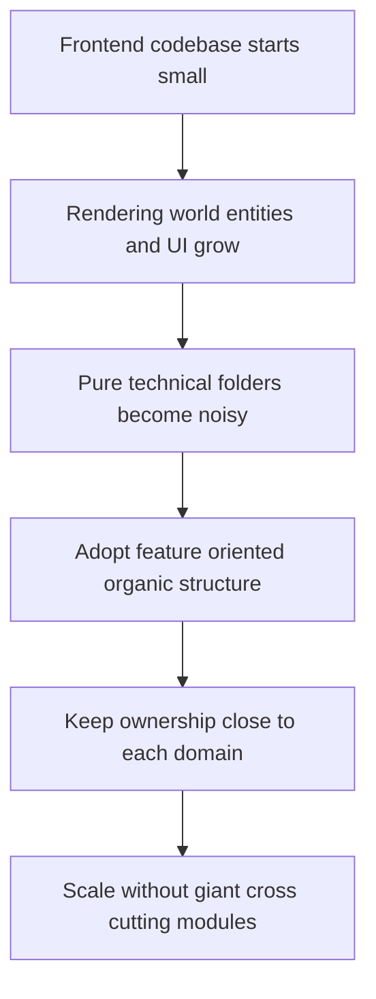

## adr_000_adopt_feature_oriented_organic_frontend_structure - Adopt feature-oriented organic frontend structure
> Date: 2026-03-17
> Status: Accepted
> Drivers: Keep the frontend maintainable as rendering, world, entity, UI, and diagnostics systems grow; avoid layer-driven sprawl; preserve clear ownership in a PixiJS + React static application.
> Related request: `req_000_bootstrap_fullscreen_2d_react_pwa_shell`, `req_002_render_evolving_world_entities_on_the_map`, `req_010_define_game_data_and_configuration_model`
> Related backlog: (none yet)
> Related task: (none yet)
> Reminder: Update status, linked refs, decision rationale, consequences, migration plan, and follow-up work when you edit this doc.

# Overview
The frontend codebase will use a feature-oriented organic structure instead of growing around technical buckets only. The repository should expand by product or runtime domain first, with local code colocated near its owning feature and only truly cross-cutting primitives promoted to shared space.

# Context
The project is not a simple content website. It is becoming a small frontend runtime with a fullscreen shell, a world renderer, entities, simulation, diagnostics, assets, overlays, and delivery concerns. If the codebase grows through flat technical buckets such as `components`, `hooks`, `utils`, and `services` only, ownership will blur quickly and feature work will be spread across too many unrelated folders.

The user explicitly wants a more intentional organization rule from the beginning, described loosely as "organic design". The best fit for that goal here is a feature-oriented structure that lets the codebase evolve around the product and runtime domains that actually exist.

This should not be interpreted as a rigid enterprise framework. The structure should stay pragmatic. The goal is not deep ceremony; it is to make it obvious where new world, entity, interaction, or overlay code belongs and to keep local changes local.

# Decision
- Organize the frontend primarily by feature or domain ownership, not by technical type alone.
- Use a small set of explicit top-level domain anchors such as `app`, `game/world`, `game/entities`, `game/input`, `game/camera`, `game/debug`, `ui`, and `shared` as the preferred starting structure.
- Use domain-first folders such as `app`, `game/world`, `game/entities`, `game/camera`, `game/debug`, `ui`, and `shared` as the baseline growth model.
- Colocate the code that belongs together inside each feature area, including components, feature hooks, state adapters, selectors, tests, and feature-specific helpers.
- Reserve `shared` for code that is stable, generic, and genuinely reused across multiple domains. `shared` must not become a dumping ground for unclear ownership.
- Prefer small local modules over global catch-all folders such as generic `utils` or broad `helpers` when a function clearly belongs to one feature.
- Let the structure grow organically by splitting a feature into subfolders only when that feature becomes large enough to justify it.
- Keep React shell code, Pixi runtime code, domain state, and debug tooling in separate but adjacent feature-owned areas so boundaries remain understandable.

# Alternatives considered
- Use a flat technical structure such as `components`, `hooks`, `services`, and `utils` for most of the repository. This was rejected because it would hide ownership as soon as world, entity, and rendering logic grow in parallel.
- Use a strict layered architecture with deep technical boundaries everywhere. This was rejected because it adds ceremony too early and does not match the project's current size.

# Consequences
- New code should usually be added to the feature that owns the behavior instead of to a global technical bucket.
- Cross-feature reuse will require a deliberate promotion step into `shared`, which adds a small amount of discipline but prevents accidental coupling.
- The codebase will contain more small folders and modules, but each one should be easier to reason about and refactor.
- Review and backlog work can discuss feature ownership more clearly because the directory model mirrors the product and runtime model.

# Migration and rollout
- Apply this structure immediately for new code and backlog implementation.
- When touching older files that violate the structure, prefer opportunistic refactors into the owning feature area instead of large one-shot directory rewrites.
- Treat broad catch-all folders as temporary at most; if they start accumulating unrelated code, split them by feature ownership.

# References
- `req_000_bootstrap_fullscreen_2d_react_pwa_shell`
- `req_001_render_top_down_infinite_chunked_world_map`
- `req_002_render_evolving_world_entities_on_the_map`
- `req_010_define_game_data_and_configuration_model`

# Follow-up work
- Reflect the initial domain-first folder structure in the first bootstrap implementation items.
- Add review guidance so new modules are placed under their owning feature by default.
