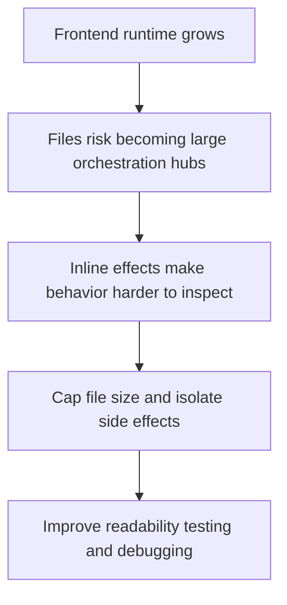

## adr_001_enforce_bounded_file_size_and_isolate_react_side_effects - Enforce bounded file size and isolate React side effects
> Date: 2026-03-17
> Status: Accepted
> Drivers: Keep the codebase readable and testable; avoid oversized scene files; make rendering and runtime side effects easier to debug; preserve clean React composition boundaries.
> Related request: `req_000_bootstrap_fullscreen_2d_react_pwa_shell`, `req_007_define_simulation_loop_and_deterministic_update_model`, `req_013_define_frontend_testing_strategy_for_rendering_simulation_and_world_logic`
> Related backlog: (none yet)
> Related task: (none yet)
> Reminder: Update status, linked refs, decision rationale, consequences, migration plan, and follow-up work when you edit this doc.

# Overview
The project will enforce a hard maximum source-file size of 1000 lines and will isolate React side effects into dedicated hook or support files instead of embedding them directly inside screens, scenes, or large components.

# Context
The project is heading toward fullscreen rendering, simulation, input handling, chunked world management, entities, overlays, and diagnostics. In that kind of codebase, large files and inline side-effect orchestration become especially expensive because they mix rendering, control flow, subscriptions, timers, browser APIs, and world logic in the same place.

The user wants two explicit rules from the beginning:
- no large files over 1000 lines
- `useEffect` and comparable effectful logic kept in their own files

Those are sensible guardrails here. Large scene files are hard to review, hard to test, and hard to split later. Inline effect clusters also make runtime behavior opaque, especially when camera, fullscreen, input, persistence, and diagnostics all need subscriptions or imperative browser bridges.

# Decision
- No production source file should exceed 1000 lines. This is a hard ceiling, not a soft preference.
- Files should usually stay far below that ceiling. If a file is trending large, split it before it becomes difficult to review or reason about.
- React side effects must be isolated into dedicated files by default. This includes `useEffect`, `useLayoutEffect`, `useInsertionEffect`, subscriptions, timers, observers, imperative browser bridges, and effect-heavy orchestration.
- Screen, scene, and feature components should compose behavior by importing named hooks or support modules such as `useFullscreenBridge`, `useCameraInputEffect`, or `useEntitySelectionSync` rather than declaring large inline effects.
- Entry-point glue, tests, and trivial leaf components may keep small local effects when that is materially simpler, but feature behavior should not accumulate inline effect orchestration inside render components.
- The same isolation principle applies beyond React hooks: non-trivial effectful integrations with browser APIs, storage, or rendering runtimes should live in dedicated modules with clear ownership.

# Alternatives considered
- Allow large files and use code review judgment only. This was rejected because the failure mode arrives too late and produces painful refactors.
- Allow inline `useEffect` usage freely inside components. This was rejected because it couples rendering and orchestration too tightly in a runtime-heavy app.

# Consequences
- The repository will contain more small hook and integration files, but runtime behavior will be easier to locate, test, and replace.
- Reviews can reject oversized files or effect-heavy components using a clear project rule instead of subjective preference.
- Feature components should remain more declarative because orchestration moves into dedicated hooks or modules.
- Refactors may happen earlier and more often, but they will usually be smaller and safer.

# Migration and rollout
- Apply the 1000-line ceiling immediately for new code.
- If a touched file is approaching or exceeding the ceiling, split it as part of the same work whenever practical.
- Move side-effect-heavy code into dedicated hook or support files as features are introduced or modified rather than waiting for a later cleanup phase.
- Consider adding linting, review checklist items, or CI checks later if the repository starts drifting from this rule.

# References
- `req_000_bootstrap_fullscreen_2d_react_pwa_shell`
- `req_007_define_simulation_loop_and_deterministic_update_model`
- `req_012_define_performance_budgets_profiling_and_diagnostics`
- `req_013_define_frontend_testing_strategy_for_rendering_simulation_and_world_logic`

# Follow-up work
- Reflect this rule in the first implementation and review guidelines.
- Add a backlog item or tooling check later so file-size and side-effect rules can be enforced automatically in CI if drift appears.
