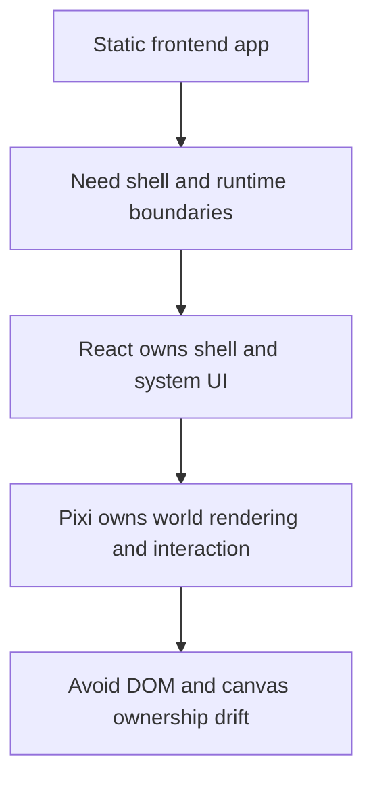

## adr_002_separate_react_shell_from_pixi_runtime_ownership - Separate React shell from Pixi runtime ownership
> Date: 2026-03-17
> Status: Accepted
> Drivers: Keep rendering ownership explicit; avoid DOM/canvas ambiguity; preserve a clean platform boundary for fullscreen shell, overlays, and interactive world rendering.
> Related request: `req_000_bootstrap_fullscreen_2d_react_pwa_shell`, `req_001_render_top_down_infinite_chunked_world_map`, `req_011_define_ui_hud_and_overlay_system`
> Related backlog: `item_000_bootstrap_react_pixi_pwa_project_foundation`, `item_001_implement_fullscreen_viewport_ownership_and_input_isolation`
> Related task: (none yet)
> Reminder: Update status, linked refs, decision rationale, consequences, migration plan, and follow-up work when you edit this doc.

# Overview
React owns the application shell and system overlays. Pixi owns the interactive world runtime and the primary render surface. The project should not mix DOM-owned and Pixi-owned interaction inside the same world area without an explicit later decision.

# Context
The project is building a fullscreen-first application with a top-down world, entities, camera controls, overlays, and PWA behavior. Without a clear ownership rule, DOM and canvas responsibilities would blur quickly. That would create recurring ambiguity around input handling, render layering, debugging, and performance.

The current requests already imply a thin DOM overlay policy and a Pixi-centered runtime. That should be treated as an architecture rule rather than as a temporary implementation preference.

# Decision
- React owns the app shell, route or lifecycle wiring, configuration entry points, and thin system overlays.
- Pixi owns the interactive world surface, world-space rendering, and runtime interaction inside that surface.
- System UI such as fullscreen prompts, install prompts, debug panels, and inspection panels should default to DOM ownership unless there is a clear runtime reason to render them in Pixi.
- World-space visuals, world-space picking, camera transforms, and entity rendering should remain Pixi-owned.
- The project should avoid split ownership inside the same world area, such as mixing DOM hit targets with Pixi hit targets for the same interaction zone.

# Alternatives considered
- Let DOM and Pixi share ownership opportunistically across the runtime surface. This was rejected because it creates input ambiguity and weakens maintainability.
- Render everything in Pixi, including system overlays. This was rejected because browser-native prompts and utility panels are simpler and more reliable in DOM.

# Consequences
- Runtime ownership stays clear during reviews and backlog splitting.
- Overlay work can be reasoned about separately from world rendering work.
- Some UI might exist twice conceptually, once as system UI in DOM and once as world-space visuals in Pixi, but their responsibilities will stay clearer.

# Migration and rollout
- Apply this boundary immediately for new implementation.
- If later work needs an exception, record that exception explicitly rather than letting the boundary drift informally.

# References
- `req_000_bootstrap_fullscreen_2d_react_pwa_shell`
- `req_001_render_top_down_infinite_chunked_world_map`
- `req_006_define_player_interactions_for_world_and_entities`
- `req_011_define_ui_hud_and_overlay_system`

# Follow-up work
- Reflect this boundary in the first implementation backlog slices and review guidance.
