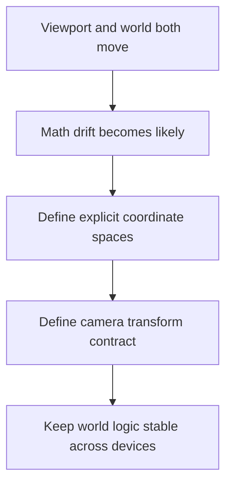

## adr_003_define_coordinate_spaces_and_camera_contract - Define coordinate spaces and camera contract
> Date: 2026-03-17
> Status: Accepted
> Drivers: Prevent transform drift; keep viewport changes from corrupting world logic; make chunking, picking, entity rendering, and debugging mathematically coherent.
> Related request: `req_000_bootstrap_fullscreen_2d_react_pwa_shell`, `req_001_render_top_down_infinite_chunked_world_map`, `req_002_render_evolving_world_entities_on_the_map`
> Related backlog: `item_002_add_stable_logical_viewport_and_world_space_shell_contract`, `item_004_implement_camera_controls_for_pan_zoom_and_rotation`
> Related task: (none yet)
> Reminder: Update status, linked refs, decision rationale, consequences, migration plan, and follow-up work when you edit this doc.

# Overview
The project uses explicit `screen space`, `world space`, and `chunk space`, with deterministic transforms between them. The viewport may resize, but it must not arbitrarily redefine world position, world scale, or camera meaning.

# Context
The requests already rely on multiple spaces: the browser viewport, the rendered world, and chunk addressing. Camera pan, zoom, rotation, picking, and entity motion all depend on these transforms being explicit and stable. If those concepts drift, later bugs will appear as “random” camera or chunk issues.

# Decision
- `screen space` is the rendered viewport-space coordinate system used for user-facing pixels and pointer positions.
- `world space` is the stable logical coordinate system used for map, entities, and movement.
- `chunk space` is the discrete addressing system derived from world-space location and chunk partitioning rules.
- Camera state is defined in world terms and transforms world space into screen space through explicit pan, zoom, and rotation rules.
- Viewport resizing may change how much of the world is visible, but must not arbitrarily move or rescale world content beyond defined adaptation rules.
- Screen-to-world and world-to-screen conversion must be treated as first-class primitives, not ad hoc calculations scattered across the codebase.

# Alternatives considered
- Let each feature derive transforms locally as needed. This was rejected because math consistency would decay quickly.
- Use screen pixels as the de facto world model. This was rejected because chunking, zoom, and device stability would become fragile.

# Consequences
- Camera and picking behavior become easier to debug and test.
- World and entity systems can reason in one stable coordinate model.
- Implementation will need shared transform primitives rather than one-off calculations.

# Migration and rollout
- Apply these terms and transforms immediately in runtime, debug, and testing work.
- Reject new code that mixes coordinate spaces without explicit conversion.

# References
- `req_000_bootstrap_fullscreen_2d_react_pwa_shell`
- `req_001_render_top_down_infinite_chunked_world_map`
- `req_002_render_evolving_world_entities_on_the_map`
- `req_013_define_frontend_testing_strategy_for_rendering_simulation_and_world_logic`

# Follow-up work
- Surface these coordinate names in debug overlays and tests.
