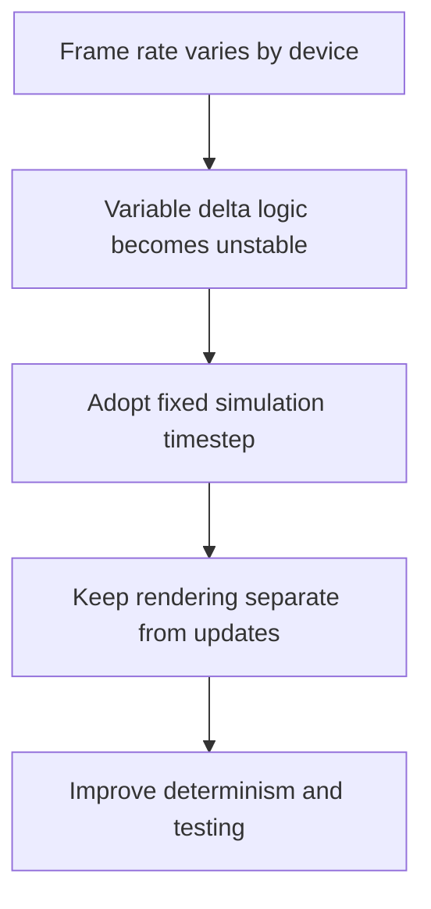

## adr_004_run_simulation_on_a_fixed_timestep - Run simulation on a fixed timestep
> Date: 2026-03-17
> Status: Accepted
> Drivers: Preserve determinism; keep updates reproducible across machines; make world and entity logic testable without depending on frame rate.
> Related request: `req_007_define_simulation_loop_and_deterministic_update_model`, `req_002_render_evolving_world_entities_on_the_map`, `req_013_define_frontend_testing_strategy_for_rendering_simulation_and_world_logic`
> Related backlog: `item_010_implement_fixed_step_entity_movement_and_state_update_loop`
> Related task: (none yet)
> Reminder: Update status, linked refs, decision rationale, consequences, migration plan, and follow-up work when you edit this doc.

# Overview
Authoritative world and entity updates run on a fixed timestep. Rendering may remain frame-driven, but simulation correctness must not depend on variable frame deltas.

# Context
The project already anticipates a moving camera, chunked world, entities, deterministic scenarios, and local persistence. All of those systems become much harder to reason about if updates depend directly on fluctuating render cadence.

# Decision
- Simulation uses a fixed timestep as the authoritative update model.
- Rendering may interpolate or redraw at the browser frame rate, but simulation state advances in fixed increments.
- Pause, single-step, and simulation-speed controls should operate on the simulation layer rather than on ad hoc rendering hacks.
- Feature code should avoid embedding world-state mutation directly inside render-frame callbacks unless the mutation is explicitly part of the fixed-step loop.

# Alternatives considered
- Use variable delta updates everywhere. This was rejected because deterministic behavior and testability would degrade quickly.
- Run rendering and simulation at exactly the same cadence always. This was rejected because browser rendering cadence is not stable enough to be the authority.

# Consequences
- The project gains a stable base for entities, world updates, and deterministic testing.
- Some interpolation or frame-sync complexity may appear later, but it is preferable to simulation drift.

# Migration and rollout
- Apply this rule for entity and world update work from the first implementation slices.
- Treat variable-delta-only logic as a code smell unless the behavior is explicitly visual and non-authoritative.

# References
- `req_007_define_simulation_loop_and_deterministic_update_model`
- `req_002_render_evolving_world_entities_on_the_map`
- `req_012_define_performance_budgets_profiling_and_diagnostics`

# Follow-up work
- Add simulation debug controls and tests that validate fixed-step behavior.
