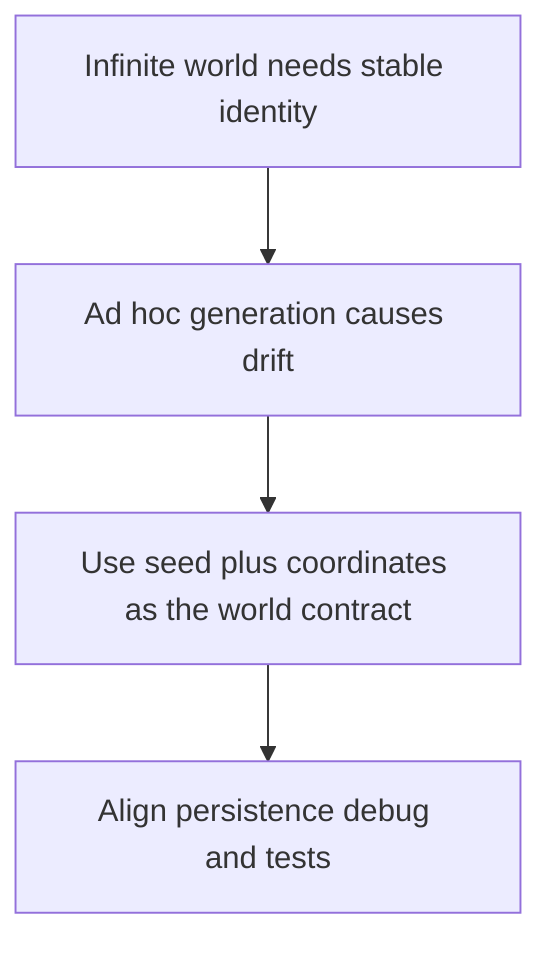

## adr_005_make_world_identity_deterministic_from_seed_and_coordinates - Make world identity deterministic from seed and coordinates
> Date: 2026-03-17
> Status: Accepted
> Drivers: Keep world generation reproducible; align map, persistence, tests, and debug scenarios; avoid hidden world-state ambiguity.
> Related request: `req_001_render_top_down_infinite_chunked_world_map`, `req_008_define_infinite_chunked_world_generation_model`, `req_009_define_local_persistence_and_save_strategy`
> Related backlog: `item_005_define_deterministic_chunked_world_model_and_seed_contract`
> Related task: (none yet)
> Reminder: Update status, linked refs, decision rationale, consequences, migration plan, and follow-up work when you edit this doc.

# Overview
World identity is deterministic. A global seed plus stable coordinates define chunk identity and debug scenarios. The same inputs should yield the same world outcomes.

# Context
The project already points toward an infinite chunked world with deterministic scenarios, local persistence, and automated testing. Those goals all benefit from one common rule: the world should be reproducible from stable identifiers instead of behaving like an opaque mutable surface.

# Decision
- The project introduces a global world seed as a first-class identity input.
- Chunk identity is derived from chunk coordinates and the seed, not from incidental runtime order.
- Deterministic debug scenarios should rely on the same contract where practical.
- Persistence should prefer storing stable identity inputs and derived state deltas rather than opaque snapshot data when a deterministic rebuild is sufficient.

# Alternatives considered
- Let world identity emerge from runtime state only. This was rejected because reproducibility and debugging would suffer.
- Persist full world snapshots by default. This was rejected because it is heavier and less transparent at the current project stage.

# Consequences
- Debugging and testing become more reliable because world state is reproducible.
- Generation and persistence will share a clearer contract.
- Later changes to generation rules may need migration thinking because determinism increases compatibility expectations.

# Migration and rollout
- Apply seed and coordinate determinism immediately in chunk and scenario design.
- If exceptions are needed later, document them explicitly instead of quietly breaking determinism.

# References
- `req_001_render_top_down_infinite_chunked_world_map`
- `req_008_define_infinite_chunked_world_generation_model`
- `req_009_define_local_persistence_and_save_strategy`
- `req_013_define_frontend_testing_strategy_for_rendering_simulation_and_world_logic`

# Follow-up work
- Add debug visibility for current seed and chunk identity.
