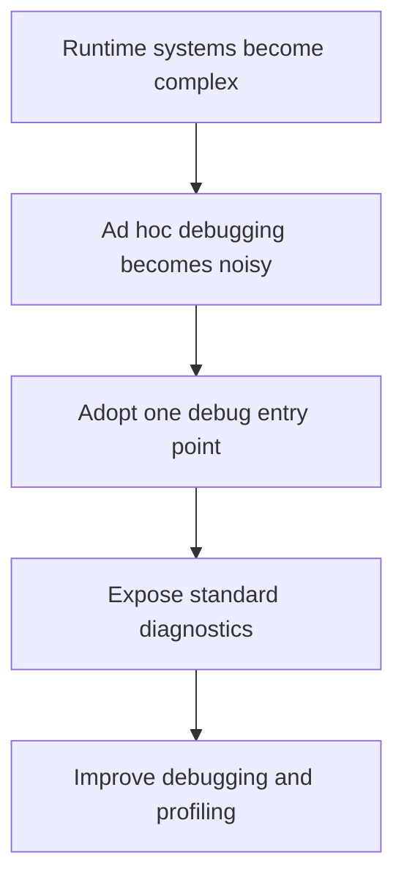

## adr_006_standardize_debug_first_runtime_instrumentation - Standardize debug-first runtime instrumentation
> Date: 2026-03-17
> Status: Accepted
> Drivers: Make rendering and world issues diagnosable early; avoid one-off debug code; keep diagnostics coherent across shell, map, entities, and simulation.
> Related request: `req_000_bootstrap_fullscreen_2d_react_pwa_shell`, `req_012_define_performance_budgets_profiling_and_diagnostics`, `req_002_render_evolving_world_entities_on_the_map`
> Related backlog: `item_003_add_render_diagnostics_fallback_handling_and_shell_preferences`, `item_008_add_map_diagnostics_picking_and_camera_reset_workflow`
> Related task: (none yet)
> Reminder: Update status, linked refs, decision rationale, consequences, migration plan, and follow-up work when you edit this doc.

# Overview
The runtime is debug-first. Diagnostics are exposed through a standard entry point in development and preview-like environments, not through scattered ad hoc helpers.

# Context
The project already depends on camera math, chunk visibility, entity movement, fullscreen behavior, and performance constraints. Those systems are difficult to inspect without deliberate instrumentation. Earlier requests already ask for overlays, metrics, and reset actions, so the architecture should formalize that posture.

# Decision
- Diagnostics should be available through a single standard shell-level or runtime-level debug entry point.
- Development and preview-style environments should expose runtime diagnostics by default or through simple toggles.
- Production builds should not expose always-on diagnostics by default.
- Standard diagnostics should cover at least viewport or camera state, chunk or world state, and core movement or performance signals.
- Debug overlays, reset actions, and inspection panels should be structured features, not temporary one-off code.

# Alternatives considered
- Add debug output only when needed per feature. This was rejected because it produces fragmentation and weak reuse.
- Hide most diagnostics in browser devtools only. This was rejected because in-world and touch-heavy systems benefit from in-app visibility.

# Consequences
- Debugging becomes more systematic and more reusable across requests.
- The runtime will carry some instrumentation overhead in development, but that is an intentional tradeoff.

# Migration and rollout
- Apply the shared debug-entry approach from the shell onward.
- Fold feature-specific debug output into the common system as features are added.

# References
- `req_000_bootstrap_fullscreen_2d_react_pwa_shell`
- `req_001_render_top_down_infinite_chunked_world_map`
- `req_002_render_evolving_world_entities_on_the_map`
- `req_012_define_performance_budgets_profiling_and_diagnostics`

# Follow-up work
- Define the initial standard diagnostic set and toggles in backlog work.
