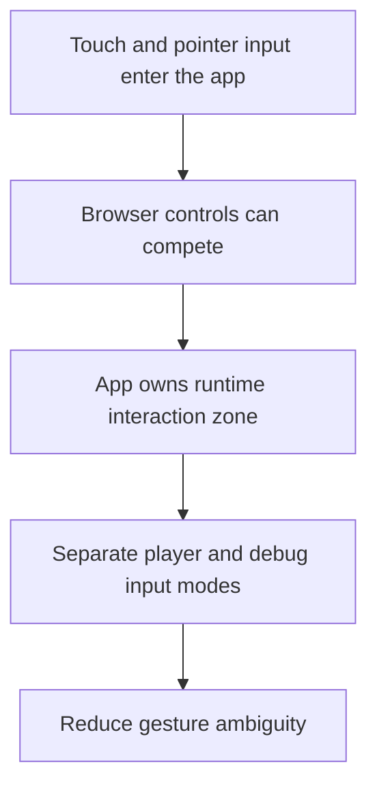

## adr_007_isolate_runtime_input_from_browser_page_controls - Isolate runtime input from browser page controls
> Date: 2026-03-17
> Status: Accepted
> Drivers: Prevent scroll and gesture conflicts; preserve fullscreen-style ownership; keep player input and debug input separated inside the app.
> Related request: `req_000_bootstrap_fullscreen_2d_react_pwa_shell`, `req_006_define_player_interactions_for_world_and_entities`, `req_014_define_world_occupancy_navigation_and_interaction_rules`
> Related backlog: `item_001_implement_fullscreen_viewport_ownership_and_input_isolation`
> Related task: (none yet)
> Reminder: Update status, linked refs, decision rationale, consequences, migration plan, and follow-up work when you edit this doc.

# Overview
The app should own runtime input inside the render surface and neutralize page-level browser controls where web-platform rules allow it. Player input and developer/debug input must remain conceptually distinct.

# Context
The project targets fullscreen-style use on mobile and desktop. Touch drag, world navigation, entity control, and debug gestures will all suffer if scroll, overscroll, pull-to-refresh, or mixed interaction ownership remains uncontrolled. The requests already point toward input isolation, but that deserves an ADR because it is a platform rule.

# Decision
- Inside the owned runtime surface, the app should suppress browser-page interactions such as scrolling, overscroll chaining, and accidental text selection where platform controls allow it.
- The project should distinguish player-facing input from developer/debug input even when both can affect the same runtime.
- Player input should have priority in player-facing modes, while debug input should enter through explicit toggles, modes, or developer-facing affordances.
- Browser or OS reserved controls remain out of scope and should not be treated as overridable runtime responsibilities.

# Alternatives considered
- Let browser behavior coexist with runtime gestures. This was rejected because mobile control quality would degrade immediately.
- Fully rely on browser fullscreen and gesture suppression semantics without app-level rules. This was rejected because the app still needs its own ownership model.

# Consequences
- Input handling remains clearer across map, entity, and debug features.
- Some debug capabilities may need explicit mode switching instead of being always available in the same gesture space.

# Migration and rollout
- Apply this rule from the shell bootstrap onward.
- Keep new interactions explicit about whether they are player-facing or debug-facing.

# References
- `req_000_bootstrap_fullscreen_2d_react_pwa_shell`
- `req_006_define_player_interactions_for_world_and_entities`
- `req_011_define_ui_hud_and_overlay_system`

# Follow-up work
- Reflect this separation in interaction backlog items and debug controls.
