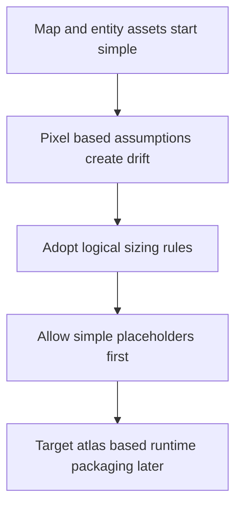

## adr_008_define_asset_logical_sizing_and_runtime_packaging_rules - Define asset logical sizing and runtime packaging rules
> Date: 2026-03-17
> Status: Accepted
> Drivers: Keep map and entity rendering consistent; avoid pixel-density coupling; give assets a pragmatic path from placeholders to production packaging.
> Related request: `req_005_define_asset_pipeline_for_map_and_entities`, `req_001_render_top_down_infinite_chunked_world_map`, `req_002_render_evolving_world_entities_on_the_map`
> Related backlog: (none yet)
> Related task: (none yet)
> Reminder: Update status, linked refs, decision rationale, consequences, migration plan, and follow-up work when you edit this doc.

# Overview
Assets use stable logical sizing independent of source pixels. Early placeholders may remain unitary files, but the target runtime packaging model should assume atlases or spritesheets as the asset set grows.

# Context
The project already depends on stable world units, entity footprints, camera zoom, and chunk rendering. If source-image pixels become the de facto world size contract, rendering behavior will drift and asset replacement will get harder. The requests also already suggest a pragmatic path from simple placeholders to more structured runtime packaging.

# Decision
- Asset meaning is defined in logical world or UI sizing terms, not in raw source-image pixel size.
- Map and entity assets should align with one coherent logical sizing model.
- Simple standalone placeholder assets are acceptable early in development when they speed iteration.
- Atlases or spritesheets are the preferred target runtime packaging model once asset count and performance considerations justify them.
- Asset packaging rules should remain compatible with static frontend bundling and PWA delivery constraints.

# Alternatives considered
- Let each asset implicitly define its own runtime size from its source pixels. This was rejected because camera and world math would become inconsistent.
- Require final atlas packaging immediately. This was rejected because it would slow early iteration unnecessarily.

# Consequences
- Asset replacement becomes safer because logical meaning stays stable.
- Runtime packaging can mature without rewriting the world or entity renderer contracts.

# Migration and rollout
- Apply logical sizing rules immediately for placeholder assets.
- Move toward atlas-based runtime packaging incrementally as the asset library grows.

# References
- `req_005_define_asset_pipeline_for_map_and_entities`
- `req_001_render_top_down_infinite_chunked_world_map`
- `req_002_render_evolving_world_entities_on_the_map`

# Follow-up work
- Define initial logical tile and sprite sizing conventions in asset backlog work.
