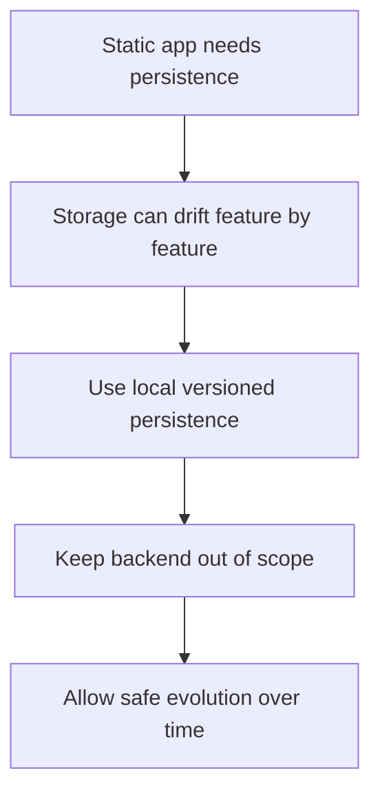

## adr_009_limit_persistence_to_local_versioned_frontend_storage - Limit persistence to local versioned frontend storage
> Date: 2026-03-17
> Status: Accepted
> Drivers: Stay aligned with the frontend-only architecture; avoid ad hoc storage sprawl; preserve save compatibility as persistence grows.
> Related request: `req_009_define_local_persistence_and_save_strategy`, `req_003_create_render_static_free_plan_blueprint`, `req_000_bootstrap_fullscreen_2d_react_pwa_shell`
> Related backlog: (none yet)
> Related task: (none yet)
> Reminder: Update status, linked refs, decision rationale, consequences, migration plan, and follow-up work when you edit this doc.

# Overview
Persistence is local and versioned. The project does not assume backend saves. Initial scope stays limited to preferences, seed, camera state, and similarly bounded local data.

# Context
The project is intentionally static and frontend-only. Several requests already need persistence, but they do not require accounts or server-side state. Without a clear boundary, local storage decisions would spread informally and become harder to evolve.

# Decision
- Persistence is local-only unless a later ADR changes that scope.
- Persisted data must carry an explicit version so migrations, resets, or invalidation can be handled intentionally.
- Initial persistence scope should stay narrow and predictable: preferences, world seed, camera state, and other bounded local state.
- Features should not silently add persistent storage without aligning with the shared local-save model.

# Alternatives considered
- Allow each feature to persist whatever it wants ad hoc. This was rejected because compatibility and debugging would degrade.
- Plan for backend persistence now. This was rejected because it contradicts the current platform scope.

# Consequences
- Local persistence remains compatible with the static deployment model.
- Save evolution can be reasoned about earlier instead of after drift has accumulated.

# Migration and rollout
- Apply version markers from the first persisted data.
- Keep new persistence additions aligned with the shared model.

# References
- `req_009_define_local_persistence_and_save_strategy`
- `req_003_create_render_static_free_plan_blueprint`
- `req_015_define_release_workflow_and_deployment_operations`

# Follow-up work
- Define the initial local-save schema boundaries and migration policy.
