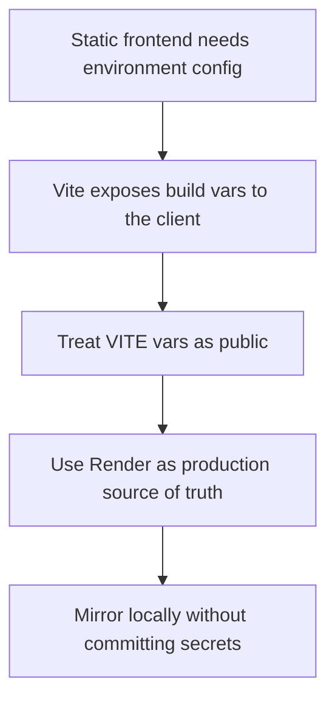

## adr_010_treat_render_build_variables_as_public_frontend_configuration - Treat Render build variables as public frontend configuration
> Date: 2026-03-17
> Status: Accepted
> Drivers: Keep Vite env usage safe; align local and Render builds; distinguish frontend config from local service tooling; avoid pretending public frontend variables are secrets.
> Related request: `req_003_create_render_static_free_plan_blueprint`, `req_004_prepare_github_actions_ci_pipeline`, `req_015_define_release_workflow_and_deployment_operations`
> Related backlog: `item_015_define_frontend_env_mirroring_and_render_build_variable_contract`
> Related task: `task_004_define_render_static_site_blueprint_and_build_contract`, `task_015_orchestrate_static_delivery_and_ci_hardening`
> Reminder: Update status, linked refs, env-family contract, decision rationale, consequences, migration plan, and follow-up work when you edit this doc.

# Overview
Frontend build variables exposed through Vite are public configuration. Render is the source of truth for production build-time values. Local `.env.production` is a non-versioned mirror for reproduction only, and local non-`VITE_*` Render service variables may coexist there for tooling.

# Context
The repository already uses `.env` files and has a Render static-site request. The user explicitly clarified that `.env.production` should mirror Render values locally without being versioned. That is a useful platform rule and should be fixed as an ADR because env misuse is a common source of confusion.

# Decision
- Any `VITE_*` variable consumed by the frontend is treated as public configuration, not as a secret.
- Render-managed build-time variables are the production source of truth.
- `.env.example` documents expected frontend variables and is versioned.
- `.env.local` and `.env.production` are non-versioned local files.
- `.env.production` is a local reproduction mirror, not an authoritative deployment source.
- Local non-`VITE_*` variables such as `RENDER_*` may exist in non-versioned env files for tooling or service operations, but they are not frontend configuration.

# Alternatives considered
- Treat frontend env vars as if they were secrets. This was rejected because Vite embeds them into the client build.
- Commit `.env.production` as deployment configuration. This was rejected because it weakens safety and clarity.

# Consequences
- Delivery documentation stays clearer and safer.
- Team members should stop expecting frontend env vars to provide secret storage.
- Local env files can document both public frontend config and non-public service-tooling inputs without implying that both are shipped to the client.

# Migration and rollout
- Apply this rule immediately in env docs, CI, and Render setup.
- Reject new delivery patterns that imply secret frontend build vars.

# References
- `req_003_create_render_static_free_plan_blueprint`
- `req_004_prepare_github_actions_ci_pipeline`
- `.env.example`
- `render.yaml`

# Follow-up work
- Reflect this contract in the eventual `render.yaml` and CI documentation.
