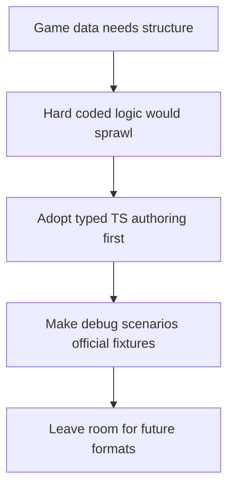

## adr_011_use_typed_typescript_as_the_initial_data_and_config_authoring_model - Use typed TypeScript as the initial data and config authoring model
> Date: 2026-03-17
> Status: Accepted
> Drivers: Keep iteration fast; avoid hard-coded drift without overbuilding a content pipeline too early; make debug scenarios first-class and typed.
> Related request: `req_010_define_game_data_and_configuration_model`, `req_013_define_frontend_testing_strategy_for_rendering_simulation_and_world_logic`, `req_005_define_asset_pipeline_for_map_and_entities`
> Related backlog: (none yet)
> Related task: (none yet)
> Reminder: Update status, linked refs, decision rationale, consequences, migration plan, and follow-up work when you edit this doc.

# Overview
The initial authoring model for game data and configuration is typed TypeScript. Reproducible debug scenarios are official data artifacts, not throwaway developer snippets. Additional external data-file formats may come later.

# Context
The project needs a coherent way to represent config, scenarios, asset references, and debug data without overbuilding an editor or external data pipeline. Requests already point toward TypeScript-backed config and first-class deterministic scenarios. That choice is architectural enough to deserve its own ADR.

# Decision
- Initial game data and configuration authoring uses typed TypeScript modules.
- Debug scenarios are official, reusable data artifacts and may be shared by runtime, tests, and diagnostics.
- Static data should still remain clearly separated from executable world or entity logic, even when both live in TypeScript.
- Additional data-file formats such as JSON may be introduced later if they add value, but they are not the baseline now.

# Alternatives considered
- Use JSON or loose data files everywhere immediately. This was rejected because it adds validation overhead too early.
- Keep content embedded directly in feature logic. This was rejected because it would create drift and weaken testability.

# Consequences
- Iteration stays fast while type safety remains strong.
- Debug scenarios can become shared fixtures across product, testing, and diagnostics.
- A later move to other authoring formats will require deliberate migration instead of silent drift.

# Migration and rollout
- Apply this rule to initial config, scenarios, and content references.
- Keep data modules explicit and domain-owned rather than mixing them directly into feature control flow.

# References
- `req_010_define_game_data_and_configuration_model`
- `req_013_define_frontend_testing_strategy_for_rendering_simulation_and_world_logic`
- `prod_000_initial_single_entity_navigation_loop`

# Follow-up work
- Define the first official scenario and config folders in backlog work.
