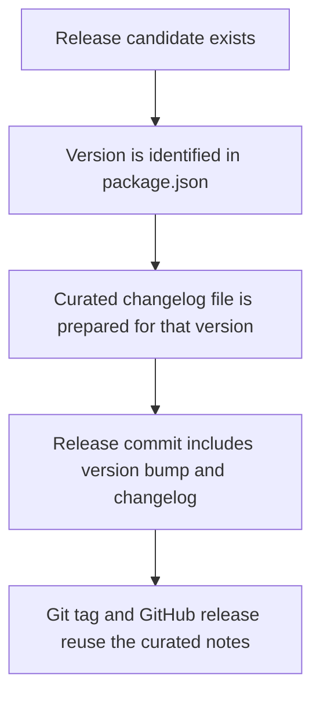

## adr_012_require_curated_versioned_changelogs_for_releases - Require curated versioned changelogs for releases
> Date: 2026-03-17
> Status: Accepted
> Drivers: Keep releases understandable; align release notes with completed work; prevent informal or undocumented version bumps.
> Related request: `req_015_define_release_workflow_and_deployment_operations`
> Related backlog: `item_059_define_semantic_versioning_and_changelog_operating_model`
> Related task: `task_012_define_semantic_versioning_and_changelog_operating_model`
> Reminder: Update status, linked refs, decision rationale, consequences, migration plan, and follow-up work when you edit this doc.

# Overview
Every tagged release must have a curated changelog file that matches the released version. Releases are blocked if the changelog is missing or out of date.

# Context
The project already intends to use lightweight semantic versioning and a simple changelog discipline. The user explicitly clarified that future releases must always ship with an up-to-date changelog. That rule affects release readiness, version bump practice, and GitHub release hygiene, so it should be fixed as an ADR rather than left as an informal habit.

Reference projects on the user's GitHub account already point in this direction: curated versioned changelog files exist in both `sentry` and `electrical-plan-editor`, with `sentry` adding a more explicit operational contract around them. This repository should adopt the same curated-per-version approach from the start.

# Decision
- Release version identity follows lightweight semantic versioning.
- `package.json` is the source of truth for the current application version.
- Every release version `X.Y.Z` must have a curated changelog file named `changelogs/CHANGELOGS_X_Y_Z.md`.
- The release commit must include the version bump and the corresponding changelog update together.
- A release is blocked if the changelog file for the target version is missing or stale.
- Git tags use the form `vX.Y.Z`.
- GitHub release notes should reuse the curated changelog content when available rather than relying only on auto-generated notes.

# Alternatives considered
- Rely only on Git commit history or GitHub-generated release notes. This was rejected because it makes release communication noisy and inconsistent.
- Keep one rolling changelog file. This was rejected because the user's existing repos already use per-version changelog files and that model is easier to map to release tags.
- Allow releases before changelog curation. This was rejected because it creates undocumented shipped states.

# Consequences
- Release readiness becomes stricter but clearer.
- Version bumps and changelog updates need to be prepared intentionally as part of release work.
- GitHub releases stay aligned with the actual shipped version rather than with a best-effort summary.

# Migration and rollout
- Apply this rule before the first tagged release of the repository.
- Add a `changelogs/` folder and use the per-version naming convention from the first release onward.
- Reflect this rule in release backlog items, tasks, and any future release scripts or CI guards.

# References
- `req_015_define_release_workflow_and_deployment_operations`
- `item_059_define_semantic_versioning_and_changelog_operating_model`
- `task_012_define_semantic_versioning_and_changelog_operating_model`

# Follow-up work
- Add release-task validation that checks the presence of the expected versioned changelog file.
- Add the initial `changelogs/` structure before the first release implementation slice.
