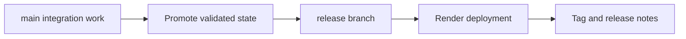

## adr_013_use_a_dedicated_release_branch_for_deployable_static_releases - Use a dedicated release branch for deployable static releases
> Date: 2026-03-17
> Status: Accepted
> Drivers: Separate day-to-day integration from deployable states; keep release promotion explicit; align deployment with a controlled release workflow.
> Related request: `req_003_create_render_static_free_plan_blueprint`, `req_004_prepare_github_actions_ci_pipeline`, `req_015_define_release_workflow_and_deployment_operations`
> Related backlog: `item_014_define_render_static_site_blueprint_and_build_contract`, `item_058_define_release_readiness_gates_and_deployable_artifact_identification`, `item_059_define_semantic_versioning_and_changelog_operating_model`
> Related task: `task_004_define_render_static_site_blueprint_and_build_contract`, `task_012_define_semantic_versioning_and_changelog_operating_model`
> Reminder: Update status, linked refs, decision rationale, consequences, migration plan, and follow-up work when you edit this doc.

# Overview
Deployable releases must come from a dedicated `release` branch rather than directly from `main`. The deployment branch represents curated release-ready states, not the full stream of integration work.

# Context
The repository already has separate requests for static delivery, CI, and release operations. Earlier documentation used a simpler `main`-driven deployment assumption, but the project now wants releases to be promoted through a dedicated branch named `release`.

That changes the delivery contract in a meaningful way. It affects Render configuration, release readiness, changelog discipline, and CI expectations. If left implicit, documents will keep contradicting each other and deployment automation will be harder to design later.

# Decision
- `main` remains the primary integration branch for day-to-day development.
- `release` is the dedicated branch for deployable static releases.
- Render production deployment must target the `release` branch rather than `main`.
- A deployable release candidate must be promoted intentionally onto `release`, not deployed automatically from ordinary integration work.
- Release-oriented documentation, changelog preparation, and tags should reflect the state carried by `release`.

# Alternatives considered
- Deploy directly from `main`. This was rejected because it conflates integration flow with curated release flow.
- Use tags only without a dedicated branch. This was rejected because the project explicitly wants a stable named branch to carry release-ready states.

# Consequences
- Deployment promotion becomes clearer and more intentional.
- Delivery docs and CI need to recognize `release` as a first-class branch.
- The repository now has a stronger distinction between integration work and deployable states.

# Migration and rollout
- Replace `main`-driven deployment language with `release`-driven deployment language in delivery and release docs.
- Configure Render to deploy from `release` when implementation begins.
- Keep CI compatible with both ordinary integration work and release-branch validation.

# References
- `req_003_create_render_static_free_plan_blueprint`
- `req_015_define_release_workflow_and_deployment_operations`
- `item_014_define_render_static_site_blueprint_and_build_contract`
- `item_059_define_semantic_versioning_and_changelog_operating_model`

# Follow-up work
- Reflect the `release` branch in the eventual `render.yaml`.
- Add release-branch expectations to CI and release tasks.
