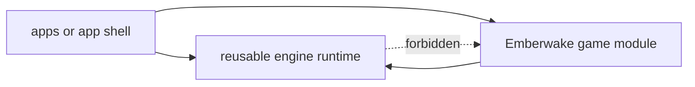

## adr_014_adopt_a_modular_app_engine_game_topology_with_one_way_dependencies - Adopt a modular app engine game topology with one way dependencies
> Date: 2026-03-20
> Status: Proposed
> Drivers: Make runtime reuse possible without freezing Emberwake delivery; prevent gameplay rules from leaking into reusable runtime code; create a migration-safe ownership model for shell, engine, and game modules.
> Related request: `req_018_define_engine_and_gameplay_boundary_for_runtime_reuse`
> Related backlog: `item_070_define_target_repository_topology_for_engine_runtime_and_game_modules`, `item_071_define_engine_to_game_contracts_for_update_render_and_input_integration`, `item_074_define_incremental_migration_and_validation_strategy_for_engine_gameplay_extraction`
> Related task: `task_026_orchestrate_engine_gameplay_boundary_extraction_for_runtime_reuse`
> Reminder: Update status, linked refs, decision rationale, consequences, migration plan, and follow-up work when you edit this doc.

# Overview
The repository should evolve toward a modular structure that separates `app shell`, reusable `engine runtime`, and `Emberwake gameplay` ownership. Dependency flow must remain one way: the app may depend on engine and game modules, the game may depend on engine modules, and engine modules must not depend on Emberwake gameplay modules.

# Context
The current repository already has strong local architecture decisions:
- feature-oriented ownership rather than flat technical buckets
- React ownership of shell and overlays
- Pixi ownership of the interactive runtime surface
- explicit camera and coordinate-space contracts

Those rules have been sufficient for the first playable foundation, but the repository now has a new pressure: it needs to keep shipping Emberwake while also making the runtime reusable for later top-down 2D web games.

At the moment, `src/game` still mixes both kinds of concerns:
- reusable runtime capabilities such as camera primitives, world-view transforms, runtime surface wiring, low-level input math, and technical diagnostics
- Emberwake-owned gameplay and content such as scenario data, entity behavior meaning, world flavor, and player-facing game rules

If that mixture continues, the codebase will drift into an awkward middle state where the runtime is too coupled to Emberwake to reuse cleanly, but Emberwake is also slowed down by premature attempts at generic abstractions. The boundary needs to be explicit before broad extraction work begins.

The project does not need a universal engine. It needs a reusable runtime posture specialized enough to stay practical for web 2D top-down games. That narrower target should shape both topology and dependency rules.

# Decision
- Adopt a modular ownership model with three primary zones:
  - `app shell`: web entrypoints, React shell wiring, release or delivery integration, and system overlays
  - `engine runtime`: reusable runtime primitives and adapters that do not encode Emberwake fiction or gameplay rules
  - `game module`: Emberwake-owned gameplay, content, scenario definitions, and game-facing presentation rules
- Treat a same-repository modular structure as the preferred first target. A topology close to `apps/emberwake-web`, `packages/engine-core`, `packages/engine-pixi`, and `games/emberwake` is the recommended default.
- Keep dependency direction one way:
  - `app shell -> engine runtime`
  - `app shell -> game module`
  - `game module -> engine runtime`
  - `engine runtime -X-> game module`
- Keep the engine specialized for reusable `web 2D top-down runtime` capabilities rather than designing for unrelated genres by default.
- Put stable runtime concerns such as camera primitives, transforms, simulation cadence helpers, runtime surface ownership, low-level input normalization, and technical diagnostics on the engine side when they are mature enough.
- Keep Emberwake-specific gameplay concerns such as scenario data, authored world flavor, game-state meaning, progression, survival rules, and player-facing content meaning on the game side.
- Keep React shell ownership and Pixi runtime ownership aligned with existing ADRs during and after the migration.
- Allow temporary migration adapters only when they preserve the one-way dependency rule and keep the runtime buildable.

# Alternatives considered
- Keep the current `src/game` ownership model and continue extracting reusable pieces opportunistically. This was rejected because the boundary would remain implicit and drift would continue.
- Split immediately into multiple repositories. This was rejected because it adds operational cost before the code boundary is stable enough to justify it.
- Build a highly generic engine abstraction before continuing Emberwake gameplay work. This was rejected because it would slow delivery and likely overfit imagined future reuse instead of real runtime needs.
- Put most systems into the engine and keep only content files in Emberwake. This was rejected because gameplay rules and state meaning are part of the game, not just its assets.

# Consequences
- The repository gains a clearer long-term ownership model for runtime reuse.
- Extraction work becomes easier to sequence because destination boundaries are explicit.
- Reviews can reject `engine -> game` coupling early instead of noticing it after the fact.
- Some modules that look reusable today may stay in Emberwake until their contracts stabilize, which is acceptable and expected.
- Migration will require temporary adapters and duplicate seams in some places, but those seams become easier to reason about when dependency direction is fixed.

# Migration and rollout
- Start by documenting the target topology and dependency direction before broad file movement.
- Define the minimum engine-to-game contracts for initialization, update flow, input handoff, and render presentation.
- Extract only the first stable runtime primitives into engine-owned boundaries.
- Move Emberwake-specific gameplay, content, and scenario ownership into the game layer in parallel with runtime extraction.
- Keep `npm run ci`, `npm run test:browser:smoke`, and `npm run release:ready` green throughout the staged migration.
- Revisit package publishing, external versioning, or multi-repository extraction only after the in-repository boundary is working in practice.

# References
- `req_018_define_engine_and_gameplay_boundary_for_runtime_reuse`
- `item_070_define_target_repository_topology_for_engine_runtime_and_game_modules`
- `item_071_define_engine_to_game_contracts_for_update_render_and_input_integration`
- `item_072_extract_reusable_runtime_primitives_from_current_game_modules`
- `item_073_separate_emberwake_specific_gameplay_content_and_scenarios_from_runtime_code`
- `item_074_define_incremental_migration_and_validation_strategy_for_engine_gameplay_extraction`
- `task_026_orchestrate_engine_gameplay_boundary_extraction_for_runtime_reuse`

# Follow-up work
- Decide whether the repository will materialize the modular boundary with workspace packages, path aliases, or both in the first migration step.
- Add an explicit contract or spec for engine-to-game initialization, update, input, and render integration.
- Create a migration inventory that classifies current modules as `engine candidate`, `game owned`, or `not stable enough to move yet`.
- Add review guidance or tooling that flags forbidden `engine -> game` imports once the first boundaries are in place.
