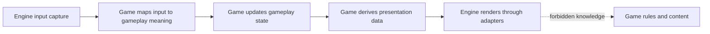

## adr_015_define_engine_to_game_runtime_contract_boundaries - Define engine to game runtime contract boundaries
> Date: 2026-03-20
> Status: Accepted
> Drivers: Prevent gameplay leakage into reusable runtime code; make engine extraction incremental and safe; keep Emberwake delivery moving while engine and game responsibilities separate.
> Related request: `req_018_define_engine_and_gameplay_boundary_for_runtime_reuse`
> Related backlog: `item_071_define_engine_to_game_contracts_for_update_render_and_input_integration`, `item_072_extract_reusable_runtime_primitives_from_current_game_modules`, `item_073_separate_emberwake_specific_gameplay_content_and_scenarios_from_runtime_code`
> Related task: `task_026_orchestrate_engine_gameplay_boundary_extraction_for_runtime_reuse`
> Reminder: Update status, linked refs, decision rationale, consequences, migration plan, and follow-up work when you edit this doc.

# Overview
The runtime boundary between `engine` and `game` should stay narrow. The engine owns runtime orchestration, normalized input, stable simulation cadence, and rendering adapters. The game owns gameplay meaning, game state, content rules, and presentation data derived from that state. The engine must not depend on Emberwake gameplay types or rules.

# Context
The repository is moving toward a modular `app shell`, `engine runtime`, and `game module` topology. That topology will fail in practice if the code boundary remains vague. The most important next decision is therefore not only where files live, but what each side is allowed to know.

The current runtime already exposes the kinds of concerns that need to be separated:
- low-level input capture and gesture normalization
- fixed-step simulation cadence
- camera and transform primitives
- runtime surface and renderer wiring
- gameplay state and entity behavior
- world flavor, scenario data, and player-facing meaning

If the engine owns too much, gameplay work becomes slow and over-abstracted. If the game owns too much, reusable runtime primitives remain trapped in Emberwake-specific modules. The solution is a narrow contract that keeps the boundary explicit and forces data to cross it in one direction through well-defined seams.

This decision also needs to stay aligned with existing architecture:
- React still owns shell and system overlays
- Pixi still owns the interactive runtime surface
- coordinate spaces and fixed-step simulation remain first-class runtime concerns
- input ownership remains explicit and must not regress into ad hoc gesture rules

The goal is not a plugin-heavy framework. The goal is a practical runtime contract for web 2D top-down games that Emberwake can use immediately.

# Decision
- The engine owns:
  - runtime bootstrap and orchestration
  - normalized low-level input capture
  - fixed-step or frame execution cadence primitives
  - camera and coordinate-space primitives
  - renderer adapters and runtime surface ownership
  - technical diagnostics that do not depend on Emberwake content meaning
- The game owns:
  - gameplay state shape and meaning
  - gameplay rules and update logic
  - entity archetypes, world flavor, and authored content
  - scenario data and progression logic
  - presentation data derived from gameplay state
  - player-facing meaning of actions, statuses, and systems
- The minimum engine-to-game contract should stay narrow and centered on four responsibilities:
  - `initialize`: the game creates its initial gameplay state and any game-owned bootstrap configuration the runtime needs
  - `map input`: the game translates normalized engine input into gameplay-meaningful actions or intents
  - `update`: the game advances gameplay state from prior state, mapped input, and engine-provided timing
  - `present`: the game derives engine-consumable presentation data from gameplay state
- The engine may provide generic input frames, timing signals, camera services, and renderer hooks, but it must not interpret those as Emberwake-specific verbs.
- The game may depend on engine primitives, but the engine must not import game state unions, entity contracts, content definitions, or scenario data.
- Presentation data crossing from game to engine should be descriptive rather than rule-bearing. The engine can render `what is visible`, but not decide `what it means`.
- Contracts should be expressed through stable TypeScript interfaces or equivalent module boundaries once implementation begins, but the architecture decision comes first.
- The first contract should avoid speculative plugin systems, lifecycle registries, or universal content schemas unless later reuse proves they are necessary.

# Alternatives considered
- Let the engine call directly into Emberwake gameplay modules with no explicit contract. This was rejected because it preserves hidden coupling and makes reuse fragile.
- Put update logic in the engine and keep only content data in the game. This was rejected because gameplay rules are part of the game, not just its assets.
- Put rendering decisions entirely in the game and treat the engine as only a shell. This was rejected because runtime surfaces, transforms, and render adapters are reusable concerns.
- Design a broad plugin architecture immediately. This was rejected because it adds ceremony before the real reusable seams have stabilized.

# Consequences
- Engine modules become easier to reuse because they stop depending on Emberwake meaning.
- Gameplay modules become more explicit because they must own their own state, rules, and presentation shaping.
- Some existing types will need to be split into `engine primitive`, `gameplay state`, and `presentation data` layers.
- The first implementation may include adapters that feel repetitive, but that repetition is preferable to hidden coupling at this stage.
- Later games will have a clearer template for integrating with the runtime without copying Emberwake-specific internals.

# Migration and rollout
- Accept this contract boundary before broad extraction of runtime primitives.
- Start by identifying current modules that already fit one of the four contract responsibilities: `initialize`, `map input`, `update`, or `present`.
- Extract engine-owned primitives first where they already have stable contracts.
- Move Emberwake-specific gameplay and scenario logic behind game-owned boundaries in parallel.
- Introduce implementation-level interfaces only after the ownership boundary is agreed and documented.
- Keep `npm run ci` and `npm run test:browser:smoke` green while adapters and boundaries are introduced incrementally, and rerun `npm run release:ready` from the `release` branch before deployment promotion.

# References
- `req_018_define_engine_and_gameplay_boundary_for_runtime_reuse`
- `item_071_define_engine_to_game_contracts_for_update_render_and_input_integration`
- `item_072_extract_reusable_runtime_primitives_from_current_game_modules`
- `item_073_separate_emberwake_specific_gameplay_content_and_scenarios_from_runtime_code`
- `task_026_orchestrate_engine_gameplay_boundary_extraction_for_runtime_reuse`

# Follow-up work
- Refine presentation or input contract shapes only if a second game or denser Emberwake gameplay makes the first contract too broad.
- Keep boundary guidance active in code review so new modules do not reintroduce engine knowledge of Emberwake gameplay rules.
