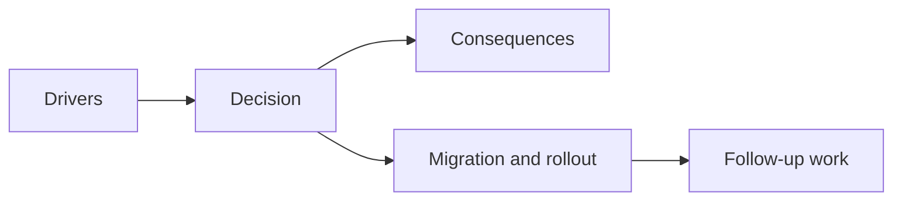

## adr_016_define_shell_scene_state_and_meta_surface_ownership - Define shell scene state and meta surface ownership
> Date: 2026-03-28
> Status: Accepted
> Drivers: Prevent `AppShell` from becoming an unstructured controller; keep runtime state ownership separate from shell state; make boot, runtime, failure, pause, and settings states explicit before more player-facing surfaces appear.
> Related request: `req_020_define_the_next_architecture_wave_for_app_state_loading_content_rendering_and_boundary_enforcement`
> Related backlog: `item_082_define_scene_and_app_state_architecture_for_boot_flow_runtime_pause_and_meta_surfaces`
> Related task: `task_028_orchestrate_the_next_architecture_wave_for_app_state_loading_content_rendering_and_boundary_enforcement`
> Reminder: Update status, linked refs, decision rationale, consequences, migration plan, and follow-up work when you edit this doc.

# Overview
The web shell should own high-level application scene state and shell-only meta-surfaces. Gameplay runtime state must remain game-owned. The shell scene model should explicitly cover `boot`, `runtime`, `pause`, `failure`, and `settings`, even if not every surface is fully implemented yet.

# Context
Runtime convergence removed the biggest ambiguity from the simulation loop, but it did not solve the broader shell question. Without a shell-level scene model, every new surface risks being bolted directly into `AppShell` through local booleans and effect chains.

That would recreate the same kind of architectural drift that the runtime-convergence wave just removed:
- shell lifecycle state would mix with gameplay state
- menu or settings surfaces would grow opportunistically
- failure handling would stay coupled to renderer-specific details
- future pause or meta-surface work would lack a shared entry model

The shell does not need a heavyweight router. It needs an explicit scene contract that says what the shell is allowed to own and what must stay inside the runtime.

# Decision
- Treat `boot`, `runtime`, `pause`, `failure`, and `settings` as the primary shell-scene vocabulary.
- Keep shell-scene selection in app-owned modules, not in game runtime state.
- Keep shell-only surfaces such as the menu, diagnostics panel host, inspection panel host, install prompts, and fullscreen controls under shell ownership.
- Keep gameplay state, gameplay pause semantics, and player-facing simulation meaning in the game module and runtime contract.
- Use a lightweight shell-scene model rather than introducing route-level ceremony or a large state machine framework.
- Allow the first implementation to materialize only the currently exercised states (`boot`, `runtime`, `failure`) while reserving `pause` and `settings` in the contract so future work extends the model instead of bypassing it.

# Alternatives considered
- Keep using local booleans in `AppShell` without a scene contract. Rejected because the next meta-surfaces would recreate implicit ownership drift.
- Put shell-scene state inside the game runtime. Rejected because menu, install, fullscreen, and renderer-failure handling are shell concerns, not gameplay concerns.
- Introduce a broad routing or global-state framework immediately. Rejected because current needs are narrower and do not justify the extra ceremony.

# Consequences
- Scene ownership becomes explicit before the shell grows more complex.
- Runtime failure and boot states gain a stable shell-owned entry model.
- Future pause or settings surfaces can plug into an existing scene vocabulary instead of inventing their own flags.
- `AppShell` still composes the application, but it no longer has to invent scene ownership ad hoc.

# Migration and rollout
- Use a small app-scene contract and shell hook as the first implementation.
- Move shell-menu open or close state under shell ownership instead of keeping it embedded inside the menu component.
- Introduce runtime-scene boundaries that can render boot or failure posture without moving gameplay state into the shell.
- Extend the scene model only when new meta-surfaces become real product needs.

# References
- `req_020_define_the_next_architecture_wave_for_app_state_loading_content_rendering_and_boundary_enforcement`
- `item_082_define_scene_and_app_state_architecture_for_boot_flow_runtime_pause_and_meta_surfaces`
- `task_028_orchestrate_the_next_architecture_wave_for_app_state_loading_content_rendering_and_boundary_enforcement`
- `adr_002_separate_react_shell_from_pixi_runtime_ownership`
- `adr_015_define_engine_to_game_runtime_contract_boundaries`

# Follow-up work
- Add explicit `pause` and `settings` surfaces only when they have product requirements, but keep them inside the shell-scene contract.
- Revisit shell-scene transitions if future meta-surfaces need richer recovery or deep-linking behavior.
