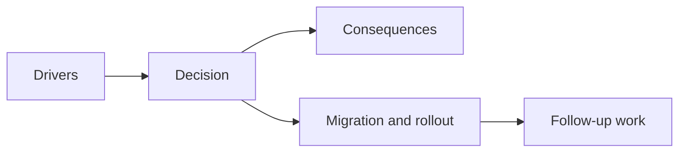

## adr_018_validate_emberwake_content_as_a_typed_cross_catalog_graph - Validate Emberwake content as a typed cross catalog graph
> Date: 2026-03-28
> Status: Accepted
> Drivers: Keep content growth safe without building a heavyweight content platform; make ids and references explicit across gameplay, entities, world data, scenarios, and assets; centralize content validation posture.
> Related request: `req_020_define_the_next_architecture_wave_for_app_state_loading_content_rendering_and_boundary_enforcement`
> Related backlog: `item_084_define_content_authoring_and_validation_architecture_for_gameplay_world_and_entity_data`
> Related task: `task_028_orchestrate_the_next_architecture_wave_for_app_state_loading_content_rendering_and_boundary_enforcement`
> Reminder: Update status, linked refs, decision rationale, consequences, migration plan, and follow-up work when you edit this doc.

# Overview
Emberwake content should remain authored through typed TypeScript catalogs owned by the game, but validation should happen across catalogs instead of staying isolated inside individual modules. Content correctness is a graph problem, not only a per-file typing problem.

# Context
The project already had typed entity, terrain, and scenario modules, but correctness still depended too heavily on local conventions:
- asset ids had to remain aligned with the shared asset catalog
- entity archetypes and visual kinds had to stay aligned across files
- scenarios had to keep ids unique and references valid
- world references had to remain compatible with runtime expectations

That is enough pressure to justify a central validation pass, but not enough to justify a generic data platform or schema toolchain yet.

# Decision
- Keep Emberwake content authored in typed TypeScript modules inside `games/emberwake/src/content`.
- Treat ids and references as owned catalog keys and namespaces, not free-form strings.
- Validate content through a central cross-catalog pass that checks asset references, archetype defaults, scenario ids, entity ids, and terrain references together.
- Keep validation lightweight and repo-native: module-load assertions plus Vitest coverage are the default posture.
- Keep the architecture Emberwake-specific and pragmatic rather than introducing a speculative generic content platform.

# Alternatives considered
- Keep only local module assertions. Rejected because cross-catalog drift would still accumulate silently.
- Introduce a schema registry and external content format immediately. Rejected because current content scale does not justify that platform cost.
- Move all validation into runtime boot only. Rejected because content correctness should fail earlier than interactive startup.

# Consequences
- Content ownership stays simple and local to the game module.
- Content correctness becomes explicit across catalogs instead of depending on reviewer memory.
- Future gameplay systems can add data on top of an existing validation posture rather than inventing new rules each time.
- The repo keeps TypeScript-first authoring while still gaining graph-level checks.

# Migration and rollout
- Add a game-owned content-authoring contract that documents ownership and validation posture.
- Introduce a central validation entrypoint that checks cross-catalog consistency.
- Keep validation running through tests and module initialization for fast feedback.
- Revisit external schemas only if content editing expands beyond curated TypeScript ownership.

# References
- `req_020_define_the_next_architecture_wave_for_app_state_loading_content_rendering_and_boundary_enforcement`
- `item_084_define_content_authoring_and_validation_architecture_for_gameplay_world_and_entity_data`
- `task_028_orchestrate_the_next_architecture_wave_for_app_state_loading_content_rendering_and_boundary_enforcement`
- `adr_011_use_typed_typescript_as_the_initial_data_and_config_authoring_model`
- `adr_015_define_engine_to_game_runtime_contract_boundaries`

# Follow-up work
- Expand validation to future authored systems such as encounters, loot, or progression only when those systems exist.
- Keep catalog namespaces explicit if additional scenario or content families appear.
