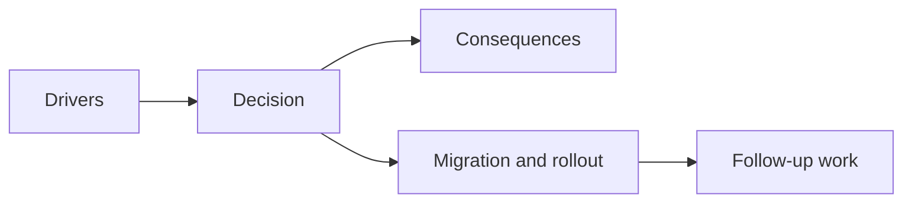

## adr_019_keep_engine_pixi_as_adapter_and_game_as_runtime_scene_composer - Keep engine Pixi as adapter and game as runtime scene composer
> Date: 2026-03-28
> Status: Accepted
> Drivers: Prevent render-layer ownership drift; keep Pixi adapters reusable; let Emberwake own scene meaning and layer order without pushing game meaning into engine modules.
> Related request: `req_020_define_the_next_architecture_wave_for_app_state_loading_content_rendering_and_boundary_enforcement`
> Related backlog: `item_085_define_render_pipeline_and_scene_composition_boundary_between_engine_pixi_and_game_visual_layers`
> Related task: `task_028_orchestrate_the_next_architecture_wave_for_app_state_loading_content_rendering_and_boundary_enforcement`
> Reminder: Update status, linked refs, decision rationale, consequences, migration plan, and follow-up work when you edit this doc.

# Overview
Engine Pixi modules should stay adapter-oriented. The game should own runtime scene composition, layer order, and visual meaning. The engine renders what the game asks for through reusable adapters, but it does not decide Emberwake’s scene structure.

# Context
Runtime convergence clarified the update boundary, but visual composition still had room to drift:
- engine-owned Pixi adapters are reusable and should stay generic
- game-owned world and entity presentation are specific to Emberwake
- future feedback or effects layers could easily end up attached at whichever boundary is most convenient

Without an explicit rule, render-layer ownership would blur again as soon as more feedback or richer visuals appear.

# Decision
- Keep `RuntimeCanvas` and lower-level Pixi viewport adapters engine-owned.
- Keep Emberwake scene composition and runtime layer order game-owned.
- Express current and future runtime render layers through a game-owned contract, even if some future layers are placeholders at first.
- Keep shell overlays such as diagnostics, inspection, and menus outside the runtime canvas and under shell ownership.
- Avoid a heavyweight rendering framework until richer visual systems prove a more formal pipeline is necessary.

# Alternatives considered
- Let engine modules define scene-layer order. Rejected because visual meaning and layer semantics belong to the game.
- Let shell modules own all rendering composition. Rejected because that would pull runtime composition back into app-owned code.
- Introduce a broad render graph abstraction immediately. Rejected because current needs are satisfied by a lighter layer contract.

# Consequences
- Engine Pixi stays reusable and free of Emberwake-specific render semantics.
- The game now has an explicit place to define future world, entity, and feedback layers.
- Shell overlays remain clearly outside runtime rendering.
- Future VFX or feedback systems have a defined place to land without reopening engine ownership questions.

# Migration and rollout
- Add a game-owned render-layer contract with current and future runtime layers.
- Consume that contract from the runtime surface instead of hardcoding layer order ad hoc.
- Keep deeper render-pipeline abstractions out until real visual-system pressure justifies them.

# References
- `req_020_define_the_next_architecture_wave_for_app_state_loading_content_rendering_and_boundary_enforcement`
- `item_085_define_render_pipeline_and_scene_composition_boundary_between_engine_pixi_and_game_visual_layers`
- `task_028_orchestrate_the_next_architecture_wave_for_app_state_loading_content_rendering_and_boundary_enforcement`
- `adr_002_separate_react_shell_from_pixi_runtime_ownership`
- `adr_015_define_engine_to_game_runtime_contract_boundaries`

# Follow-up work
- Add concrete feedback or VFX layers through the game-owned layer contract when those systems become real.
- Revisit engine-side rendering primitives only if multiple games or multiple runtime scenes prove the current adapter set too narrow.
