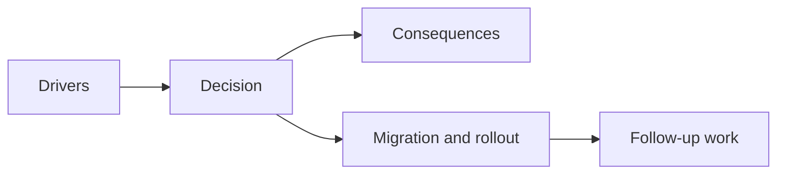

## adr_022_keep_product_meta_flow_shell_owned_while_runtime_state_remains_game_preserved - Keep product meta flow shell owned while runtime state remains game preserved
> Date: 2026-03-28
> Status: Accepted
> Drivers: Make pause, settings, failure, and runtime re-entry explicit before more product surfaces arrive; avoid mixing shell scenes with gameplay state; preserve live session continuity when the player leaves the runtime temporarily.
> Related request: `req_021_define_the_next_runtime_product_and_gameplay_system_architecture_wave`
> Related backlog: `item_088_define_product_meta_flow_architecture_for_pause_settings_failure_and_runtime_reentry`
> Related task: `task_029_orchestrate_runtime_performance_product_meta_flow_and_gameplay_system_architecture`
> Reminder: Update status, linked refs, decision rationale, consequences, migration plan, and follow-up work when you edit this doc.

# Overview
The shell owns product meta-flow scenes such as `pause`, `settings`, and renderer-facing `failure`. The gameplay runtime remains game-owned and should be preserved across temporary exits from the live loop unless a later gameplay rule explicitly requests a reset.

# Context
`adr_016` established shell-scene ownership, but the reserved scene vocabulary still needed concrete re-entry semantics. Without that layer, future product surfaces would drift into ad hoc behavior:
- pause could become a gameplay flag in some places and a shell flag in others
- settings could accidentally rebuild runtime state
- failure recovery could mix renderer boot problems with gameplay loss semantics
- menu actions could mutate runtime state without a clear ownership rule

The next product step is not a large menu system. It is a durable rule for how the shell and runtime cooperate when the player steps out of the live loop and returns.

# Decision
- Keep `pause`, `settings`, and renderer-facing `failure` as shell-owned scenes in the app layer.
- Preserve the current game session while the shell shows `pause` or `settings`; entering those scenes pauses the runtime runner instead of rebuilding gameplay state.
- Resume the preserved runtime session when the shell returns to `runtime`.
- Keep renderer retry flow shell-owned: the shell may reset renderer-health tracking and re-enter `runtime` without treating the event as a gameplay reset.
- Persist only shell-facing meta-flow preferences needed for continuity, such as `lastMetaScene` and fullscreen preference, not live gameplay simulation state.
- Require future gameplay-specific defeat or death semantics to arrive as game-owned signals that the shell can reflect, instead of moving gameplay meaning into shell state.

# Alternatives considered
- Move pause and settings into gameplay state. Rejected because product surfaces and browser-facing controls are shell concerns.
- Rebuild gameplay state every time the player leaves the runtime. Rejected because it makes meta-flow destructive and fragile.
- Treat renderer failure and gameplay failure as one state immediately. Rejected because the current failure posture is renderer-health driven and should stay distinct until gameplay loss states exist.

# Consequences
- Product meta surfaces now have explicit ownership and predictable runtime re-entry behavior.
- `AppShell` can coordinate shell scenes without becoming the owner of gameplay state.
- Runtime pause semantics remain compatible with the engine-owned runner.
- Future gameplay defeat flows still need a game-owned signal contract so the shell can distinguish technical failure from player failure.

# Migration and rollout
- Use the shell scene model as the single source of truth for current meta-surface selection.
- Pause or resume the runtime runner when the active shell scene changes.
- Add shell-owned UI surfaces that explain runtime preservation and re-entry without recreating gameplay state locally.
- Expand shell persistence only for shell concerns.

# References
- `req_021_define_the_next_runtime_product_and_gameplay_system_architecture_wave`
- `item_088_define_product_meta_flow_architecture_for_pause_settings_failure_and_runtime_reentry`
- `task_029_orchestrate_runtime_performance_product_meta_flow_and_gameplay_system_architecture`
- `adr_016_define_shell_scene_state_and_meta_surface_ownership`
- `adr_015_define_engine_to_game_runtime_contract_boundaries`

# Follow-up work
- Introduce a game-owned failure or defeat signal once player-loss semantics become part of the live loop.
- Revisit deep-linking or richer meta-navigation only if product surfaces grow beyond the current shell-scene model.
