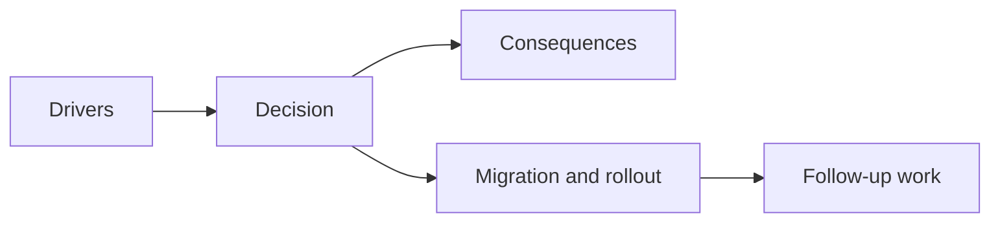

## adr_023_model_gameplay_systems_as_game_owned_state_slices_around_the_game_module - Model gameplay systems as game owned state slices around the game module
> Date: 2026-03-28
> Status: Accepted
> Drivers: Prepare combat, AI, status effects, and progression without reopening runtime ambiguity; keep gameplay growth Emberwake-specific; clarify what belongs to simulation state, gameplay systems, presentation diagnostics, and future persistence.
> Related request: `req_021_define_the_next_runtime_product_and_gameplay_system_architecture_wave`
> Related backlog: `item_089_define_gameplay_system_ownership_for_combat_status_effects_ai_and_progression`
> Related task: `task_029_orchestrate_runtime_performance_product_meta_flow_and_gameplay_system_architecture`
> Reminder: Update status, linked refs, decision rationale, consequences, migration plan, and follow-up work when you edit this doc.

# Overview
Gameplay systems should live as game-owned state slices adjacent to, but distinct from, the raw runtime simulation slice inside `GameModule` state. They observe simulation changes during update, own cross-cutting gameplay meaning, and expose derived diagnostics or presentation-ready data without owning render adapters.

# Context
The converged runtime already had a clean engine-to-game contract, but future gameplay growth still lacked a placement rule:
- combat could be added directly into raw entity simulation state
- autonomous logic could accumulate as side effects around input mapping
- status effects and progression could appear as random flags with no persistence posture
- presentation code could start owning gameplay meaning because it is the easiest place to display it

That would recreate ambiguity at a higher level just as the runtime core became cleaner.

# Decision
- Keep raw movement and entity simulation in the runtime simulation slice.
- Model cross-cutting gameplay concerns as explicit game-owned system slices inside Emberwake game state.
- Start with a lightweight ownership contract for autonomy, combat, status effects, and progression.
- Advance gameplay systems during `GameModule.update` using the previous and next simulation snapshots plus engine timing.
- Allow presentation to consume diagnostics or derived values from gameplay systems, but keep render adapters and scene composition outside system ownership.
- Treat progression and status effects as the first likely persistence-facing slices while combat and autonomy remain runtime-only until product requirements justify deeper storage.
- Keep the abstraction Emberwake-specific and lightweight instead of designing a generic engine-level gameplay framework.

# Alternatives considered
- Put every future gameplay concern into the raw simulation slice. Rejected because cross-cutting systems would become harder to evolve and persist cleanly.
- Push gameplay systems down into engine modules. Rejected because combat, progression, and effects are game meaning, not engine concerns.
- Build a large ECS or generic gameplay framework immediately. Rejected because current needs are narrower and should stay pragmatic.

# Consequences
- Future gameplay systems have a clear ownership zone before they become large.
- The game module remains the integration point between input mapping, simulation, gameplay systems, and presentation derivation.
- Persistence evolution has a clearer path because progression and status effects are already modeled separately from raw simulation.
- More complex combat or AI loops may still require deeper system scheduling later, but the first seam is explicit now.

# Migration and rollout
- Add a game-owned gameplay-systems contract and initial state alongside the Emberwake game module.
- Advance those slices inside `GameModule.update` and expose diagnostics from `present`.
- Keep initial system behavior lightweight and evidence-driven until real combat or progression requirements arrive.
- Expand persistence and content coupling only where the system contract already indicates ownership.

# References
- `req_021_define_the_next_runtime_product_and_gameplay_system_architecture_wave`
- `item_089_define_gameplay_system_ownership_for_combat_status_effects_ai_and_progression`
- `task_029_orchestrate_runtime_performance_product_meta_flow_and_gameplay_system_architecture`
- `adr_015_define_engine_to_game_runtime_contract_boundaries`
- `adr_018_validate_emberwake_content_as_a_typed_cross_catalog_graph`

# Follow-up work
- Add gameplay-system content rules once combat or effects need authored data beyond the current runtime bootstrap.
- Revisit system scheduling only if multiple update phases or denser autonomous simulation make the current seam too narrow.
