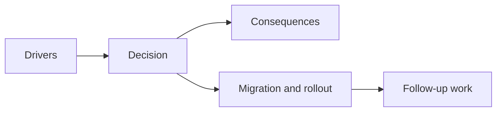

## adr_024_drive_live_runtime_from_the_pixi_visual_frame_while_engine_keeps_fixed_step_authority - Drive live runtime from the Pixi visual frame while engine keeps fixed step authority
> Date: 2026-03-28
> Status: Accepted
> Drivers: Remove the live dual-loop posture; keep one visual-frame scheduler on the main thread; preserve engine ownership of fixed-step simulation and `GameModule` update semantics.
> Related request: `req_022_define_a_unified_frame_loop_architecture_for_runtime_stability_and_render_scheduling`
> Related backlog: `item_090_define_the_target_master_frame_loop_between_runtime_runner_presentation_and_pixi_render_submission`
> Related task: `task_030_orchestrate_unified_frame_loop_architecture_for_runtime_stability_and_render_scheduling`
> Reminder: Update status, linked refs, decision rationale, consequences, migration plan, and follow-up work when you edit this doc.

# Overview
The live runtime should be advanced from the Pixi application visual frame, while the engine runtime runner remains the owner of fixed-step simulation accumulation, catch-up control, and `GameModule` progression.

# Context
The repository previously had two active frame-driven schedulers in the live runtime:
- the engine runner used `requestAnimationFrame`
- Pixi rendered through its own application ticker

That posture worked, but it left frame ownership ambiguous:
- simulation and render cadence could drift
- frame-pacing spikes were harder to attribute
- future rendering or gameplay density would amplify scheduler ambiguity

The goal is not to make Pixi the owner of gameplay meaning. The goal is to let one visual-frame transport drive the live loop while the engine keeps authoritative simulation semantics.

# Decision
- Treat the Pixi application ticker as the live visual-frame transport for the mounted runtime surface.
- Advance the engine runtime runner from that visual frame instead of running a second independent `requestAnimationFrame` loop for the live runtime.
- Keep fixed-step accumulation, catch-up clamping, pause semantics, and `GameModule` update ownership inside the engine runner.
- Keep Pixi adapter-owned as the render surface and visual-frame source, but not as the owner of gameplay state or fixed-step logic.
- Expose scheduler mode and frame-loop counters through runtime metrics so profiling and smoke validation can distinguish the live unified path from the legacy internal rAF path.

# Alternatives considered
- Keep both loops and only optimize draw cost. Rejected because scheduling ambiguity would remain.
- Make Pixi directly own gameplay cadence. Rejected because gameplay progression should remain engine-owned.
- Build a custom renderer-agnostic master loop before proving value. Rejected because the current repo already has Pixi as the live render transport and needs the highest-leverage simplification first.

# Consequences
- The mounted runtime now has one active visual-frame loop instead of two competing frame schedulers.
- Engine-owned fixed-step guarantees remain intact.
- Scheduler mode becomes explicit in runtime metrics and diagnostics.
- React publication and Pixi reconciliation still introduce their own cost, so loop unification does not eliminate all frame-pacing work by itself.

# Migration and rollout
- Add a Pixi frame-loop bridge that advances the runtime runner on each visual tick.
- Stop starting an additional internal rAF loop for the live mounted runtime.
- Preserve the internal runner-driven path for direct tests and non-mounted usage.
- Validate the unified path through runtime integration tests and browser smoke.

# References
- `req_022_define_a_unified_frame_loop_architecture_for_runtime_stability_and_render_scheduling`
- `item_090_define_the_target_master_frame_loop_between_runtime_runner_presentation_and_pixi_render_submission`
- `task_030_orchestrate_unified_frame_loop_architecture_for_runtime_stability_and_render_scheduling`
- `adr_015_define_engine_to_game_runtime_contract_boundaries`
- `adr_019_keep_engine_pixi_as_adapter_and_game_as_runtime_scene_composer`

# Follow-up work
- Revisit whether React-facing presentation publication should move closer to the runtime surface if future scene density makes one-frame publication latency too visible.
- Reassess a renderer-agnostic frame coordinator only if multiple render transports become real product needs.
