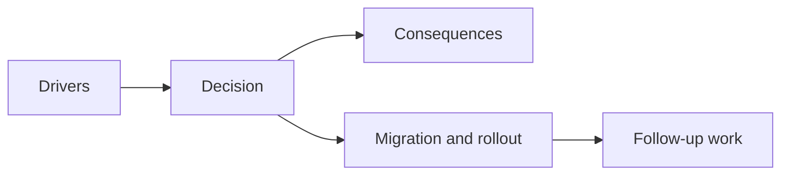

## adr_026_validate_unified_runtime_scheduling_with_frame_pacing_telemetry_and_browser_smoke - Validate unified runtime scheduling with frame pacing telemetry and browser smoke
> Date: 2026-03-28
> Status: Accepted
> Drivers: Give loop unification a measurable definition of success; prove scheduler mode and frame-pacing behavior through repeatable repository validation; keep runtime smoothness evidence close to delivery tooling.
> Related request: `req_022_define_a_unified_frame_loop_architecture_for_runtime_stability_and_render_scheduling`
> Related backlog: `item_092_define_frame_pacing_profiling_and_validation_for_unified_runtime_scheduling`
> Related task: `task_030_orchestrate_unified_frame_loop_architecture_for_runtime_stability_and_render_scheduling`
> Reminder: Update status, linked refs, decision rationale, consequences, migration plan, and follow-up work when you edit this doc.

# Overview
Unified runtime scheduling should be validated through runtime telemetry captured in the browser smoke path, not only through subjective feel or startup-only budgets.

# Context
The repository already validated startup size and renderer readiness, but loop-unification work needed different evidence:
- which scheduler is active in the live runtime
- how many frames are observed after the runtime becomes ready
- whether catch-up behavior remains bounded
- whether runtime frame pacing can be inspected locally and recorded in artifacts

Without explicit proof, the project could refactor loop architecture without being able to show whether it actually improved runtime stability.

# Decision
- Extend runtime telemetry so the shell publishes scheduler mode and frame-pacing metrics into `window.__EMBERWAKE_RUNTIME_METRICS__`.
- Track the meaningful frame-pacing window from renderer-ready onward, rather than from initial shell boot.
- Add a frame-pacing budget section to the shared runtime performance budget contract.
- Validate the live runtime through browser smoke by asserting:
  - unified Pixi-driven scheduler mode is active
  - enough post-ready visual frames were observed
  - simulation step bursts stay inside the allowed budget
  - catch-up frame ratio stays bounded
- Preserve detailed frame-pacing values in the browser smoke metrics artifact for inspection after test execution.

# Alternatives considered
- Keep frame-pacing proof purely manual. Rejected because it does not scale or protect regressions.
- Add a heavy generic observability platform. Rejected because the repo currently needs focused runtime evidence, not broad telemetry infrastructure.
- Validate only average FPS. Rejected because average FPS hides scheduler ambiguity and burst behavior.

# Consequences
- Loop-unification work now has explicit evidence in CI-adjacent tooling.
- Browser smoke becomes more meaningful because it validates runtime stability signals, not just shell boot and basic movement.
- The frame-pacing budget remains intentionally lightweight, so deeper GPU, memory, or long-session telemetry may still need later work.

# Migration and rollout
- Publish runtime scheduler and frame-pacing telemetry from the shell.
- Add shared frame-pacing budgets to runtime performance config.
- Extend browser smoke to read and assert those metrics after interactive runtime movement.
- Keep the output artifact so follow-up profiling can compare future changes against the current baseline.

# References
- `req_022_define_a_unified_frame_loop_architecture_for_runtime_stability_and_render_scheduling`
- `item_092_define_frame_pacing_profiling_and_validation_for_unified_runtime_scheduling`
- `task_030_orchestrate_unified_frame_loop_architecture_for_runtime_stability_and_render_scheduling`
- `adr_021_define_runtime_performance_budgets_and_profiling_at_the_shell_to_runtime_boundary`

# Follow-up work
- Add richer sustained-runtime metrics if combat, effects, or entity density create longer-session frame-pacing risks.
- Revisit the frame-pacing budget thresholds when real gameplay load replaces the current debug-heavy slice.
