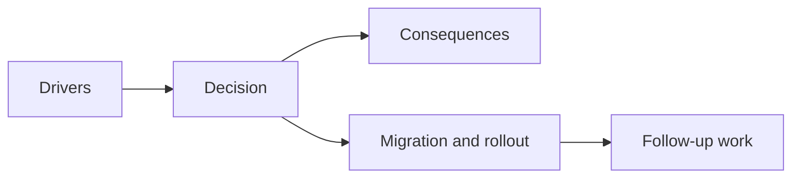

## adr_029_model_phase_two_gameplay_systems_with_ordered_phases_and_narrow_signals - Model phase-two gameplay systems with ordered phases and narrow signals
> Date: 2026-03-28
> Status: Accepted
> Drivers: Keep gameplay-system growth compatible with `GameModule`; avoid a new monolith around combat, progression, and future systems; establish a narrow signal posture before any larger event substrate.
> Related request: `req_023_define_the_next_runtime_shell_render_and_system_boundary_architecture_wave`
> Related backlog: `item_095_define_gameplay_system_phase_two_ownership_for_ordered_phases_signals_and_progression_scale`
> Related task: `task_031_orchestrate_the_remaining_open_architecture_and_runtime_input_reliability_wave`
> Reminder: Update status, linked refs, decision rationale, consequences, migration plan, and follow-up work when you edit this doc.

# Overview
Gameplay systems should advance through explicit ordered phases and emit narrow signals, rather than relying on one opaque update block or jumping straight to a generic event bus.

# Context
The repo already had game-owned system slices for autonomy, combat, progression, and status effects, but lacked a stronger phase-order and coordination model.

# Decision
- Extend gameplay systems with an explicit phase order: `autonomy -> combat -> status-effects -> progression -> outcomes`.
- Track narrow recent signals and lifecycle data inside the systems slice so inter-system coordination remains inspectable and bounded.
- Keep outcome publication inside the systems layer so progression/combat/failure semantics can later map into shell outcomes without crossing ownership boundaries.
- Avoid a general event bus for now; phase-local signals are enough for the current complexity.

# Alternatives considered
- Keep a single aggregate systems update. Rejected because it does not scale.
- Add a generic event bus immediately. Rejected because the current needs are narrower and a bus would be premature.
- Push system coordination into the shell. Rejected because gameplay ownership must stay game-local.

# Consequences
- The gameplay-system seam is now more explicit and extensible.
- Diagnostics can show recent signals and phase order without leaking rendering or shell concerns into gameplay code.
- Future combat/status/progression slices have a clearer place to plug in.

# Migration and rollout
- Add explicit phase-order and signal posture to the gameplay systems contract.
- Track lifecycle metadata and narrow recent signals in the systems state.
- Keep non-idle outcome emission for future gameplay work, while establishing the seam now.

# References
- `req_023_define_the_next_runtime_shell_render_and_system_boundary_architecture_wave`
- `item_095_define_gameplay_system_phase_two_ownership_for_ordered_phases_signals_and_progression_scale`
- `task_031_orchestrate_the_remaining_open_architecture_and_runtime_input_reliability_wave`
- `adr_023_model_gameplay_systems_as_game_owned_state_slices_around_the_game_module`

# Follow-up work
- Introduce real non-idle outcomes from combat or progression systems when those mechanics exist.
- Revisit whether signal density eventually justifies a larger event substrate.

