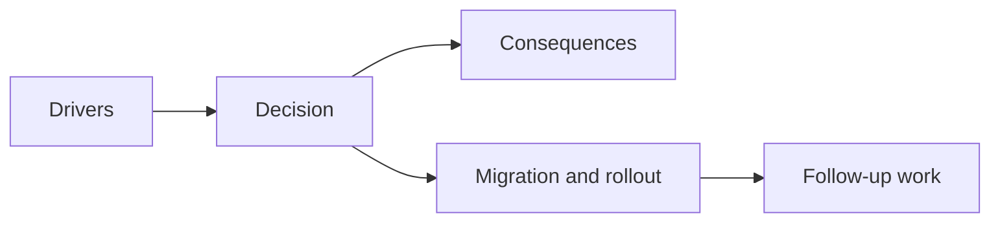

## adr_030_harden_public_package_entrypoints_with_targeted_deep_import_rules - Harden public package entrypoints with targeted deep-import rules
> Date: 2026-03-28
> Status: Accepted
> Drivers: Make package boundaries more durable without a monorepo overhaul; provide real public entrypoints for `@engine`, `@engine-pixi`, and `@game`; keep lint enforcement practical for delivery work.
> Related request: `req_023_define_the_next_runtime_shell_render_and_system_boundary_architecture_wave`
> Related backlog: `item_096_define_public_entrypoint_hardening_and_architecture_regression_rules_for_app_engine_and_game_modules`
> Related task: `task_031_orchestrate_the_remaining_open_architecture_and_runtime_input_reliability_wave`
> Reminder: Update status, linked refs, decision rationale, consequences, migration plan, and follow-up work when you edit this doc.

# Overview
The repository should expose public package entrypoints and enforce a few targeted deep-import restrictions where boundary regressions are most likely, rather than trying to ban deep imports everywhere at once.

# Context
The codebase already had alias-based package boundaries, but cross-package consumers still depended mostly on deep paths. That made intended public APIs harder to recognize and regression rules harder to apply.

# Decision
- Add bare TypeScript entrypoints for `@engine`, `@engine-pixi`, and `@game`.
- Move selected shell and render-boundary consumers to those public entrypoints.
- Add targeted lint rules where public entrypoints matter most right now:
  - app-shell code should prefer public `@engine` and `@game` entrypoints when it crosses package boundaries
  - render-shell code should prefer the public `@engine-pixi` entrypoint instead of adapter-deep imports
- Keep the rule set intentionally scoped so daily delivery is not blocked by a repo-wide deep-import migration.

# Alternatives considered
- Ban all deep imports immediately. Rejected because the repo still contains many legitimate transitional paths.
- Leave entrypoints implicit. Rejected because it does not create a durable public API posture.
- Repackage the repo as a full published monorepo. Rejected because it is disproportionate to the current need.

# Consequences
- Cross-package boundaries are more legible.
- Lint can now guard a real public API surface instead of only guarding ownership by convention.
- Further hardening can happen incrementally from this base.

# Migration and rollout
- Add bare entrypoint aliases to TypeScript config.
- Export the needed contracts from package indexes.
- Update a targeted set of consumers.
- Enforce only the highest-signal deep-import restrictions for now.

# References
- `req_023_define_the_next_runtime_shell_render_and_system_boundary_architecture_wave`
- `item_096_define_public_entrypoint_hardening_and_architecture_regression_rules_for_app_engine_and_game_modules`
- `task_031_orchestrate_the_remaining_open_architecture_and_runtime_input_reliability_wave`
- `adr_020_enforce_architecture_boundaries_with_targeted_module_scoped_lint_rules`

# Follow-up work
- Broaden public entrypoint usage gradually as legacy deep imports are retired.
- Add package-scope checks only if targeted lint rules stop being sufficient.

