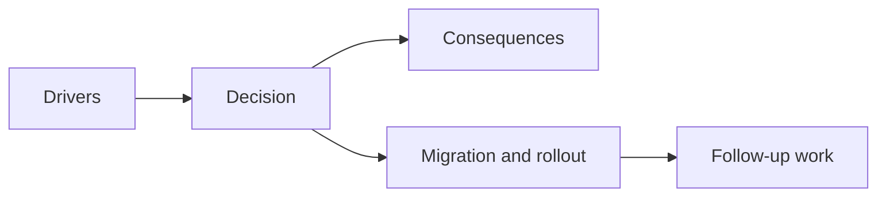

## adr_031_bind_runtime_surface_interactions_to_resolved_elements_after_lazy_mount - Bind runtime surface interactions to resolved elements after lazy mount
> Date: 2026-03-28
> Status: Accepted
> Drivers: Restore joystick and runtime-surface interaction reliability after lazy mount; avoid reopening the broader input model; make surface-bound hooks robust when the shell renders before the Pixi surface exists.
> Related request: `req_024_restore_runtime_surface_input_binding_reliability_after_lazy_mount`
> Related backlog: `item_097_restore_surface_bound_interaction_hooks_to_attach_after_lazy_runtime_mount`, `item_098_add_regression_coverage_for_mobile_joystick_and_surface_interactions_after_delayed_surface_availability`, `item_099_validate_runtime_surface_input_reliability_without_reopening_input_ownership_design`
> Related task: `task_031_orchestrate_the_remaining_open_architecture_and_runtime_input_reliability_wave`
> Reminder: Update status, linked refs, decision rationale, consequences, migration plan, and follow-up work when you edit this doc.

# Overview
Runtime-surface interaction hooks should bind to the resolved runtime surface element, not assume that a stable ref object implies the element existed during the initial effect pass.

# Context
After the runtime became lazy-mounted, the shell could render before the Pixi surface existed. Hooks that only depended on `surfaceRef.current` inside an effect risked never attaching listeners when the surface arrived later.

The regression was player-visible:
- the mobile joystick stopped responding
- adjacent surface-bound interactions were exposed to the same timing risk

# Decision
- Route runtime-surface availability through a real surface-element callback instead of relying on the ref object alone.
- Make interaction hooks depend on the resolved `HTMLElement | null` so they rebind when the surface actually appears.
- Cover the timing-sensitive path with focused Vitest regression tests for:
  - the mobile virtual stick
  - a second adjacent surface interaction path
- Keep validation bounded to the current input model and existing repo workflows.

# Alternatives considered
- Do nothing and rely on eager mount timing. Rejected because the bug was already user-visible.
- Redesign input ownership wholesale. Rejected because the issue was binding reliability, not ownership.
- Add only manual smoke validation. Rejected because the regression needed automated protection.

# Consequences
- Surface-bound interactions now survive lazy runtime mount.
- The correction remains narrow and compatible with the current shell/runtime architecture.
- Future hook authors have a clearer pattern: subscribe from the resolved element, not only from a stable ref object.

# Migration and rollout
- Update runtime canvas boundaries to publish the resolved surface element.
- Update surface-bound hooks to subscribe from `HTMLElement | null`.
- Add focused regression tests for delayed surface availability.
- Validate through the existing repo test and smoke workflow.

# References
- `req_024_restore_runtime_surface_input_binding_reliability_after_lazy_mount`
- `item_097_restore_surface_bound_interaction_hooks_to_attach_after_lazy_runtime_mount`
- `item_098_add_regression_coverage_for_mobile_joystick_and_surface_interactions_after_delayed_surface_availability`
- `item_099_validate_runtime_surface_input_reliability_without_reopening_input_ownership_design`
- `task_031_orchestrate_the_remaining_open_architecture_and_runtime_input_reliability_wave`

# Follow-up work
- Reuse the resolved-surface pattern for any future runtime-surface hooks.
- Only revisit the broader input model if a separate product need appears.

