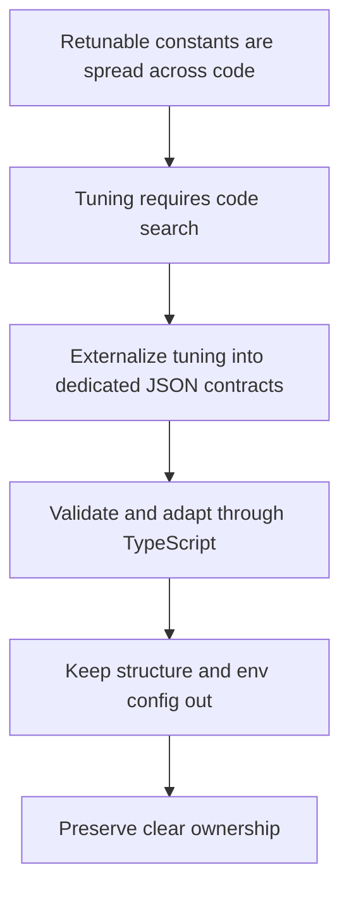

## adr_036_externalize_retunable_gameplay_and_system_tuning_as_validated_json_contracts - Externalize retunable gameplay and system tuning as validated JSON contracts
> Date: 2026-03-22
> Status: Accepted
> Drivers: Make gameplay and technical tuning easier to edit without code search; preserve the current TypeScript-first content posture for structural data; prevent tuning-value ownership drift; keep runtime consumption typed and fail-fast.
> Related request: `req_052_define_an_externalized_json_gameplay_tuning_contract`, `req_053_define_an_externalized_json_system_tuning_contract`
> Related backlog: `item_187_define_a_json_owned_gameplay_tuning_surface_for_first_wave_balance_values`, `item_188_define_validation_and_adapter_rules_for_externalized_gameplay_tuning_json`, `item_191_define_a_json_owned_system_tuning_surface_for_externalizable_technical_constants`, `item_192_define_validation_and_adapter_rules_for_externalized_system_tuning_json`, `item_193_define_clear_boundaries_between_system_tuning_gameplay_tuning_structural_constants_and_env_config`
> Related task: (none yet)
> Reminder: Update status, linked refs, decision rationale, consequences, migration plan, and follow-up work when you edit this doc.

# Overview
Retunable gameplay and technical/system constants should be externalized into dedicated JSON contracts, validated and adapted through small TypeScript modules. Structural content, ids, ownership markers, and env-backed configuration remain outside those JSON surfaces.

# Context
`adr_011` established typed TypeScript as the baseline authoring model for game data and configuration. That remains the right default for:
- structural content
- ids and references
- scenario graphs
- ownership contracts
- game-specific content catalogs

However, the current gameplay/runtime has now accumulated a meaningful set of retunable values that are awkward to manage as code-local literals or runtime-local contract objects:
- health, damage, cooldowns, spawn cadence, progression values
- input feel knobs, viewport knobs, pathfinding/search limits, and runtime-presentation timings

The repository already accepts repo-native JSON for some bounded config use cases such as `runtimePerformanceBudget.json`, so the missing decision is not “can JSON exist?” but rather:
- what kind of values should move into JSON
- how those values should be validated
- how JSON tuning relates to TypeScript-first content authoring
- how gameplay tuning and technical/system tuning stay separate

Without a decision here, the repo risks drifting into inconsistent ownership:
- some tuning values move into JSON
- others remain in code without a rule
- gameplay and system tuning blur together
- raw JSON could leak directly into runtime without validation

# Decision
- Keep typed TypeScript as the default authoring model for structural content and game-owned content catalogs.
- Introduce two dedicated JSON-owned tuning contracts:
  - `gameplayTuning.json` for balance and gameplay-feel values
  - `systemTuning.json` for retunable technical/system values
- Pair each JSON contract with a small TypeScript adapter module that:
  - loads the JSON
  - validates completeness and bounds
  - derives runtime-safe values when authored units need translation
  - exposes typed consumption to runtime systems
- Do not allow runtime systems to consume raw tuning JSON directly.
- Fail fast in development and tests when tuning JSON is invalid or incomplete.
- Keep gameplay tuning and system tuning separate rather than merging them into one generic constant file.
- Keep the following outside JSON tuning contracts unless a later ADR explicitly changes the rule:
  - ids and reference namespaces
  - ownership strings
  - environment/deployment config
  - architecture markers and structural contracts
  - enum-like constant families that are not meant for tuning
- Prefer human-editable authored units where useful, such as:
  - degrees instead of radians
  - chunk/tile multipliers instead of opaque world-unit formulas
  - named timing/count fields instead of unlabeled ratios

# Alternatives considered
- Keep all tuning in TypeScript. Rejected because balancing and technical tuning remain too scattered and too code-adjacent.
- Replace the TypeScript-first content model with JSON broadly. Rejected because structural content still benefits from typed game-owned authoring and cross-catalog validation.
- Use one giant JSON file for all gameplay and system values. Rejected because it would blur ownership and make tuning surfaces harder to scan.
- Let runtime systems import raw JSON directly. Rejected because it weakens validation, derivation discipline, and typed access.

# Consequences
- Gameplay and technical tuning become easier to edit from one obvious surface each.
- The repo gains a deliberate exception to the TypeScript-first rule without abandoning it.
- Ownership between gameplay tuning, system tuning, structural TypeScript contracts, and env-backed config becomes clearer.
- Future work needs discipline: retunable values should default to the relevant tuning contract rather than reappearing as new local literals.
- Adapter modules become an explicit maintenance point, but they keep runtime safety high.

# Migration and rollout
- Create `gameplayTuning.json` and `systemTuning.json` as separate first-class tuning surfaces.
- Add small adapter modules that validate and derive typed runtime-safe values.
- Migrate the highest-value retunable domains first:
  - gameplay: hostile/player/pickup/progression
  - system: input/viewport/runtime-presentation first, pathfinding next
- Keep structural content and env-backed config in their existing TypeScript/env layers.
- Reject future tuning changes that add new retunable literals directly into runtime systems unless they are justified as non-tuning structural constants.

# References
- `req_052_define_an_externalized_json_gameplay_tuning_contract`
- `req_053_define_an_externalized_json_system_tuning_contract`
- `adr_011_use_typed_typescript_as_the_initial_data_and_config_authoring_model`
- `adr_018_validate_emberwake_content_as_a_typed_cross_catalog_graph`
- `adr_010_treat_render_build_variables_as_public_frontend_configuration`

# Follow-up work
- Define the first exact JSON shapes and adapter boundaries for gameplay and system tuning.
- Decide whether linting or review guidance should enforce the “retunable values default to tuning contracts” rule.
- Revisit whether movement-surface feel remains system tuning or later becomes fully content-owned.
