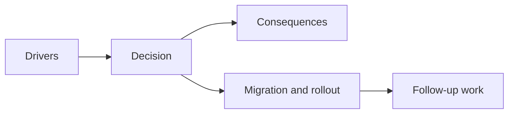

## adr_037_reuse_player_runtime_chunk_base_visuals_through_a_bounded_prerender_cache - Reuse player-runtime chunk base visuals through a bounded prerender cache
> Date: 2026-03-28
> Status: Accepted
> Drivers: Remove tile-by-tile chunk base redraw from the steady-state player frame loop; keep world identity deterministic; avoid turning performance fixes into unbounded render-resource retention; preserve the current game-to-Pixi ownership split.
> Related request: `req_056_define_a_runtime_render_hot_path_optimization_wave_for_world_and_entity_drawing`
> Related backlog: `item_205_define_a_bounded_chunk_visual_reuse_strategy_for_player_runtime_world_rendering`
> Related task: `task_048_orchestrate_runtime_render_hot_path_optimization_for_world_and_entity_drawing`
> Reminder: Update status, linked refs, decision rationale, consequences, migration plan, and follow-up work when you edit this doc.

# Overview
Player-runtime chunk base visuals should be prerendered and reused through a bounded cache rather than rebuilt tile by tile every visual frame.

# Context
The current world render posture rebuilds chunk base visuals inside `WorldScene` draw callbacks:
- each visible chunk reconstructs its base geometry tile by tile
- the resulting player-runtime cost repeats even when the chunk visuals are logically static
- the renderer already has explicit player and diagnostics modes, so the next step is to reduce steady-state player redraw rather than broaden debug/posture work

This is not primarily a world-generation decision. World identity should remain deterministic from seed and coordinates. The decision here is about runtime visual reuse:
- where the static chunk visuals are materialized
- how long they live
- how they are bounded and invalidated

# Decision
- Treat chunk base visuals as reusable player-runtime render nodes rather than as per-frame rebuilt `Graphics` instructions.
- Keep chunk base geometry in local chunk space and retain stable draw callbacks while a chunk remains mounted in the player runtime.
- Reuse the existing bounded chunk debug-data cache and avoid a more aggressive off-screen texture cache in this rollout.
- Keep cache ownership at the render adapter boundary so game/world data stays declarative and Pixi resources stay adapter-owned.
- Keep diagnostics-only overlays, labels, and other debug visuals outside this base chunk reuse posture unless a later ADR explicitly extends it.

# Alternatives considered
- Keep rebuilding chunk tiles every frame. Rejected because it leaves an obvious hot path in place.
- Build an aggressive off-screen `cacheAsTexture` warm cache for many recent chunks. Rejected in this rollout because traversal-only profiling regressed under long eastbound drift.
- Move full chunk visual ownership into game content/state. Rejected because Pixi resources belong in the render adapter layer, not the game-state layer.
- Rewrite the world renderer around a more invasive batching system immediately. Rejected because this wave needed a lower-risk reuse seam first, not a larger renderer rewrite.

# Consequences
- Steady-state player runtime spends less time rebuilding static world visuals while chunks stay mounted.
- Chunk visual reuse is now explicit and testable rather than accidental.
- This rollout favors stable retained graphics over a more aggressive off-screen texture cache, which keeps the resource lifecycle simpler and safer.
- A deeper off-screen world-cache experiment remains possible later, but only if profiling proves it beats the current posture across all scenarios.

# Migration and rollout
- Keep deterministic chunk identity as the ownership seam for chunk visual reuse.
- Move player-runtime chunk base drawing into local chunk space with stable retained draw callbacks.
- Keep diagnostics overlays out of the base chunk reuse path for the first rollout.
- Validate the new posture against the long-session scenarios and reject more aggressive off-screen chunk caching if it regresses traversal-only profiling.

# References
- `req_056_define_a_runtime_render_hot_path_optimization_wave_for_world_and_entity_drawing`
- `item_205_define_a_bounded_chunk_visual_reuse_strategy_for_player_runtime_world_rendering`
- `adr_005_make_world_identity_deterministic_from_seed_and_coordinates`
- `adr_019_keep_engine_pixi_as_adapter_and_game_as_runtime_scene_composer`
- `adr_028_budget_player_runtime_and_debug_visuals_as_separate_render_modes`

# Follow-up work
- Revisit a bounded off-screen chunk warm cache only if it can beat the current posture on `eastbound-drift` as well as on combat-heavy scenarios.
- Revisit whether the full-screen background fill should join the same reuse posture after chunk base visuals land.
- Extend the cache posture to diagnostics visuals only if a later wave proves that worthwhile.
