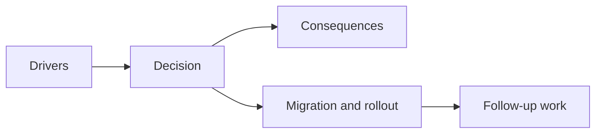

## adr_039_structure_the_first_survivor_build_loop_around_separate_active_and_passive_slots - Structure the first survivor build loop around separate active and passive slots
> Date: 2026-03-28
> Status: Proposed
> Drivers: Keep the first build system readable; preserve strong role separation between attacks and support items; adopt a genre-proven run-growth model instead of inventing an early acquisition grammar from scratch.
> Related request: `req_058_define_a_foundational_survivor_build_system_for_weapons_passives_fusions_and_run_progression`
> Related backlog: `item_214_define_a_slot_limited_level_up_and_run_reward_model_for_build_growth`
> Related task: `task_050_orchestrate_the_foundational_survivor_build_system_wave`
> Reminder: Update status, linked refs, decision rationale, consequences, migration plan, and follow-up work when you edit this doc.

# Overview
The first Emberwake survivor build loop should use separate active and passive slots, with run growth driven primarily through level-up choices rather than through a free-form inventory or ad hoc reward grammar.

# Context
The project now wants to add:
- multiple active weapons
- passive support items
- curated active + passive fusions
- a readable progression loop during the run

Without a structural decision, the implementation could drift into a muddled acquisition model where attacks, support items, and upgrades all compete in one unclear container. That would make build identity harder to read and would weaken future fusion logic.

The survivor-like genre already provides a strong default posture:
- active attack slots remain distinct from passive support slots
- level-up choices drive the main build loop
- slot pressure creates identity
- secondary rewards accelerate or pay off that loop rather than replacing it

# Decision
- Use separate active and passive slot collections in the first build loop.
- Start the run with one active weapon by default and no passive item by default unless a later character layer deliberately overrides that rule.
- Treat level-ups as the primary acquisition and upgrade source during a run.
- Keep a bounded slot posture for the first implementation, with a genre-proven target of `6` active slots and `6` passive slots unless later validation forces a reduction.
- Treat chest-like or equivalent reward moments as secondary payoff/acceleration tools rather than as the primary content-acquisition grammar.

# Alternatives considered
- Use one unified inventory pool for attacks and passives. Rejected because it weakens role readability and makes fusion planning messier.
- Acquire most content through world drops rather than level-up choices. Rejected because the first loop needs a more controlled, readable build grammar.
- Invent a novel build-acquisition structure before the first baseline exists. Rejected because it spends product complexity too early.

# Consequences
- The build loop becomes easier to teach and reason about.
- Future fusion logic has cleaner preconditions because it can depend on one active slot and one passive slot family.
- UI and persistence layers need explicit build-state modeling for two slot families instead of one merged pool.
- The system becomes more visibly genre-familiar, which is acceptable because Emberwake intends to differentiate through content identity rather than through acquisition novelty.

# Migration and rollout
- Introduce build-state structures that separate active and passive ownership.
- Introduce level-up choice generation based on open slots, owned items, and upgrades.
- Add secondary reward hooks once the slot and level-up posture is stable.
- Revisit exact slot counts only after the baseline loop is playable and understandable.

# References
- `prod_006_foundational_survivor_weapon_roster_for_emberwake`
- `prod_007_foundational_passive_item_direction_for_emberwake`
- `prod_009_level_up_slots_and_run_progression_model_for_emberwake`
- `req_058_define_a_foundational_survivor_build_system_for_weapons_passives_fusions_and_run_progression`

# Follow-up work
- Decide the first-wave rules for slot filling priority and dead-roll prevention.
- Decide how much of the build state must be visible in the player-facing HUD or shell overlays.
- Revisit whether any later characters should override the default starting-loadout rules.
