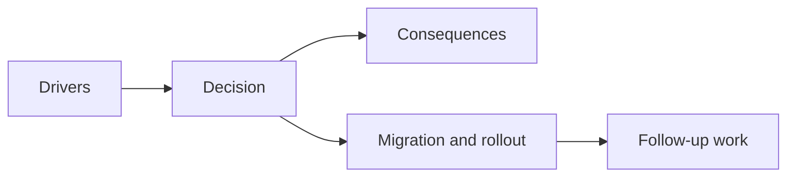

## adr_040_use_curated_active_passive_fusions_as_the_foundational_build_payoff_layer - Use curated active passive fusions as the foundational build payoff layer
> Date: 2026-03-28
> Status: Proposed
> Drivers: Give the first build loop a strong payoff layer; keep evolutions readable and bounded; avoid combinatorial explosion while preserving genre-familiar mid-run spikes.
> Related request: `req_058_define_a_foundational_survivor_build_system_for_weapons_passives_fusions_and_run_progression`
> Related backlog: `item_215_define_a_curated_first_wave_of_active_passive_fusions_and_readiness_rules`
> Related task: `task_050_orchestrate_the_foundational_survivor_build_system_wave`
> Reminder: Update status, linked refs, decision rationale, consequences, migration plan, and follow-up work when you edit this doc.

# Overview
The first Emberwake build system should use a curated active + passive fusion layer as its main build payoff instead of a fully combinatorial evolution matrix.

# Context
The project wants:
- weapons that define attack roles
- passives that shape build identity
- fusion moments that reward deliberate build planning

Without an explicit decision, implementation could drift in either of two weak directions:
- no fusion payoff at all, which would flatten build identity
- an overly broad matrix where too many items combine, making the system expensive and hard to communicate

The right early posture is narrower:
- some active weapons have curated passive partners
- those pairings are deliberate, readable, and bounded
- fusion becomes a payoff layer rather than an everything-combines sandbox

# Decision
- Use curated active + passive pairings as the first fusion model.
- Treat fusion as a payoff state that sits on top of the baseline active/passive build loop rather than replacing it.
- Require clear readiness conditions before fusion can trigger: owning the relevant active and passive pair and investing enough upgrades into the active path.
- Keep the first fusion wave intentionally small and implementation-friendly.
- Use Emberwake-specific names, fantasy escalation, and presentation for fused forms even when the structural logic remains genre-familiar.

# Alternatives considered
- No fusion layer in the first build system. Rejected because actives plus passives alone would leave the payoff layer too weak.
- Let every active combine with every passive. Rejected because that creates excessive scope, weak readability, and brittle balancing.
- Make fusions purely numeric hidden upgrades. Rejected because they would not feel like meaningful build milestones.

# Consequences
- Build planning becomes more legible because only some pairings matter as payoff routes.
- Content scope stays smaller and easier to balance than a full matrix.
- Not every weapon will get equal payoff support immediately, which is acceptable in the first implementation.
- UI and reward systems must communicate readiness and payoff clearly enough that curated pairings feel intentional, not arbitrary.

# Migration and rollout
- Define a small first wave of active-passive pairings.
- Define readiness rules and payoff triggers after the baseline slot and level-up posture is stable.
- Add fusion presentation and reward timing only after the base build loop works.
- Expand fusion coverage later only when the first curated set is understood and validated.

# References
- `prod_006_foundational_survivor_weapon_roster_for_emberwake`
- `prod_007_foundational_passive_item_direction_for_emberwake`
- `prod_008_active_passive_fusion_direction_for_emberwake`
- `req_058_define_a_foundational_survivor_build_system_for_weapons_passives_fusions_and_run_progression`

# Follow-up work
- Define the first curated set of active + passive fusion pairs.
- Decide the first implementation’s exact readiness threshold for fusion payoff.
- Decide how explicit fusion-readiness messaging should be in the player-facing UI.
