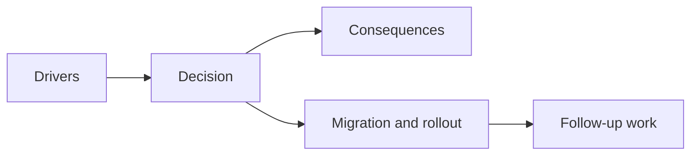

## adr_043_extend_transient_weapon_feedback_with_bounded_anticipation_and_linger_states - Extend transient weapon feedback with bounded anticipation and linger states
> Date: 2026-03-28
> Status: Accepted
> Drivers: The first weapon-feedback wave proved the transient seam, but some roles still require non-hit and linger cues to remain readable; the project needs those cues without falling into a projectile rewrite.
> Related request: `req_062_define_a_second_combat_skill_feedback_polish_wave_for_underexpressed_weapons`
> Related backlog: `item_233_define_a_non_hit_readability_posture_for_polished_weapon_feedback`, `item_234_define_a_stronger_cinder_arc_anticipation_and_travel_signature_without_full_projectiles`, `item_235_define_a_more_present_orbit_sutra_and_null_canister_spatial_ownership_signature`, `item_236_define_clearer_visual_role_separation_between_guided_senbon_and_shade_kunai`, `item_237_define_targeted_validation_for_second_pass_weapon_feedback_polish`
> Related task: `task_054_orchestrate_post_0_4_0_runtime_expression_and_progression_waves`
> Related architecture: `adr_038_split_entity_player_rendering_into_stable_geometry_and_transient_combat_overlays`, `adr_042_separate_weapon_simulation_from_transient_combat_skill_feedback_presentation`
> Reminder: Update status, linked refs, decision rationale, consequences, migration plan, and follow-up work when you edit this doc.

# Overview
The transient weapon-feedback seam should be extended with bounded anticipation and linger states for the roles that need them, rather than replaced with a general projectile simulation system.

# Context
The current seam already supports:
- hit-linked transient feedback
- bounded effect lifetimes
- weapon identity through presentation

What it under-expresses is:
- attack anticipation
- pre-hit travel read
- short-lived owned-space presence

# Decision
- Keep transient feedback presentation-owned.
- Allow bounded non-hit and linger cues for specific roles that need them.
- Restrict these extensions to authored, short-lived states rather than persistent gameplay-owned projectiles.
- Use these cues only where role readability clearly benefits.

# Consequences
- Delayed and zone-control weapons become more legible.
- The project avoids an early projectile architecture rewrite.
- Some event shapes may become richer, but the seam stays bounded.

# Alternatives considered
- Rewrite affected weapons into projectile-owned gameplay objects now.
  Rejected as too broad for the readability problem being solved.
- Keep everything hit-only.
  Rejected because some roles remain too under-expressed.
