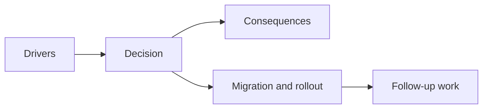

## adr_046_expose_post_run_skill_performance_summaries_as_shell_consumable_outcome_data - Expose post-run skill performance summaries as shell-consumable outcome data
> Date: 2026-03-28
> Status: Accepted
> Drivers: The defeat screen needs a skill-ranking analysis view, which requires outcome-time performance summaries without turning the shell into a combat-log reader.
> Related request: `req_066_define_a_game_over_skill_ranking_view_toggle`
> Related backlog: `item_248_define_a_game_over_view_toggle_between_recap_and_skill_ranking_analysis`, `item_249_define_a_first_pass_skill_performance_summary_contract_for_post_run_ranking`, `item_250_define_a_compact_skill_ranking_presentation_for_game_over_analysis`, `item_251_define_targeted_validation_for_game_over_skill_analysis_readability_and_metric_credibility`
> Related task: `task_054_orchestrate_post_0_4_0_runtime_expression_and_progression_waves`
> Related architecture: `adr_027_expose_gameplay_outcomes_as_a_game_owned_shell_consumable_contract`
> Reminder: Update status, linked refs, decision rationale, consequences, migration plan, and follow-up work when you edit this doc.

# Overview
Post-run skill ranking should be delivered as compact outcome summaries owned by gameplay and consumed by the shell, not as raw combat-log playback.

# Decision
- Extend outcome-facing data with bounded skill performance summaries.
- Keep the shell focused on presentation and ranking.
- Prefer one clear primary metric for first-pass ranking.

# Consequences
- The defeat screen can show skill performance without becoming debug UI.
- The shell remains decoupled from low-level combat history.

# Alternatives considered
- Replay combat logs directly in the shell.
  Rejected because it is too heavy and too noisy for the product goal.
