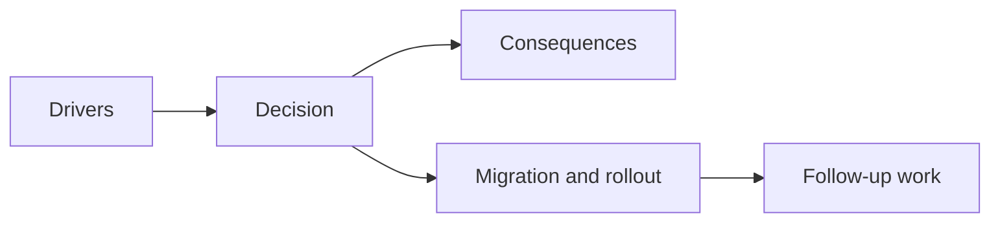

## adr_048_adopt_a_viewport_safe_scroll_owner_contract_for_shell_surfaces - Adopt a viewport-safe scroll owner contract for shell surfaces
> Date: 2026-03-28
> Status: Accepted
> Drivers: Shell-owned scenes increasingly contain variable-height content, but the current layout posture mixes viewport locking, fixed panel heights, and `overflow: hidden`, which makes some screens clip or hide bottom actions instead of scrolling safely.
> Related request: `req_068_define_a_viewport_safe_scroll_ownership_wave_for_shell_surfaces`
> Related backlog: `item_274_define_a_shared_viewport_safe_shell_surface_sizing_contract`, `item_275_define_a_single_scroll_owner_scene_body_posture_for_variable_height_shell_content`, `item_276_define_regression_fixes_for_existing_shell_scenes_under_the_viewport_safe_scroll_contract`, `item_277_define_targeted_validation_for_shell_viewport_fit_scroll_ownership_and_action_reachability`
> Related task: `task_056_orchestrate_viewport_safe_scroll_ownership_for_shell_surfaces`
> Related architecture: `adr_016_define_shell_scene_state_and_meta_surface_ownership`, `adr_044_split_runtime_hud_into_anchored_blocks_and_route_mobile_menu_entry_to_the_full_screen_shell_surface.md`
> Reminder: Update status, linked refs, decision rationale, consequences, migration plan, and follow-up work when you edit this doc.

# Overview
Shell-owned scenes should follow one shared viewport-safe layout contract:
- the surface itself must fit within the usable viewport
- one named internal region must own vertical overflow
- content growth must not push primary actions or essential information off-screen without a reachable scroll path

# Decision
- Treat viewport fit and scroll ownership as a first-class shell architecture concern, not a per-screen styling detail.
- Model each shell scene as:
  - bounded surface
  - stable chrome regions such as header and footer/actions
  - one explicit scroll owner for the growable body
- Prefer viewport-safe `max-height` or equivalent bounded sizing over rigid fixed heights for variable-content shell scenes.
- Allow `overflow: hidden` only when a subordinate scroll owner is intentionally declared and verified.
- Review new shell scenes against the contract before they ship.

# Contract
## 1. Surface fit
- A shell panel must fit within the safe usable viewport after shell offsets and safe-area insets are applied.
- If content can grow, the surface may not depend on document scroll, because the shell root is viewport-owned.

## 2. One declared scroll owner
- A variable-content shell scene must name one primary vertical scroll owner.
- The scroll owner should usually be the scene body, not a scattered set of unrelated nested lists.
- Nested scrollers are allowed only when they are deliberate and do not trap the user away from primary actions.

## 3. Reachable actions
- Primary controls such as `Back`, `Apply`, `Resume`, or outcome actions should remain reachable.
- Header and footer chrome should stay visually stable while the scene body absorbs overflow whenever possible.

## 4. Review rule
- A new shell scene is not complete unless viewport fit and scroll ownership are verified on:
  - desktop
  - mobile browser
  - non-PWA browser mode when that mode exists

# Consequences
- Shell scenes become more robust as content expands over time.
- Codex/archive and changelog surfaces stop depending on fragile fixed heights.
- UI reviews gain a concrete architectural checklist instead of subjective “looks fine on my screen” approval.
- Some existing scenes may need refactoring to move overflow responsibility from nested lists back to a shared scene-body contract.

# Alternatives considered
- Keep fixing each panel individually when it breaks.
  Rejected because the same structural mistake keeps returning as new shell scenes are added.
- Allow document-level page scrolling for shell scenes.
  Rejected because the runtime shell is intentionally viewport-owned and mixes overlays, safe areas, and game surfaces.
- Ban all nested scrollers.
  Rejected because some archive or diagnostics surfaces may still need local lists, but they must remain subordinate to an explicit scene-level contract.

# Migration plan
- Audit the existing shell scenes and runtime auxiliary panels for overflow ownership.
- Convert the shell panel family to a shared viewport-safe surface pattern.
- Fix the highest-risk scenes first:
  - `Settings`
  - `Changelogs`
  - `Grimoire`
  - `Bestiary`
  - `Game over`
- Add validation expectations so future scene work checks scroll ownership before merge.

# Follow-up work
- `task_056_orchestrate_viewport_safe_scroll_ownership_for_shell_surfaces` landed the shared shell surface bounds, explicit scene-body scroll owners, and the first regression fixes for the named shell scenes.
- Use the resulting validation matrix to reject future shell scenes that reintroduce viewport clipping or missing scroll ownership.
