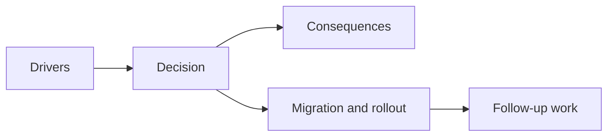

## adr_049_structure_time_scaled_enemy_pressure_around_authored_population_opening_composition_tiers_and_mini_boss_beats - Structure time-scaled enemy pressure around authored population opening, composition tiers, and mini-boss beats
> Date: 2026-03-28
> Status: Accepted
> Drivers: The run already has authored time phases, but the next pressure step needs calmer openings, denser late runs, stronger enemy composition, and periodic mini-boss spikes without becoming a full adaptive director.
> Related request: `req_069_define_a_smoother_early_game_and_stronger_time_scaled_enemy_pressure_wave`
> Related backlog: `item_256_define_a_softer_opening_hostile_spawn_posture_for_the_time_owned_run_arc`, `item_257_define_a_more_open_late_run_hostile_population_envelope`, `item_258_define_phase_gated_stronger_enemy_composition_for_run_escalation`, `item_259_define_authored_mini_boss_beats_for_every_five_minutes_of_survival`, `item_260_define_targeted_validation_for_the_normalized_difficulty_curve_and_threat_spikes`
> Related task: `task_055_orchestrate_difficulty_iconography_rotation_and_balance_foundations`
> Related architecture: `adr_047_structure_first_pass_run_difficulty_escalation_as_authored_time_phases`
> Reminder: Update status, linked refs, decision rationale, consequences, migration plan, and follow-up work when you edit this doc.

# Overview
The next pressure wave should remain authored and phase-driven, but expand from simple spawn/stat scaling into a fuller run arc:
- softer opening
- wider late density envelope
- stronger enemy composition tiers
- periodic mini-boss beats

# Decision
- Keep difficulty authored by run phase.
- Soften the opening before widening later pressure.
- Add stronger enemy composition as part of later escalation.
- Add mini-boss beats on a first-pass authored cadence rather than as a free-form director rule.

# Consequences
- Early build establishment gets more room.
- Late runs can feel denser and more varied.
- The run gains explicit threat spikes instead of only ambient pressure.

# Alternatives considered
- Keep escalation mostly numeric.
  Rejected because it underuses composition and milestone spikes.
- Build a full adaptive encounter director.
  Rejected because the project still needs a readable authored baseline first.
