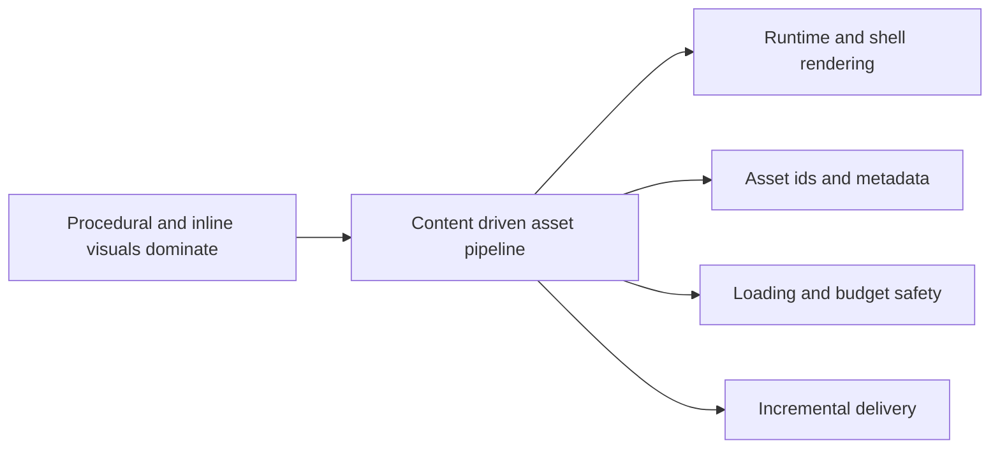

## adr_052_adopt_a_content_driven_graphical_asset_pipeline_for_runtime_and_shell_surfaces - Adopt a content driven graphical asset pipeline for runtime and shell surfaces
> Date: 2026-03-29
> Status: Accepted
> Drivers: Emberwake already has a typed placeholder-ready asset catalog, but runtime and shell visuals are still split across procedural Pixi graphics, inline SVGs, and hand-localized presentation logic that will not scale cleanly once authored art starts landing.
> Related request: `req_093_define_a_first_graphical_asset_integration_strategy_for_runtime_and_shell_surfaces`
> Related backlog: `item_342_define_a_first_graphical_asset_integration_strategy_for_runtime_and_shell_surfaces`
> Related task: `task_065_orchestrate_the_first_graphical_asset_integration_strategy_and_delivery_plan`
> Reminder: Update status, linked refs, decision rationale, consequences, migration plan, and follow-up work when you edit this doc, including scope realignments.

# Overview
Emberwake should integrate graphical assets through one content-driven pipeline that keeps asset ownership explicit, fallbacks safe, and runtime plus shell surfaces aligned. The target operator workflow should be close to drop-in delivery: once an asset id is known, a correctly named file can be deposited in the expected location and resolved automatically without additional per-asset code.

# Context
- `src/assets/README.md`, `src/assets/assetCatalog.ts`, and `src/shared/config/assetPipeline.ts` already establish:
- domain ownership
- placeholder and runtime stages
- naming and bundling intent
- lazy-loading posture
- The runtime currently renders most gameplay visuals through Pixi `Graphics` in `src/game/entities/render/EntityScene.tsx` and `src/game/world/render/WorldScene.tsx`.
- The shell already contains one authored vector-first island in `src/app/components/SkillIcon.tsx`, but that logic is locally owned and does not yet generalize into a broader app-wide asset strategy.
- As soon as authored art starts arriving, Emberwake will need consistent answers for:
- where asset ownership lives
- how runtime and shell surfaces resolve visuals
- how missing assets fall back safely
- whether operators can simply drop files into a known folder structure
- which surfaces should remain procedural
- how startup and runtime budgets stay protected
- The repo is a Vite and PWA app with active performance guardrails, so asset growth must stay incremental and explicit.

# Decision
- Keep the primary ownership model content-driven through explicit asset identifiers plus shared metadata or resolver logic. Do not use scattered direct asset imports in runtime and shell components as the main source of truth.
- Make `assetId` the primary pivot between gameplay or shell meaning and the shipped file on disk. The intended flow is:
- list the required ids once
- author the files
- drop them into the expected folder and naming convention
- let the shared resolver pick them up automatically
- Continue to separate asset families by surface, with current `entities`, `map`, and `overlays` preserved and shell-facing art introduced through an explicit adjacent domain or equivalent cataloged family rather than being hidden inside arbitrary components.
- Use a strict file naming convention derived from the `assetId` so the common case does not require a hand-maintained per-file mapping table. The runtime should prefer deterministic conventions such as:
- one logical asset id
- one expected runtime file stem equal to that asset id
- one predictable fallback chain
- The exact on-disk rule is:
- `src/assets/<domain>/runtime/<assetId>.<ext>` for shipped runtime files
- `src/assets/<domain>/placeholders/<assetId>.<ext>` for placeholder files
- `src/assets/<domain>/<stage>/<assetId>.meta.json` only when non-default metadata is needed
- Concrete examples for the formalized contract are:
- `src/assets/entities/runtime/entity.player.primary.runtime.png`
- `src/assets/map/placeholders/map.terrain.emberplain.placeholder.svg`
- `src/assets/overlays/runtime/overlay.system.fullscreen-button.runtime.svg`
- `src/assets/shell/runtime/shell.scene.panel.runtime.png`
- Add a shared resolver layer that maps `assetId` to the discovered file and degrades automatically to placeholder or procedural fallback when the authored file is not present.
- Keep metadata optional for the common case. If an asset only needs the default logical size, pivot, and loading behavior, dropping the correctly named file should be enough. Introduce a manifest or sidecar metadata file only when the asset needs non-default behavior such as:
- special pivot or anchor
- multiple named variants
- frame-based animation data
- custom bounds or collision-aligned presentation offsets
- Preserve placeholder-first and procedural fallbacks so missing assets degrade safely to the current debug or vector presentation instead of blocking rendering.
- Keep procedural rendering where it remains structurally useful:
- telegraphs
- diagnostics
- cheap overlays
- possibly some hit-feedback primitives
- Allow the runtime to consume raster or atlas-ready assets when gameplay surfaces need authored silhouettes, while shell-facing surfaces may remain vector-first where that is cheaper and clearer.
- Load assets lazily by surface or domain and keep them inside the existing performance posture rather than front-loading a giant shared pack.
- Validate each wave against runtime readability and the existing startup, activation, and long-session budget expectations before expanding deeper into ambiance work.

# Alternatives considered
- Scatter direct imports in each component or scene.
  Rejected because ownership would fragment quickly across runtime and shell and make fallbacks, caching, and swaps hard to manage.
- Require a manifest entry for every single asset file.
  Rejected because it would slow the expected art-drop workflow and recreate per-asset bookkeeping even when defaults are sufficient.
- Convert every procedural visual into asset-backed sprites immediately.
  Rejected because some procedural visuals are still the best expression for telegraphs, diagnostics, and inexpensive overlays.
- Ship one large up-front atlas or art bundle for the whole app.
  Rejected because it would front-load cost before the repo has even proven which surfaces benefit first from authored assets.

# Consequences
- Content and visuals stay linked through explicit ids instead of invisible file coupling.
- The common delivery path becomes simpler for asset production: once the id list and naming contract exist, new files can be deposited without writing per-asset integration code.
- The repo can grow authored art incrementally while preserving the ability to ship with partial coverage.
- Runtime and shell surfaces can converge on one visual language without forcing them into one file format.
- The team must maintain naming, resolver, and metadata discipline as the asset count grows.
- Some surfaces will intentionally remain procedural, which means the rendering model will stay hybrid by design.
- A minority of assets will still need sidecar metadata or manifest entries, so "drop file and go" is the default path, not a universal law.

# Migration and rollout
- Align the first visual inventory and priority waves through `req_093`, `item_342`, and `prod_017`.
- Extend or formalize the catalog and resolver shape needed for shell-facing assets and shared fallback behavior.
- Define the drop-in contract explicitly:
- canonical `assetId` list
- expected folder per domain
- expected file naming convention
- file stem equals `assetId`
- fallback chain when the authored file is missing
- sidecar metadata rule for exceptional cases only
- Introduce the first runtime readability pack using the content-driven ownership model.
- Validate performance and readability before expanding into shell identity surfaces.
- Revisit atlas promotion only after the authored runtime asset count is high enough to justify it under the existing thresholds.

# References
- `src/assets/README.md`
- `src/assets/assetCatalog.ts`
- `src/shared/config/assetPipeline.ts`
- `src/game/entities/render/EntityScene.tsx`
- `src/game/world/render/WorldScene.tsx`
- `src/app/components/SkillIcon.tsx`
- `logics/product/prod_017_graphical_asset_direction_for_runtime_readability_and_shell_identity.md`

# Follow-up work
- `item_342_define_a_first_graphical_asset_integration_strategy_for_runtime_and_shell_surfaces`
- `task_065_orchestrate_the_first_graphical_asset_integration_strategy_and_delivery_plan`
