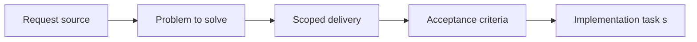

## item_000_bootstrap_react_pixi_pwa_project_foundation - Bootstrap React Pixi PWA project foundation
> From version: 0.5.0
> Status: Done
> Understanding: 97%
> Confidence: 94%
> Progress: 100%
> Complexity: Medium
> Theme: Rendering
> Reminder: Update status/understanding/confidence/progress and linked task references when you edit this doc.

# Problem
- The project needs a frontend-only application foundation based on React, TypeScript, PixiJS, and `@pixi/react`, with no backend runtime dependency.
- The bootstrap must establish the production-ready project skeleton for later requests without prematurely implementing world, camera, or entity behavior.
- The first scaffold should already impose an opinionated runtime structure instead of a flat starter that would need to be reorganized immediately.
- The repository needs a reusable quality baseline aligned with the other projects already used as references: linting, typecheck, tests, PWA setup, and CI-friendly commands.

# Scope
- In:
- React + TypeScript + PixiJS + `@pixi/react` frontend scaffold
- Static-hosted PWA project setup and base installable shell
- Project structure for app shell, runtime, rendering integration, input, debug, and shared utilities
- Quality scripts and CI-friendly commands for lint, typecheck, tests, and build
- Empty Pixi-ready application shell mount
- Out:
- Fullscreen behavior details and input isolation rules
- Stable world-space viewport contract and infinite-world camera assumptions
- Render diagnostics, fallback UX, and shell preference tooling beyond the minimal setup required to bootstrap

# Acceptance criteria
- AC1: The project targets a frontend-only stack based on React, TypeScript, PixiJS, and `@pixi/react`, with no backend service required for local development or production runtime.
- AC2: The repository includes a working PWA baseline with installable metadata, build integration, and a static-friendly application shell.
- AC3: The delivered runtime is still an empty shell and does not yet include world-map, camera, or entity behavior.
- AC4: The project structure separates app shell concerns, runtime concerns, rendering integration, input or debug support, and shared utilities so later requests can add features without a structural rewrite.
- AC5: Quality gates and developer commands exist for linting, typecheck, testing, and build in a CI-friendly form.
- AC6: The resulting foundation is suitable to host later fullscreen, world-map, and entity work without replacing the core scaffold.

# AC Traceability
- AC1 -> Scope: Frontend-only React, TypeScript, PixiJS, and @pixi-react scaffold without backend runtime. Proof: `package.json`, `src/game/render/RuntimeSurface.tsx`.
- AC2 -> Scope: PWA baseline and static-friendly shell are configured. Proof: `vite.config.ts`, `public/icon.svg`, `index.html`.
- AC3 -> Scope: Delivery stays at empty shell stage without world or gameplay features. Proof: `src/app/AppShell.tsx`.
- AC4 -> Scope: Project structure is separated for later shell, runtime, rendering, and shared work. Proof: `src/app`, `src/game`, `src/shared`.
- AC5 -> Scope: Lint, typecheck, test, and build workflows are available in a CI-friendly form. Proof: `package.json`, `eslint.config.js`, `vitest.config.ts`.
- AC6 -> Scope: Foundation remains reusable for later fullscreen, map, and entity slices. Proof: `src/shared/constants/logicalViewport.ts`, `src/game/render/RuntimeSurface.tsx`.

# Decision framing
- Product framing: Required
- Product signals: pricing and packaging, experience scope
- Product follow-up: Create or link a product brief before implementation moves deeper into delivery.
- Architecture framing: Required
- Architecture signals: data model and persistence, contracts and integration, runtime and boundaries, state and sync, security and identity, delivery and operations
- Architecture follow-up: Create or link an architecture decision before irreversible implementation work starts.

# Links
- Product brief(s): `prod_003_high_density_top_down_survival_action_direction`
- Architecture decision(s): `adr_000_adopt_feature_oriented_organic_frontend_structure`, `adr_001_enforce_bounded_file_size_and_isolate_react_side_effects`, `adr_002_separate_react_shell_from_pixi_runtime_ownership`
- Request: `req_000_bootstrap_fullscreen_2d_react_pwa_shell`
- Primary task(s): `task_000_bootstrap_react_pixi_pwa_project_foundation`

# Priority
- Impact: High
- Urgency: High

# Notes
- Derived from request `req_000_bootstrap_fullscreen_2d_react_pwa_shell`.
- Source file: `logics/request/req_000_bootstrap_fullscreen_2d_react_pwa_shell.md`.
- Request context seeded into this backlog item from `logics/request/req_000_bootstrap_fullscreen_2d_react_pwa_shell.md`.
- This slice is the prerequisite project scaffold for the other req_000 backlog items.
