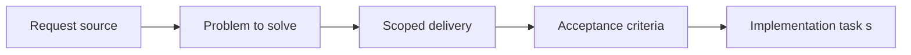

## item_001_implement_fullscreen_viewport_ownership_and_input_isolation - Implement fullscreen viewport ownership and input isolation
> From version: 0.5.0
> Status: Done
> Understanding: 97%
> Confidence: 94%
> Progress: 100%
> Complexity: Medium
> Theme: Rendering
> Reminder: Update status/understanding/confidence/progress and linked task references when you edit this doc.

# Problem
- The shell must fully own the viewport and prevent browser-page gestures or controls from interfering with the render surface.
- The runtime needs an explicit user-triggered fullscreen path, a robust non-fullscreen fallback layout, and mobile safe-area handling.
- Input ownership on the render surface needs to be explicit so pointer and touch interactions route into the app instead of the page.

# Scope
- In:
- Full-viewport app host and overflow ownership for `html`, `body`, and root shell
- Explicit fullscreen CTA backed by the Fullscreen API and a fullscreen-like fallback layout
- Page scroll suppression, overscroll isolation, selection prevention, and safe-area handling
- Pointer and touch ownership rules for the render surface
- Out:
- Project scaffold and quality baseline
- Stable logical viewport contract and world-coordinate invariants
- Debug overlay, fallback diagnostics, and persisted shell preferences

# Acceptance criteria
- AC1: The shell fills the full visible viewport on desktop and mobile, with document-level scrolling and overflow neutralized.
- AC2: An explicit user-triggered fullscreen CTA exists when supported through the Fullscreen API, with a robust fullscreen-like fallback layout when true fullscreen is unavailable.
- AC3: Page-level interactions that would interfere with the render surface are suppressed where the browser allows it, including scroll chaining and accidental selection.
- AC4: Mobile safe-area insets are handled so the render shell remains usable on notched or inset devices.
- AC5: Pointer and touch interactions are treated as first-class on the render surface and do not fall back into browser-page navigation behavior.
- AC6: This slice does not yet define world-space invariants or debugging workflows, but it leaves the shell ready for them.

# AC Traceability
- AC1 -> Scope: Full-viewport shell neutralizes document scrolling and overflow. Proof: `src/app/styles/app.css`, `src/app/hooks/useDocumentViewportLock.ts`.
- AC2 -> Scope: Fullscreen API flow and fallback layout are implemented. Proof: `src/app/components/FullscreenToggleButton.tsx`, `src/app/hooks/useFullscreenController.ts`.
- AC3 -> Scope: Page-level interference with the render surface is suppressed where possible. Proof: `src/app/hooks/useRuntimeInteractionGuards.ts`, `src/app/styles/theme.css`.
- AC4 -> Scope: Mobile safe-area behavior is covered. Proof: `src/app/styles/app.css`.
- AC5 -> Scope: Pointer and touch ownership are explicit on the render surface. Proof: `src/game/render/RuntimeSurface.tsx`, `src/app/styles/app.css`.
- AC6 -> Scope: Slice leaves room for later world-space and debug work without taking them on now. Proof: `src/app/AppShell.tsx`, `src/game/render/RuntimeSurface.tsx`.

# Decision framing
- Product framing: Required
- Product signals: pricing and packaging, experience scope
- Product follow-up: Create or link a product brief before implementation moves deeper into delivery.
- Architecture framing: Required
- Architecture signals: data model and persistence, contracts and integration, runtime and boundaries, state and sync, security and identity, delivery and operations
- Architecture follow-up: Create or link an architecture decision before irreversible implementation work starts.

# Links
- Product brief(s): `prod_000_initial_single_entity_navigation_loop`, `prod_003_high_density_top_down_survival_action_direction`
- Architecture decision(s): `adr_002_separate_react_shell_from_pixi_runtime_ownership`, `adr_007_isolate_runtime_input_from_browser_page_controls`
- Request: `req_000_bootstrap_fullscreen_2d_react_pwa_shell`
- Primary task(s): `task_001_implement_fullscreen_viewport_ownership_and_input_isolation`

# Priority
- Impact: High
- Urgency: High

# Notes
- Derived from request `req_000_bootstrap_fullscreen_2d_react_pwa_shell`.
- Source file: `logics/request/req_000_bootstrap_fullscreen_2d_react_pwa_shell.md`.
- Request context seeded into this backlog item from `logics/request/req_000_bootstrap_fullscreen_2d_react_pwa_shell.md`.
- This slice depends on the project foundation item and enables later camera and map work.
