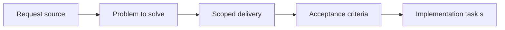

## item_003_add_render_diagnostics_fallback_handling_and_shell_preferences - Add render diagnostics fallback handling and shell preferences
> From version: 0.1.0
> Status: Ready
> Understanding: 95%
> Confidence: 92%
> Progress: 0%
> Complexity: Medium
> Theme: Rendering
> Reminder: Update status/understanding/confidence/progress and linked task references when you edit this doc.

# Problem
- The shell needs a single standard debug entry point so render diagnostics do not get scattered across later map and entity work.
- The runtime must remain diagnosable when Pixi, WebGL, or fullscreen fail or degrade.
- Shell-level preferences such as debug visibility and fullscreen preference should persist locally without becoming gameplay persistence.

# Scope
- In:
- Standard debug entry point for shell-level rendering diagnostics
- Dev and preview availability rules for diagnostics
- Controlled fallback behavior and visible diagnostics when rendering capabilities fail
- Local persistence of shell-only preferences such as debug visibility and fullscreen preference
- Out:
- Base project scaffold
- Viewport ownership and input isolation
- Logical world-space contract and map or entity diagnostics

# Acceptance criteria
- AC1: A single standard shell-level debug entry point exists for rendering diagnostics.
- AC2: Shell-level diagnostics are available in development and preview environments and are hidden or disabled by default in production builds.
- AC3: If Pixi, WebGL, or true fullscreen cannot initialize correctly, the shell fails in a controlled and diagnosable way rather than silently.
- AC4: Local shell preferences such as fullscreen preference and debug visibility can be persisted without expanding into gameplay-state persistence.
- AC5: This slice keeps later map and entity diagnostics compatible with one shared debug workflow instead of fragmenting tooling.
- AC6: Fallback and preference behavior remain limited to shell concerns and do not pull in gameplay features.

# AC Traceability
- AC1 -> Scope: One standard shell-level debug entry point exists. Proof: TODO.
- AC2 -> Scope: Diagnostics are available in dev and preview but not exposed by default in production. Proof: TODO.
- AC3 -> Scope: Render and fullscreen failures remain visible and diagnosable. Proof: TODO.
- AC4 -> Scope: Shell-only preferences persist locally without gameplay persistence. Proof: TODO.
- AC5 -> Scope: Debug workflow remains shared for later map and entity slices. Proof: TODO.
- AC6 -> Scope: Slice is limited to shell-level diagnostics, fallbacks, and preferences. Proof: TODO.

# Decision framing
- Product framing: Required
- Product signals: pricing and packaging, experience scope
- Product follow-up: Create or link a product brief before implementation moves deeper into delivery.
- Architecture framing: Required
- Architecture signals: data model and persistence, contracts and integration, runtime and boundaries, state and sync, security and identity, delivery and operations
- Architecture follow-up: Create or link an architecture decision before irreversible implementation work starts.

# Links
- Product brief(s): (none yet)
- Architecture decision(s): (none yet)
- Request: `req_000_bootstrap_fullscreen_2d_react_pwa_shell`
- Primary task(s): `task_XXX_example`

# Priority
- Impact: High
- Urgency: Medium

# Notes
- Derived from request `req_000_bootstrap_fullscreen_2d_react_pwa_shell`.
- Source file: `logics/request/req_000_bootstrap_fullscreen_2d_react_pwa_shell.md`.
- Request context seeded into this backlog item from `logics/request/req_000_bootstrap_fullscreen_2d_react_pwa_shell.md`.
- This slice provides the shared debug workflow that later map and entity slices can plug into.
