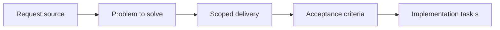

## item_005_define_deterministic_chunked_world_model_and_seed_contract - Define deterministic chunked world model and seed contract
> From version: 0.5.0
> Status: Done
> Understanding: 96%
> Confidence: 92%
> Progress: 100%
> Complexity: High
> Theme: World
> Reminder: Update status/understanding/confidence/progress and linked task references when you edit this doc.

# Problem
- The map layer needs a deterministic chunked world model with stable identity before camera culling and entity indexing can build on it.
- World, chunk, and screen coordinates need explicit transforms grounded in stable logical units rather than pixels.
- A global world seed must exist early enough to support deterministic debug content and later procedural generation.

# Scope
- In:
- Fixed square chunk model and default `16x16` chunk shape
- Stable world units, tile sizing, and coordinate transforms
- Deterministic chunk identity and global world-seed contract, with a fixed default seed baseline
- Support for positive and negative world coordinates
- Out:
- Camera controls and gesture mapping
- Map rendering and debug overlays
- Chunk visibility, culling, preload, and caching rules

# Acceptance criteria
- AC1: The world model uses fixed square chunks with a default target of `16x16` tiles or logical cells per chunk.
- AC2: World, chunk, and screen coordinates are explicitly distinguished and transform cleanly between one another.
- AC3: Stable logical world units and tile sizing are defined independently from raw screen pixels.
- AC4: Chunk identity is deterministic from chunk coordinates and compatible with a global world-seed model, starting from a fixed default seed that can be overridden later.
- AC5: The world model supports positive and negative coordinates and remains compatible with a future infinite-map approach.
- AC6: This slice provides the deterministic world contract required by later rendering, culling, and entity indexing work.

# AC Traceability
- AC1 -> Scope: Chunk model uses fixed square chunks with default `16x16` sizing. Proof: `src/game/world/model/worldContract.ts`.
- AC2 -> Scope: World, chunk, and screen transforms are explicit. Proof: `src/game/world/types.ts`, `src/game/world/model/worldContract.ts`.
- AC3 -> Scope: Logical world units and tile sizing are defined independently from pixels. Proof: `src/game/world/model/worldContract.ts`.
- AC4 -> Scope: Chunk identity and world-seed contract are deterministic. Proof: `src/game/world/model/worldContract.ts`, `src/game/world/model/worldContract.test.ts`.
- AC5 -> Scope: Positive and negative coordinates are supported for future infinite world use. Proof: `src/game/world/model/worldContract.ts`, `src/game/world/model/worldContract.test.ts`.
- AC6 -> Scope: Slice supplies deterministic world contract for later rendering and entity work. Proof: `src/game/world/model/worldContract.ts`, `src/game/debug/ShellDiagnosticsPanel.tsx`.

# Decision framing
- Product framing: Required
- Product signals: conversion journey, navigation and discoverability, engagement loop
- Product follow-up: Create or link a product brief before implementation moves deeper into delivery.
- Architecture framing: Required
- Architecture signals: contracts and integration, runtime and boundaries, delivery and operations
- Architecture follow-up: Create or link an architecture decision before irreversible implementation work starts.

# Links
- Product brief(s): `prod_000_initial_single_entity_navigation_loop`, `prod_002_readable_world_traversal_and_presence`
- Architecture decision(s): `adr_003_define_coordinate_spaces_and_camera_contract`, `adr_005_make_world_identity_deterministic_from_seed_and_coordinates`
- Request: `req_001_render_top_down_infinite_chunked_world_map`
- Primary task(s): `task_006_define_deterministic_chunked_world_model_and_seed_contract`

# Priority
- Impact: High
- Urgency: High

# Notes
- Derived from request `req_001_render_top_down_infinite_chunked_world_map`.
- Source file: `logics/request/req_001_render_top_down_infinite_chunked_world_map.md`.
- Request context seeded into this backlog item from `logics/request/req_001_render_top_down_infinite_chunked_world_map.md`.
- This slice defines the deterministic world contract that later culling and entity indexing depend on.
