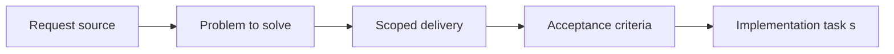

## item_008_add_map_diagnostics_picking_and_camera_reset_workflow - Add map diagnostics picking and camera reset workflow
> From version: 0.1.2
> Status: Done
> Understanding: 95%
> Confidence: 91%
> Progress: 100%
> Complexity: High
> Theme: World
> Reminder: Update status/understanding/confidence/progress and linked task references when you edit this doc.

# Problem
- The map layer needs diagnostics that expose camera state, chunk state, and viewport metrics while the world model is still being validated.
- Screen-to-world conversion and debug picking are needed to inspect the map with intent rather than only visually.
- Resetting the camera to a known state must be quick so navigation debugging stays efficient without implicitly mutating entity state.

# Scope
- In:
- Map-level diagnostics surfaced through the shared shell debug workflow
- Screen-to-world conversion for debug picking
- Camera reset actions for development and testing
- Inspectable map metrics such as camera state and visible chunk state
- Out:
- Camera gesture definitions themselves
- Base map rendering and world model contracts
- Entity selection and inspection workflows

# Acceptance criteria
- AC1: Map diagnostics expose at least camera position, zoom level, rotation state, current chunk, rendered chunk count, and viewport-related metrics.
- AC2: Screen-to-world conversion is usable for development diagnostics or debug picking.
- AC3: Camera reset actions can restore position, zoom, and rotation to a known state quickly, and stay camera-only in the initial baseline.
- AC4: Map-level diagnostics plug into the shared shell debug workflow instead of inventing a separate tool path.
- AC5: This slice improves map inspectability without taking on map rendering, world generation, or entity inspection concerns.
- AC6: The resulting tooling remains reusable by later entity-layer debugging.

# AC Traceability
- AC1 -> Scope: Map diagnostics expose camera, chunk, and viewport metrics. Proof: `src/game/debug/ShellDiagnosticsPanel.tsx`, `src/app/AppShell.tsx`.
- AC2 -> Scope: Screen-to-world conversion supports debug picking. Proof: `src/game/world/hooks/useWorldInteractionDiagnostics.ts`, `src/game/world/model/worldViewMath.ts`.
- AC3 -> Scope: Camera reset restores a known state quickly. Proof: `src/game/camera/hooks/useCameraController.ts`, `src/app/AppShell.tsx`.
- AC4 -> Scope: Map diagnostics use the shared shell debug workflow. Proof: `src/game/debug/ShellDiagnosticsPanel.tsx`.
- AC5 -> Scope: Slice is limited to inspectability, not rendering or generation behavior. Proof: `src/game/world/hooks/useWorldInteractionDiagnostics.ts`, `src/game/debug/ShellDiagnosticsPanel.tsx`.
- AC6 -> Scope: Tooling remains reusable for later entity debugging. Proof: `src/game/world/hooks/useWorldInteractionDiagnostics.ts`, `src/game/debug/ShellDiagnosticsPanel.tsx`.

# Decision framing
- Product framing: Required
- Product signals: conversion journey, navigation and discoverability, engagement loop
- Product follow-up: Create or link a product brief before implementation moves deeper into delivery.
- Architecture framing: Required
- Architecture signals: contracts and integration, runtime and boundaries, delivery and operations
- Architecture follow-up: Create or link an architecture decision before irreversible implementation work starts.

# Links
- Product brief(s): `prod_000_initial_single_entity_navigation_loop`
- Architecture decision(s): `adr_003_define_coordinate_spaces_and_camera_contract`, `adr_006_standardize_debug_first_runtime_instrumentation`
- Request: `req_001_render_top_down_infinite_chunked_world_map`
- Primary task(s): `task_013_orchestrate_world_render_and_chunk_visibility_foundation`

# Priority
- Impact: Medium
- Urgency: Medium

# Notes
- Derived from request `req_001_render_top_down_infinite_chunked_world_map`.
- Source file: `logics/request/req_001_render_top_down_infinite_chunked_world_map.md`.
- Request context seeded into this backlog item from `logics/request/req_001_render_top_down_infinite_chunked_world_map.md`.
- This slice gives the map layer the inspection workflow needed before adding entities.
