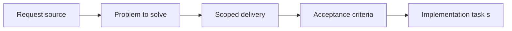

## item_009_define_entity_contract_and_generic_archetype_baseline - Define entity contract and generic archetype baseline
> From version: 0.1.3
> Status: Done
> Understanding: 94%
> Confidence: 91%
> Progress: 100%
> Complexity: High
> Theme: Entities
> Reminder: Update status/understanding/confidence/progress and linked task references when you edit this doc.

# Problem
- The entity layer needs a minimum shared entity contract before movement, rendering, and lifecycle systems can diverge.
- The first implementation should start from one generic movable archetype rather than prematurely locking several gameplay-specific families.
- A player-controlled entity should still fit the same shared contract rather than becoming a special-case data model.
- Entity identity, footprint, orientation, mutable state, and explicit render ordering need to be part of the baseline contract.

# Scope
- In:
- Minimum entity fields and shared contract
- One generic movable archetype baseline
- Separation between entity data and whoever currently owns player control
- Footprint or radius model and orientation field
- Explicit render ordering or layer priority in the entity contract
- Out:
- Movement simulation rules
- Chunk indexing and visibility policy
- Selection, inspection, and debug scenario behavior

# Acceptance criteria
- AC1: The entity layer defines a minimum shared contract that includes at least stable identity, world position, orientation, visual representation, and mutable state.
- AC2: The first implementation starts from one generic movable archetype rather than multiple gameplay-specialized families.
- AC3: Entities include a simple footprint model such as a radius or equivalent size indicator.
- AC4: Entity orientation is part of the baseline contract and is available for rendering and later movement-facing behavior.
- AC5: Render ordering or layer priority for entities is explicit enough to avoid unstable draw order.
- AC6: This baseline contract is suitable for later movement, chunk indexing, inspection, and player-control slices without being replaced by a special player entity model.

# AC Traceability
- AC1 -> Scope: Minimum shared entity contract is explicit. Proof: `src/game/entities/model/entityContract.ts`.
- AC2 -> Scope: One generic movable archetype is the default baseline. Proof: `src/game/entities/model/entityContract.ts`.
- AC3 -> Scope: Footprint or radius model exists. Proof: `src/game/entities/model/entityContract.ts`.
- AC4 -> Scope: Orientation is part of the baseline contract. Proof: `src/game/entities/model/entityContract.ts`.
- AC5 -> Scope: Render ordering is explicit. Proof: `src/game/entities/model/entityContract.ts`.
- AC6 -> Scope: Contract remains reusable for later movement, indexing, and inspection work. Proof: `src/game/entities/model/entityContract.ts`, `src/game/entities/model/entityContract.test.ts`.

# Decision framing
- Product framing: Not needed
- Product signals: (none detected)
- Product follow-up: No product brief follow-up is expected based on current signals.
- Architecture framing: Required
- Architecture signals: contracts and integration, delivery and operations
- Architecture follow-up: Create or link an architecture decision before irreversible implementation work starts.

# Links
- Product brief(s): (none yet)
- Architecture decision(s): `adr_000_adopt_feature_oriented_organic_frontend_structure`
- Request: `req_002_render_evolving_world_entities_on_the_map`
- Primary task(s): `task_008_define_entity_contract_and_generic_archetype_baseline`

# Priority
- Impact: High
- Urgency: High

# Notes
- Derived from request `req_002_render_evolving_world_entities_on_the_map`.
- Source file: `logics/request/req_002_render_evolving_world_entities_on_the_map.md`.
- Request context seeded into this backlog item from `logics/request/req_002_render_evolving_world_entities_on_the_map.md`.
- This slice defines the baseline entity model that all later entity work depends on.
