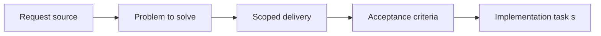

## item_010_implement_fixed_step_entity_movement_and_state_update_loop - Implement fixed-step entity movement and state update loop
> From version: 0.1.0
> Status: Ready
> Understanding: 92%
> Confidence: 89%
> Progress: 0%
> Complexity: High
> Theme: Entities
> Reminder: Update status/understanding/confidence/progress and linked task references when you edit this doc.

# Problem
- The entity layer needs a deterministic update loop that does not depend on arbitrary frame mutations.
- Movement should start as continuous world-space motion driven by velocity, without requiring acceleration, collision resolution, or pathfinding yet.
- Evolving entity state needs a simple, reproducible update model that later simulation systems can extend.

# Scope
- In:
- Fixed-step-compatible entity update mindset
- Velocity-based continuous movement
- Deterministic or debug-driven movement patterns
- Simple evolving state transitions over time
- Out:
- Chunk indexing and visibility ownership
- Entity rendering details and debug visuals
- Selection, inspection, and lifecycle scenario tooling

# Acceptance criteria
- AC1: Entity updates are compatible with a fixed simulation-step mindset even if rendering remains frame-based.
- AC2: Entity movement uses continuous world-space motion and supports at least velocity-based updates in the first pass.
- AC3: Initial movement remains deterministic, scripted, or developer-driven without requiring advanced AI or pathfinding.
- AC4: Entities can expose or transition through evolving state over time, even if the first implementation uses simple placeholder states.
- AC5: Acceleration, collision resolution, combat, and advanced animation remain out of scope for this slice.
- AC6: The resulting movement and state loop is reusable by later indexing, rendering, and behavior slices.

# AC Traceability
- AC1 -> Scope: Entity updates follow a fixed-step-compatible mindset. Proof: TODO.
- AC2 -> Scope: Movement is continuous and velocity-based. Proof: TODO.
- AC3 -> Scope: Movement remains deterministic or debug-driven without advanced AI. Proof: TODO.
- AC4 -> Scope: State can evolve over time under the update loop. Proof: TODO.
- AC5 -> Scope: Collision, combat, and advanced animation remain out of scope. Proof: TODO.
- AC6 -> Scope: Update loop remains reusable for later indexing, rendering, and behavior slices. Proof: TODO.

# Decision framing
- Product framing: Not needed
- Product signals: (none detected)
- Product follow-up: No product brief follow-up is expected based on current signals.
- Architecture framing: Required
- Architecture signals: contracts and integration, delivery and operations
- Architecture follow-up: Create or link an architecture decision before irreversible implementation work starts.

# Links
- Product brief(s): (none yet)
- Architecture decision(s): (none yet)
- Request: `req_002_render_evolving_world_entities_on_the_map`
- Primary task(s): `task_XXX_example`

# Priority
- Impact: High
- Urgency: High

# Notes
- Derived from request `req_002_render_evolving_world_entities_on_the_map`.
- Source file: `logics/request/req_002_render_evolving_world_entities_on_the_map.md`.
- Request context seeded into this backlog item from `logics/request/req_002_render_evolving_world_entities_on_the_map.md`.
- This slice provides the simulation baseline that later rendering and inspection slices will observe.
