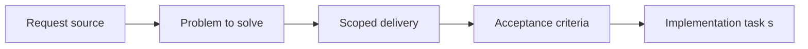

## item_013_add_entity_picking_selection_inspection_and_deterministic_debug_scenario - Add entity picking selection inspection and deterministic debug scenario
> From version: 0.1.0
> Status: Ready
> Understanding: 92%
> Confidence: 89%
> Progress: 0%
> Complexity: High
> Theme: Entities
> Reminder: Update status/understanding/confidence/progress and linked task references when you edit this doc.

# Problem
- The entity layer needs a reproducible debug scenario so movement, state, chunk crossing, and inspection can be tested consistently.
- Selecting an entity should immediately expose inspectable state instead of creating separate, fragmented debug flows.
- Map-level picking must connect screen interaction to entity inspection in world space.

# Scope
- In:
- Deterministic debug spawn scenario for entities
- Debug picking from map view into entity inspection
- Single-entity selection model linked to entity inspection
- Inspectable entity state surfaced in the debug workflow
- Out:
- Baseline entity contract
- Simulation update rules
- World-space rendering presentation details

# Acceptance criteria
- AC1: A deterministic debug scenario exists for spawning and observing entities so movement and state changes can be reproduced reliably.
- AC2: Debug picking or inspection is available so an entity can be selected from the map view.
- AC3: A simple single-entity selection model is supported and exposes the selected entity's inspectable state directly.
- AC4: The debug flow surfaces useful entity inspection data such as identity, position, chunk, facing, velocity, or state.
- AC5: This slice keeps entity inspection tied to the shared debug workflow rather than inventing a separate tool path.
- AC6: The resulting debug scenario and selection flow remain reusable for later gameplay and behavior testing.

# AC Traceability
- AC1 -> Scope: Deterministic debug spawn scenario is available. Proof: TODO.
- AC2 -> Scope: Picking and inspection from the map view are supported. Proof: TODO.
- AC3 -> Scope: Single-entity selection exposes inspectable state directly. Proof: TODO.
- AC4 -> Scope: Useful entity debug fields are surfaced in inspection. Proof: TODO.
- AC5 -> Scope: Inspection stays tied to the shared debug workflow. Proof: TODO.
- AC6 -> Scope: Debug scenario and selection flow remain reusable later. Proof: TODO.

# Decision framing
- Product framing: Not needed
- Product signals: (none detected)
- Product follow-up: No product brief follow-up is expected based on current signals.
- Architecture framing: Required
- Architecture signals: contracts and integration, delivery and operations
- Architecture follow-up: Create or link an architecture decision before irreversible implementation work starts.

# Links
- Product brief(s): (none yet)
- Architecture decision(s): (none yet)
- Request: `req_002_render_evolving_world_entities_on_the_map`
- Primary task(s): `task_XXX_example`

# Priority
- Impact: Medium
- Urgency: Medium

# Notes
- Derived from request `req_002_render_evolving_world_entities_on_the_map`.
- Source file: `logics/request/req_002_render_evolving_world_entities_on_the_map.md`.
- Request context seeded into this backlog item from `logics/request/req_002_render_evolving_world_entities_on_the_map.md`.
- This slice supplies the repeatable debug workflow needed to validate entity behavior in the world.
