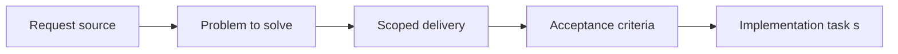

## item_016_define_free_plan_static_delivery_constraints_and_operating_notes - Define free-plan static delivery constraints and operating notes
> From version: 0.1.1
> Status: Ready
> Understanding: 94%
> Confidence: 91%
> Progress: 0%
> Complexity: Medium
> Theme: Delivery
> Reminder: Update status/understanding/confidence/progress and linked task references when you edit this doc.

# Problem
- The project needs an explicit operating envelope for Render static free-plan delivery.
- This slice captures free-plan constraints and practical delivery notes so later implementation does not assume unsupported platform behavior.

# Scope
- In: Free-plan assumptions, static-hosting limits, and operating notes relevant to the frontend runtime.
- Out: Paid-plan features, release process details, or CI workflow design.

# Acceptance criteria
- AC1: The request produces a Render Blueprint for a static site and does not assume a backend runtime, database, worker, or other non-static service.
- AC2: The deployment model is expressed through a Git-backed `render.yaml` file rather than an ad hoc dashboard-only setup.
- AC3: The Blueprint targets the Render free plan static-site path and avoids assumptions that require paid-tier infrastructure.
- AC4: The Blueprint remains compatible with the frontend-only stack defined in `req_000_bootstrap_fullscreen_2d_react_pwa_shell`.
- AC5: The Blueprint captures the minimum required static deployment settings, including build command and publish directory.
- AC6: The request defines a Vite-compatible frontend env strategy in which public client variables use the `VITE_` prefix and are treated as build-time public values.
- AC7: The request treats `.env.example` as the versioned documentation source for expected frontend variables.
- AC8: The request treats `.env.local` and `.env.production` as non-versioned files, with `.env.production` explicitly positioned as a local mirror of Render build-time values rather than the source of truth.
- AC9: The request treats the initial deployment path as a `main`-driven free-plan static-site deployment without requiring preview or staging environments.
- AC10: The resulting deployment blueprint is suitable for later implementation without forcing the app into a backend or multi-service topology.

# AC Traceability
- AC1 -> Scope: The request produces a Render Blueprint for a static site and does not assume a backend runtime, database, worker, or other non-static service.. Proof: TODO.
- AC2 -> Scope: The deployment model is expressed through a Git-backed `render.yaml` file rather than an ad hoc dashboard-only setup.. Proof: TODO.
- AC3 -> Scope: The Blueprint targets the Render free plan static-site path and avoids assumptions that require paid-tier infrastructure.. Proof: TODO.
- AC4 -> Scope: The Blueprint remains compatible with the frontend-only stack defined in `req_000_bootstrap_fullscreen_2d_react_pwa_shell`.. Proof: TODO.
- AC5 -> Scope: The Blueprint captures the minimum required static deployment settings, including build command and publish directory.. Proof: TODO.
- AC6 -> Scope: The request defines a Vite-compatible frontend env strategy in which public client variables use the `VITE_` prefix and are treated as build-time public values.. Proof: TODO.
- AC7 -> Scope: The request treats `.env.example` as the versioned documentation source for expected frontend variables.. Proof: TODO.
- AC8 -> Scope: The request treats `.env.local` and `.env.production` as non-versioned files, with `.env.production` explicitly positioned as a local mirror of Render build-time values rather than the source of truth.. Proof: TODO.
- AC9 -> Scope: The request treats the initial deployment path as a `main`-driven free-plan static-site deployment without requiring preview or staging environments.. Proof: TODO.
- AC10 -> Scope: The resulting deployment blueprint is suitable for later implementation without forcing the app into a backend or multi-service topology.. Proof: TODO.

# Decision framing
- Product framing: Required
- Product signals: pricing and packaging, experience scope
- Product follow-up: Create or link a product brief before implementation moves deeper into delivery.
- Architecture framing: Required
- Architecture signals: data model and persistence, security and identity, delivery and operations
- Architecture follow-up: Create or link an architecture decision before irreversible implementation work starts.

# Links
- Product brief(s): (none yet)
- Architecture decision(s): `adr_010_treat_render_build_variables_as_public_frontend_configuration`
- Request: `req_003_create_render_static_free_plan_blueprint`
- Primary task(s): (none yet)

# Priority
- Impact: Medium
- Urgency: Medium

# Notes
- Derived from request `req_003_create_render_static_free_plan_blueprint`.
- Source file: `logics/request/req_003_create_render_static_free_plan_blueprint.md`.
- Request context seeded into this backlog item from `logics/request/req_003_create_render_static_free_plan_blueprint.md`.
