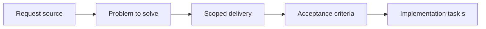

## item_017_define_baseline_github_actions_workflow_triggers_and_dependency_caching - Define baseline GitHub Actions workflow triggers and dependency caching
> From version: 0.1.2
> Status: Done
> Understanding: 95%
> Confidence: 93%
> Progress: 100%
> Complexity: Medium
> Theme: Delivery
> Reminder: Update status/understanding/confidence/progress and linked task references when you edit this doc.

# Problem
- CI needs a minimal but explicit execution model before quality gates can be trusted.
- This slice defines workflow triggers and dependency caching so GitHub Actions runs are predictable and practical.

# Scope
- In: `push` and `pull_request` triggers, package-manager caching, baseline workflow shape, and compatibility with a dedicated `release` branch.
- Out: Quality-gate content, deployment jobs, or release automation.

# Acceptance criteria
- AC1: The request defines a GitHub Actions CI pipeline for the repository rather than a local-only validation approach.
- AC2: The CI scope remains compatible with the frontend-only static architecture and does not assume backend runtime services.
- AC3: The pipeline includes the baseline repository checks needed for this stack, such as install, lint, typecheck, and build verification, with tests included when relevant to the project state.
- AC4: The request treats lint, typecheck, tests, build verification, and Logics lint as the intended baseline mandatory checks for the initial CI workflow.
- AC5: The request treats `push` and `pull_request` as the default triggering events for the initial CI workflow.
- AC6: The CI trigger design remains compatible with a dedicated `release` branch used for deployable states.
- AC7: The CI design accounts for dependency caching suitable for the project's package-management setup.
- AC8: The CI design remains compatible with the delivery direction defined in `req_003_create_render_static_free_plan_blueprint`.
- AC9: The CI design accounts for Logics validation as part of repository quality rather than treating `logics/` as out-of-band documentation.
- AC10: The resulting pipeline foundation is suitable for later extension into deployment or release workflows without requiring a full CI redesign.

# AC Traceability
- AC1 -> Scope: GitHub Actions is the repository CI entry point. Proof: `.github/workflows/ci.yml`.
- AC2 -> Scope: CI remains frontend-only and static-hosting compatible. Proof: `.github/workflows/ci.yml`.
- AC3 -> Scope: Install, lint, typecheck, tests, and build are all in the workflow. Proof: `.github/workflows/ci.yml`.
- AC4 -> Scope: Baseline mandatory checks remain explicit. Proof: `.github/workflows/ci.yml`.
- AC5 -> Scope: `push`, `pull_request`, and manual dispatch triggers are explicit. Proof: `.github/workflows/ci.yml`.
- AC6 -> Scope: Triggering remains compatible with the `release` branch. Proof: `.github/workflows/ci.yml`.
- AC7 -> Scope: Dependency caching is configured with the lockfile path. Proof: `.github/workflows/ci.yml`.
- AC8 -> Scope: CI stays compatible with the static delivery blueprint. Proof: `.github/workflows/ci.yml`, `render.yaml`.
- AC9 -> Scope: Logics lint remains part of repository validation. Proof: `.github/workflows/ci.yml`.
- AC10 -> Scope: Artifact upload and release-branch readiness preserve extension points. Proof: `.github/workflows/ci.yml`.

# Decision framing
- Product framing: Not needed
- Product signals: (none detected)
- Product follow-up: No product brief follow-up is expected based on current signals.
- Architecture framing: Required
- Architecture signals: contracts and integration, delivery and operations
- Architecture follow-up: Create or link an architecture decision before irreversible implementation work starts.

# Links
- Product brief(s): (none yet)
- Architecture decision(s): (none yet)
- Request: `req_004_prepare_github_actions_ci_pipeline`
- Primary task(s): `task_015_orchestrate_static_delivery_and_ci_hardening`

# Priority
- Impact: High
- Urgency: High

# Notes
- Derived from request `req_004_prepare_github_actions_ci_pipeline`.
- Source file: `logics/request/req_004_prepare_github_actions_ci_pipeline.md`.
- Request context seeded into this backlog item from `logics/request/req_004_prepare_github_actions_ci_pipeline.md`.
- Completed in `task_015_orchestrate_static_delivery_and_ci_hardening`.
